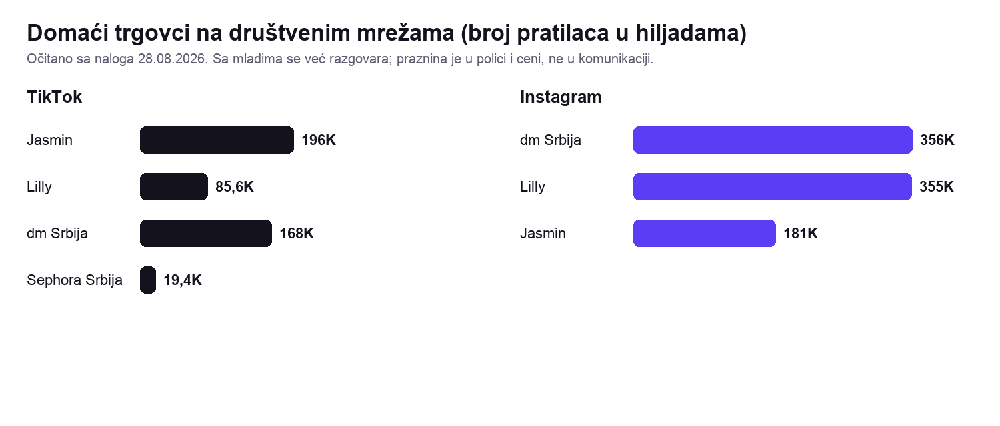
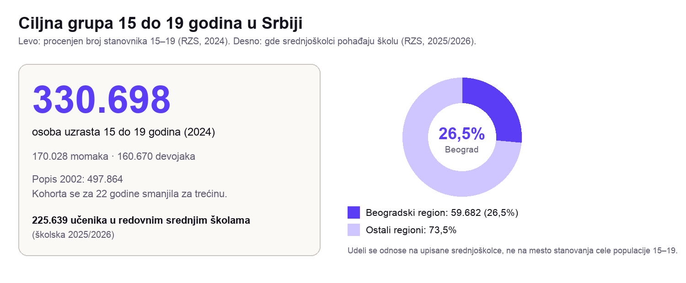
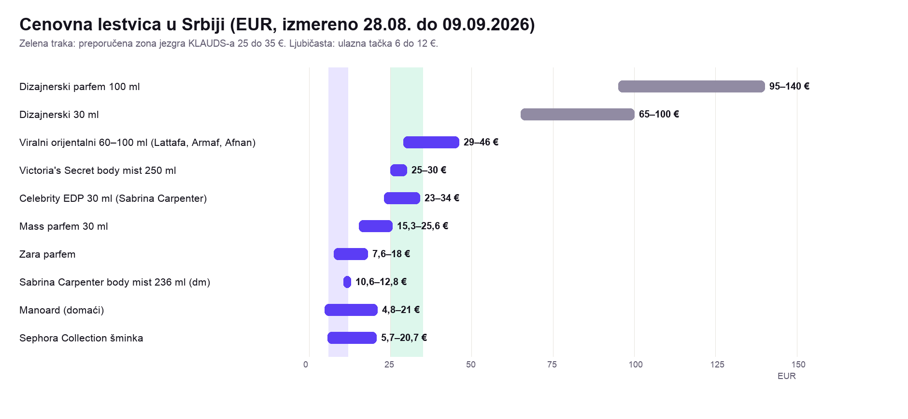
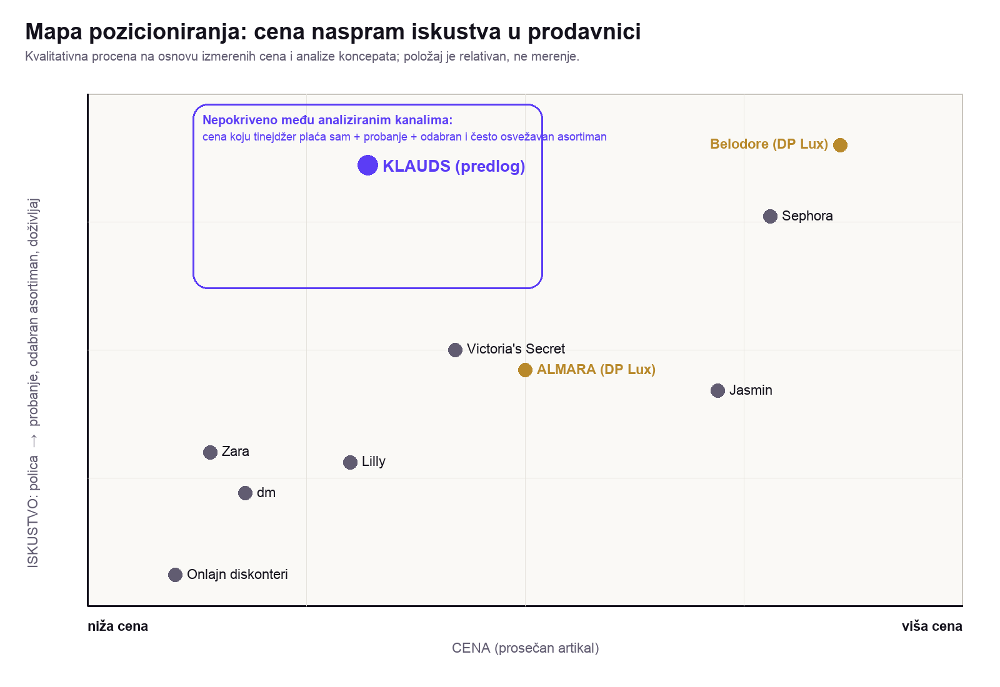
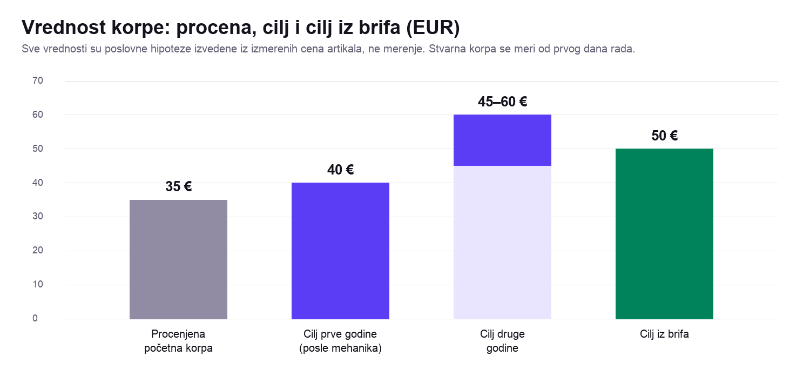
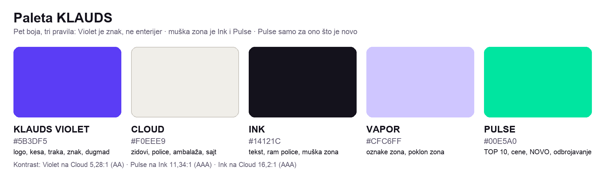

# KLAUDS · Analiza tržišta i strateške preporuke

**Naručilac:** DP Lux Group · **Izradio:** VladsDigital
**Datum:** 09.09.2026 · **Verzija:** 2.1 · **Status dokumenta:** verzija za donošenje ključnih odluka
**Namena:** menadžment i vlasnik kompanije, interni dokument
**Period analize:** 28.08.2026 do 09.09.2026 · **Kurs u celom dokumentu:** 1 EUR = 117,34 RSD (28.08.2026)

> **Šta je ovaj dokument.** Sekundarna analiza tržišta (desk research) za KLAUDS, novi retail
> koncept DP Lux Group. Rađena je iz javno dostupnih podataka, sopstvenih merenja pretrage i
> cena, i zvaničnih statistika. Nije rađena anketa, intervju ni fokus grupa sa tinejdžerima u
> Srbiji. Zato je dokument pisan tako da razdvaja **podatak**, **tumačenje** i **preporuku**,
> a na kraju daje osam odluka koje treba doneti pre nastavka projekta.

---

## SADRŽAJ

| # | Poglavlje | Šta je unutra |
|---|---|---|
| 1 | Kontekst projekta i cilj analize | Šta je KLAUDS, kome je namenjen, koje dileme rešava |
| **2** | **Executive summary** | Jedna strana koja stoji samostalno |
| 3 | Metodologija i ograničenja | Kako je rađeno, kako su građene rang liste, šta brojevi mogu a šta ne |
| 4 | Tržište i konkurencija | Veličina tržišta, ključni igrači, TC Galerija, ko još dolazi |
| 5 | Ciljna grupa i ponašanje kupaca | Veličina grupe, online kupovina i plaćanje, TikTok, sedam nalaza, persone |
| 6 | Cenovno pozicioniranje | Izmerene cene, preporučena pozicija, korpa kao scenario |
| 7 | Preporuka asortimana | 26 preporučenih brendova i asortimanskih grupa, struktura police, odnos prema ALMARI |
| 8 | Iskustvo u prodavnici | Put kupca kroz radnju, KLAUDS MOMENT, pet interaktivnih elemenata |
| 9 | Pozicioniranje, ton i komunikacija brenda | Pravilo jezika, pravni okvir, paleta, pet reči, stubovi sadržaja |
| 10 | Influenseri i aktivacije | Konkretni kandidati, tipovi kreatora, deset aktivacija |
| 11 | Plan lansiranja | Šta je realno do oktobra 2026, šta ide u drugu fazu, rokovi odluka |
| 12 | Ključne metrike | Dvanaest pokazatelja za prvih 90 dana |
| **13** | **Osam odluka koje klijent treba da donese** | Jedna strana |
| 14 | Predloženi sledeći koraci | Šta radi klijent, šta radi VladsDigital, šta je opciono |
| 15 | Izvori i metodološki prilozi | Ključni izvori po tvrdnji, Google Trends napomena, pravni okvir, pun registar |

**Gde su isporuke koje je klijent tražio:** pozicioniranje **2 i 6** · persone **5.8** · content
pillars **9.7** · influenseri **10.1** · aktivacije **10.3** · launch smernice **11** · put kupca i
pet interaktivnih elemenata **8.2 i 8.5** · KLAUDS MOMENT **8.4** · cenovno pozicioniranje **6** ·
brendovi **7** · do/don't **9.8** · paleta i vizuelni identitet **9.5 i 9.6** · pet reči **9.6** ·
loyalty motiv **8.7**.

---

# 1. KONTEKST PROJEKTA I CILJ ANALIZE

## 1.1 Šta je KLAUDS

KLAUDS je novi retail koncept DP Lux Group, vlasnika lanca niche parfimerija Belodore.
Zamišljen je kao multibrend prodavnica u kojoj parfemi čine oko 80% ponude, a beauty
proizvodi oko 20%, uz sopstveni private label u kasnijoj fazi. Nastupa kao samostalan brend,
odvojen od komunikacije Belodore-a, uz sopstvene prodajne objekte i sopstveni web shop (bez
marketplace-a i bez franšize).

**Kome je namenjen.** Primarna grupa su tinejdžeri od 15 do 19 godina: devojke (planirano 50%
prometa) i momci (20%). Sekundarna grupa (30%) su odrasli koji kupuju za sebe ili kao poklon
tinejdžeru. Polazna ideja klijenta je da su postojeće parfimerije u Srbiji konceptom okrenute
starijoj publici, a da KLAUDS treba da bude interaktivan prostor koji poštuje način na koji
mladi biraju, probaju i razgovaraju o mirisima.

**Gde i koliki.** Prvi objekat je planiran u TC Galerija u Beogradu, na 150 m². Planirano
otvaranje je oktobar 2026, uz napomenu klijenta da rok kasni. Kanali su prodavnica, web shop,
performance marketing, Instagram, TikTok, newsletter i Viber.

**Cenovni okvir iz brifa.** Prosečna cena artikla oko 30 EUR i ciljna vrednost korpe oko
50 EUR. Uzor po viđenju klijenta je Gold Apple (u brifu naveden kao „Golden Apple"; zvanično
ime firme je Gold Apple i tako se koristi u ovom dokumentu).

## 1.2 Glavne dileme klijenta

U brifu i upitniku klijent je otvorio nekoliko pitanja koja ova analiza treba da razreši:

1. **Cenovno pozicioniranje.** U brifu su navedena dva cilja koja treba međusobno uskladiti:
   „pristupačno" i „slično Sephora".
2. **Lista brendova ne postoji.** Klijent očekuje da analiza predloži idealne brendove, uz
   minimalno preklapanje sa asortimanom Belodore-a.
3. **Konkurencija.** Klijent smatra da u Srbiji ne postoji direktna konkurencija po konceptu
   (mladi, interaktivno, Gen Z). Analiza to tretira kao hipotezu, ne kao ulazni podatak.
4. **Loyalty.** Da li KLAUDS deli loyalty program sa Belodore-om, čija je publika starija i
   premium.
5. **Ponašanje, ne stavovi.** Klijent je izričito tražio da se analiza ne oslanja samo na ono
   što ljudi kažu, nego na stvarno ponašanje: pretraga, razgovori na TikToku i forumima, viralni
   proizvodi, jezik recenzija, ponašanje u prodavnici.

## 1.3 Na koja pitanja analiza odgovara

| Pitanje | Gde je odgovor |
|---|---|
| Koliko je tržište i ko su glavni igrači | Poglavlje 4 |
| Ko je stvarna konkurencija KLAUDS-u u TC Galerija | 4.3 i 4.4 |
| Koliko je velika ciljna grupa, gde živi, kako kupuje i plaća | 5.1 do 5.3 |
| Šta tinejdžer u Srbiji traži kad bira miris | 5.4 do 5.7 |
| Ko su tipični kupci (persone) | 5.8 |
| Koje cene i koja korpa su realne | 6 |
| Koje brendove i u kom odnosu staviti na policu | 7 |
| Kako prodavnica treba da radi i šta je KLAUDS MOMENT | 8 |
| Kako brend govori, kako izgleda i šta sme po zakonu | 9 |
| Sa kim sarađivati i kojim aktivacijama lansirati | 10 |
| Šta je realno do otvaranja i šta se meri | 11 i 12 |
| Koje odluke klijent mora da donese | 13 |

## 1.4 Šta nije u obimu

Pravno, poresko i carinsko savetovanje, uvozne procedure, transport i skladištenje, precizne
finansijske projekcije (nabavne cene, marže, zakup) i terensko istraživanje (ankete, intervjui,
fokus grupe). Gde dokument dodiruje ove oblasti, to je označeno kao pitanje za stručnjaka ili
za interne podatke klijenta.

---

# 2. EXECUTIVE SUMMARY

**Tržišna praznina.** Sa mladima se u Srbiji već razgovara: Jasmin ima 196.000 pratilaca na
TikToku, dm i Lilly po više od 350.000 na Instagramu. Praznina nije komunikacija, nego polica,
cena i način probanja. Nijedan od analiziranih vodećih kanala ne objedinjuje istovremeno
pažljivo odabran asortiman, probanje, cenu koju šesnaestogodišnjak plaća sam i često uvođenje
novog. Ono što KLAUDS može, a dm i Lilly na svojoj mreži ne rade, jeste probanje kao sistem,
rang lista, muška zona, predmet koji se nosi kući i sloj brendova kojih u Srbiji nema.

**Primarni kupac.** 330.698 osoba uzrasta 15 do 19 (RZS, 2024); 73,5% srednjoškolaca pohađa
školu van Beogradskog regiona, pa je web shop uslov za nacionalni domet. Tinejdžer ne kupuje
miris nego reakciju okoline (kompliment), miris opisuje referencama („miriše na čisto", „na
kokos"), ne notama, i gradi kolekciju od više mirisa umesto jednog. Otkriva na TikToku,
potvrđuje kod vršnjaka, odlučuje u radnji. Momci su potcenjeni u brifu: preporuka je cilj od 30%
umesto 20%, sa zasebnom zonom od prvog dana. Petnaestogodišnjak uglavnom plaća kešom, sopstvena
kartica je realna od 16 godina uz roditelja, a pouzeće ostaje najčešći način onlajn plaćanja.

**Glavni konkurenti.** Najvažniji konkurenti KLAUDS-u nisu samo parfimerije. Značajan cenovni
i asortimanski pritisak dolazi iz dm-a, Lilly-ja, Zare i Victoria's Secreta, svi u istoj zgradi.
dm i Lilly već drže Lattafa, Armaf, Afnan, Sabrina Carpenter, Sol de Janeiro i Ariana Grande, a
dm prodaje Sabrina Carpenter body mist po 10,6 do 12,8 €, tačno na cenovnoj tački drugog artikla
u korpi. ALMARA, sopstveni lanac DP Lux Group u istoj zgradi, nije konkurent KLAUDS-u: to je
prodavnica jedne kategorije za ljubitelje orijentalnih mirisa, sa oko 13.000 pratilaca na
Instagramu i bez web shopa. Preklapanje postoji, ali je usko: tri do četiri kuće (Lattafa,
Armaf, Afnan) i rešava se razlikom u formatu, ne izbacivanjem tih kuća iz asortimana.

**Cenovno pozicioniranje.** Preporuka je treća pozicija između „pristupačno" i „slično
Sephora": pristupačni trendovski brend, cenovno bliže dm-u i Lilly-ju, iskustveno bliže Sephori.
Jezgro asortimana 25 do 35 €, ulazna tačka 6 do 12 €, dizajnerska boca samo kao izlog. Prosečna
cena artikla od 30 € nije dovoljna kao jedina metrika; prati se zajedno sa brojem artikala po
korpi i vrednošću korpe. Početna korpa od oko 35 do 40 € je poslovna hipoteza za proveru, ne
nalaz.

**Najvažnija razlika KLAUDS-a.** Nabavka, ne enterijer. Kineski talas „Gen Z beauty" prodavnica
imao je estetiku, probanje i mladu publiku, i zatvorio preko 700 objekata jer nije imao razliku u
robi. Sopstveni uvoz DP Lux Group i 15 do 25 artikala koje niko drugi u Srbiji nema (Bath &
Body Works, e.l.f., Phlur, Billie Eilish, Glossier) su prva stavka plana, a KLAUDS MOMENT
(foto-traka sa imenom mirisa koji si probao) i TOP 10 zid sa odvojenom muškom listom su ono
što se nosi kući i što se pamti. Nijedan predloženi element nije ekran.

**Najveći rizici.** (1) Otvaranje u oktobru 2026. bez ekskluziva i bez mehanike probanja daje
radnju koja se ne razlikuje od dm-a i Lilly-ja. (2) Cenovni pritisak dm-a i Lilly-ja na drugom
artiklu u korpi: obe mreže već drže mist i mini formate u zoni 10 do 15 €, a Lilly od
decembra 2025. prodaje i domaće mistove Atine i Nike Tošić po 1.529 do 1.699 RSD.
(3) Zakon o oglašavanju ograničava komunikaciju prema maloletnicima
(obećanje društvene prednosti, pridev uz cenu, poziv na kupovinu); bez advokata kampanja može
stati. (4) Kupovna moć ciljne grupe nije izmerena ni u jednom domaćem izvoru; svi iznosi korpe
su scenariji.

**Četiri odluke koje treba doneti odmah** (svih osam je u poglavlju 13):
1. **Datum i obim otvaranja:** osnovna verzija u oktobru 2026. sa punim lansiranjem u prvom
   tromesečju 2027, ili pun koncept od početka.
2. **Odnos prema ALMARI:** iste kuće, drugi formati (mini, setovi, mist, discovery).
3. **Ekskluzive:** koliko artikala i ko pregovara; početi od pune liste brendova koje DP Lux
   Group već distribuira.
4. **Enterijer:** mirisno zoniranje u projekat instalacija pre izvođenja i odluka o
   foto-kabini pre projekta enterijera; uz to boja brenda pre rasvete i ambalaže.

---

# 3. METODOLOGIJA I OGRANIČENJA

## 3.1 Vrsta istraživanja

Ovo je **sekundarno (desk) istraživanje**. Nije rađena anketa, intervju ni fokus grupa sa
tinejdžerima u Srbiji. Umesto toga, u skladu sa zahtevom klijenta da se gleda ponašanje a ne
izjave, težište je bilo na podacima koji nastaju dok ljudi nešto rade: šta pretražuju, šta
kupuju, koliko plaćaju, šta trgovci objavljuju i kako publika na to reaguje.

Analiza je rađena u sedam istraživačkih koraka (konkurencija i cene; rang liste i brendovi;
Gen Z kupac; iskustvo u prodavnici; globalni primeri i tržišna praznina; ton i jezik brenda;
sinteza), a zatim je prošla internu kontrolu. **Svi ključni podaci, proračuni i izvori prošli
su dodatnu internu proveru pre izrade ovog dokumenta.**

## 3.2 Kako su prikupljani podaci

| Metod | Šta je konkretno rađeno | Za šta služi |
|---|---|---|
| **Merenje pretrage** | Google Trends za Srbiju (geo=RS), krive 2019 do 2026 za više od 20 pojmova; 104 upita kroz Google predloge pretrage (autocomplete, hl=sr, gl=rs) u dve runde | Koje kategorije, brendovi i reči imaju tražnju; kojim rečima kupac opisuje miris |
| **Očitavanje cena** | Više od 20 referentnih artikala direktno sa sajtova i kataloga: Jasmin, Belodore, dm Srbija, dm Hrvatska, Sephora Srbija katalog, Mirris.rs, Apothecary.rs; dm asortiman parfema u celini (408 artikala) | Cenovna mapa tržišta i poređenje sa EU |
| **Analiza društvenih mreža** | Broj pratilaca i doslovni tekst objava tri najveća domaća trgovca (Jasmin, dm, Lilly) na TikToku i Instagramu; doseg kanala u Srbiji (DataReportal); regionalni medijski prenosi TikTok trendova i komentara | Kako trgovci govore sa mladima i kako mladi govore o mirisu |
| **Merenje boja konkurencije** | Direktno čitanje boja sa sajtova (CSS i theme-color oznake) | Koje boje su zauzete, koje su slobodne |
| **Zvanične statistike** | Republički zavod za statistiku (procena stanovništva, srednje škole, upotreba interneta), Narodna banka Srbije, finansijski izveštaji (CompanyWall, SEC 10-K), Euromonitor (sažetak), Statista, Piper Sandler | Veličina tržišta i grupe, kupovna moć, međunarodni obrasci |
| **Pravni tekstovi** | Zakon o oglašavanju (izvorni tekst sa sajta Narodne skupštine) i Zakon o zaštiti podataka o ličnosti, unakrsno provereni na Paragraf Lex | Šta sme da se kaže maloletnicima i od koje godine sme da se obrađuju podaci |
| **Globalni primeri** | 12 retail koncepata (Gold Apple, Bath & Body Works, @cosme TOKYO, NOSE Paris, FACES/Ghawali, MINISO, P.LOUISE, The Colorist i dr.) | Mehanike koje se prenose, ne veličine efekta |

## 3.3 Kako su građene rang liste

**Javnih podataka o prodaji po artiklu u Srbiji nema.** Nijedan trgovac ne objavljuje količine.
Zato su sve rang liste u ovom dokumentu **indikativne** i građene ukrštanjem pet nezavisnih
signala. Brend ili proizvod ulazi na listu samo ako ga potvrđuju najmanje dva signala:

1. objavljene liste najprodavanijih na sajtovima trgovaca (Mirris.rs, originalniparfemi.rs,
   Jasmin kategorije);
2. obim i oblik pretrage (Google Trends za Srbiju i Google predlozi pretrage);
3. zastupljenost i cene na polici (broj artikala po brendu kod dm-a, Jasmina, Sephore, Lilly-ja
   preko agregatora);
4. prisustvo i angažman na društvenim mrežama (broj recenzija i objava kao posredan pokazatelj);
5. zvanični finansijski izveštaji (prihodi lanaca, udeli proizvođača).

Uz svaku rang listu u dokumentu stoji: koji proizvodi su analizirani, u kom periodu, prema
kojim signalima, i napomena da lista **nije izvedena iz podataka o prodaji**.

## 3.4 Oznake pouzdanosti

| Oznaka | Značenje |
|---|---|
| **VISOKA** | Više nezavisnih izvora, zvaničan podatak, ili sopstveno merenje koje se može ponoviti |
| **SREDNJA** | Jedan solidan izvor, posredan zaključak, ili podatak od izvora sa komercijalnim interesom |
| **NISKA** | Pretpostavka, procena ili radna konstrukcija; ne koristi se za finansijsku projekciju |

Oznaka pouzdanosti nije zamena za izvor. Uz najvažnije brojke u tekstu stoji broj izvora u
uglastim zagradama, na primer [izv. 68]; puna lista je u poglavlju 15 i u prilogu.

## 3.5 Ograničenja koja treba imati u vidu pre korišćenja brojeva

1. **Nema srpskih podataka o ponašanju kupaca u prodavnici.** Sve brojke o ponašanju u
   prostoru (zone, vreme zadržavanja, efekat kase) dolaze iz SAD, UK, EU i Koreje. Prenose se
   mehanizmi, ne veličine efekta. Nijedna od tih brojki ne sme se citirati kao „u Srbiji je tako".
2. **Deo brojki o efektu dolazi od dobavljača opreme, softvera i loyalty platformi.** Smer je
   dosledan kroz više izvora, ali veličine se ne prenose kao projekcije.
3. **Javnog podatka o džeparcu i potrošnji srednjoškolaca u Srbiji nema.** Provereno je dva
   puta, u dva odvojena koraka istraživanja. Najbliži surogat je hrvatsko istraživanje HUB i
   Štedopis (n=1.011, 13 do 19 godina, 2020), koje daje strukturu potrošnje, ne iznose. Zato su
   svi iznosi korpi u ovom dokumentu izvedeni iz izmerenih cena artikala, ne iz merene potrošnje,
   i označeni su kao scenario.
4. **Google Trends i Google predlozi pretrage pokazuju relativan interes, ne prodaju.** Ne mogu
   da dokažu obim prodaje, tržišni udeo, stvarnu kupovinu ni motiv kupca. Mogu da pokažu
   redosled, smer i oblik trenda i koje reči ljudi koriste. Detaljna napomena je u 15.2.
5. **Analiza TikTok sadržaja rađena je na nivou naloga trgovaca, njihovih objava, javnih
   brojeva pratilaca i regionalnih medijskih prenosa viralnih objava i komentara.** Sistematski
   uzorak komentara srpskih korisnika nije bio deo ovog obima; predložen je kao sledeći korak
   (poglavlje 14). Zbog toga persone i stubovi sadržaja stoje prvenstveno na izmerenoj pretrazi i
   na objavama trgovaca.
6. **Odsustvo rezultata pretrage nigde nije tretirano kao dokaz.** Gde nešto nije nađeno
   (zvanična distribucija brenda, regionalni Gen Z koncept, foto-kabine u beogradskim tržnim
   centrima), to je označeno kao SREDNJA uz napomenu kako se proverava.
7. **Cene inostranih brendova koji nisu u Srbiji** navedene su kao inostrane maloprodajne cene i
   služe samo za grubo pozicioniranje. Ne treba ih čitati kao očekivane cene u Srbiji, jer ne
   uključuju uvoz, poreze, marže i uslove distributera.
8. **Namerno odbačeni podaci** su navedeni sa razlogom gde se pojavljuju (na primer, dve
   nesaglasne javne cifre o prihodu Gold Applea, zbog čega se nijedna ne citira).

---

# 4. TRŽIŠTE I KONKURENCIJA

## 4.1 Veličina i rast tržišta

| Podatak | Vrednost | Izvor | Pouzdanost |
|---|---|---|---|
| Tržište kozmetike i parfema u Srbiji (2025) | **71.774 miliona RSD, oko 612 miliona €**, rast 6% godišnje | Euromonitor [izv. 61] | VISOKA, tri nezavisna izvora u istom rangu |
| Ukupno tržište nege i lepote | oko 600 miliona € | Statista preko Biznis.rs [izv. 3] | VISOKA |
| Broj firmi u specijalizovanoj maloprodaji kozmetike | **558** (2025), rast 471 → 510 → 558 u tri godine | CompanyWall preko Biznis.rs [izv. 1] | VISOKA |
| Udeli proizvođača parfema (2025) | Puig 18% · Sarantis 14% · Coty 8% · L'Oréal 6% · Avon 5% | Euromonitor, sažetak [izv. 62] | SREDNJA, pun izveštaj iza plaćenog zida |
| Prosečna neto zarada (jun 2026) | 120.401 RSD; **medijalna 94.281 RSD** | RZS preko Forbes Srbija [izv. 343] | VISOKA |

**Tumačenje.** Tržište raste, i to vučeno mass segmentom, ne premium segmentom, što ide u prilog
KLAUDS poziciji. Udeli proizvođača ne nose nijednu preporuku u ovom dokumentu; koriste se samo
kao potvrda smera.

## 4.2 Pregled ključnih tržišnih igrača

| Igrač | Prihod (2025) | Broj objekata | Brendovi / artikli | Cenovni segment | Glavna prednost | Relevantnost za KLAUDS |
|---|---|---|---|---|---|---|
| **Lilly Drogerie** | 15,6 milijardi RSD (maloprodaja kozmetike; apotekarska ustanova Lilly je zaseban subjekt) [izv. 1] | više od 200 u Srbiji (kompanija navodi 230) [izv. 372] | 919 brendova onlajn; parfemi od dizajnerskih do niche; viralni brendovi (Sol de Janeiro, Ariana Grande, Sabrina Carpenter, Kayali, Lattafa, Armaf, Afnan) i K-beauty [izv. 369] | širok, od 10 do 150 i više €; viralni parfemi 25 do 70 € | Mreža, loyalty klub star 10 godina sa više od milion korisnika (tačan broj nije objavljen) [izv. 371], stalne akcije do −50/−60% [izv. 23, 24], sopstveni događaji | **Visoka.** Najveći igrač; „parfemi lilly" je prvi predlog pretrage za „parfemi" u Srbiji [izv. 50] |
| **dm drogerie markt** | uporediv prihod nije bio dostupan u istoj bazi | 136 u 40 gradova, 2.190 zaposlenih [izv. 15] | 408 artikala parfema, uključujući Lattafa, Armaf, Afnan, Sabrina Carpenter [izv. 13] | 8,5 do 68 € | Cena, navika, doslednost komunikacije na „ti" | **Visoka.** Najozbiljniji konkurent po ceni i asortimanu; objekat u prizemlju Galerije |
| **Sephora Srbija** | 2,42 milijarde RSD [izv. 2] | 5 i više | 66 brendova u katalogu [izv. 11] | srednje-premium do premium | Globalne ekskluzive (Sol de Janeiro, Fenty, Huda), prestiž | Srednja. Referentni okvir za iskustvo, ne za cenu |
| **Jasmin** | uporediv prihod nije bio dostupan u istoj bazi | mreža u Srbiji [izv. 10] | 88 brendova [izv. 8] | premium; 37 do 53% skuplji od Sephore na istim artiklima *(SREDNJA)* [izv. 9] | Najveći domaći nalog na TikToku (196.000 pratilaca) [izv. 33] | Srednja. Klasična parfimerija; sa mladima već komunicira |
| **Belodore** (DP Lux Group) | 466 miliona RSD [izv. 1] | 17 objekata, 7 zemalja [izv. 53] | 71 niche brend [izv. 7] | premium niche, ulazna cena 80 i više € | Ekskluzivni niche portfolio | Niska po asortimanu; deli loyalty sistem (8.7) |
| **ALMARA** (DP Lux Group) | nije javno | 6 u Srbiji, uključujući Galeriju [izv. 57] | orijentalni brendovi: Afnan, Ajmal, Al Haramain, Armaf, Khadlaj, Lattafa, Paris Corner, Swiss Arabian, Zimaya [izv. 56] | 25 do 60 € | Sopstveni uvoz najtraženijih brendova | **Srednja.** Usko preklapanje asortimana, drugačija publika (4.4) |
| **Zara** | nije relevantno | mreža | sopstveni parfemi | 7,6 do 18 € [izv. 19, 20] | Cena i modni kontekst | Srednja do visoka za ulaznu cenovnu tačku |
| **Victoria's Secret** | nije relevantno | Galerija | body mist | 25 do 30 € [izv. 17, 18] | Prepoznatljivost mist kategorije | Srednja; objekat u istoj zgradi |
| **Onlajn diskonteri** (Mirris i sl.) | nije javno | onlajn | dizajnerski i viralni | 30 do 50% ispod parfimerija [izv. 16] | Cena | Srednja; kupac ih proverava telefonom u radnji |

*(VISOKA osim gde je označeno)*

**Napomena o veličini.** Po prihodu u bazi specijalizovanih prodavnica kozmetike (CompanyWall),
Belodore je iza Lilly-ja i Sephore, ali uporedivi prihodi dm-a i Jasmina u toj bazi nisu bili
dostupni, pa se redosled ne može tvrditi za celo tržište. KLAUDS ulazi iz relativno male baze:
to nije prepreka za koncept na 150 m², ali jeste ograničenje za pregovaračku moć prema
brendovima i za medijski budžet.

## 4.3 Lilly: najveći igrač i najbliži tinejdžeru

Anegdotski, tinejdžerke u Beogradu parfeme najviše kupuju u Lilly-ju i Zari. Podaci to podržavaju:

- **Pretraga.** Za upit „parfemi" prvi predlog pretrage u Srbiji je „parfemi lilly", ispred „parfemi
  dm" i „parfemi jasmin"; redosled pretrage parfema po trgovcima je Lilly → dm → Jasmin, dok se
  Sephora pretražuje znatno manje [izv. 50] *(VISOKA)*.
- **Brendovi koje tinejdžeri traže su u Lilly-ju.** Sol de Janeiro se pretražuje uz naziv trgovca
  („sol de janeiro lilly" je drugi predlog, ispred „sol de janeiro dm" i „sol de janeiro sephora
  srbija") [izv. 50]. Lista brendova na lilly.rs (919 stavki, očitano 09.09.2026) sadrži Sol de
  Janeiro (sedam Cheirosa mistova), Ariana Grande (parfemi i body mist), Sabrina Carpenter (četiri
  varijante), Kayali, Lattafa, Armaf, Afnan, Ajmal, Al Haramain, Swiss Arabian, domaće Manoard i
  Zorannah, a od beauty brendova Rare Beauty, Charlotte Tilbury, Kylie Cosmetics, Drunk Elephant,
  CeraVe i celu K-beauty listu (COSRX, Anua, Laneige, TirTir, Medicube) [izv. 369] *(VISOKA)*.
  Lilly nema: Victoria's Secret, Billie Eilish, Bath & Body Works, e.l.f., Phlur, Glossier, Rhode,
  Fenty [izv. 369] *(VISOKA za listu brendova onlajn; polica u objektu može se razlikovati)*.
- **Događaji i kreatori.** Lilly je 30.06.2026. u TC Galerija ugostio Jeremyja Fragrancea na
  promociji Manoard kolekcije [izv. 367], a od maja do septembra 2026. vodi „Lilly Studio" na Adi
  Ciganliji, letnji prostor sa dermatolozima, DJ nastupima i edukacijom o zaštiti od sunca
  [izv. 368] *(VISOKA)*. Lilly, dakle, ne konkuriše samo cenom i mrežom, nego i događajima.
- **Popust kao stalno stanje.** Ciklusi do −50/−60% i „dodatnih −15% na sve parfeme i setove"
  [izv. 23, 24] *(VISOKA)*.

**Cene viralnih parfema u Lilly-ju** (lilly.rs, 09.09.2026) [izv. 370] *(VISOKA)*:

| Proizvod | Redovna cena | Cena za članove loyalty kluba (septembar 2026) |
|---|---|---|
| Sol de Janeiro Cheirosa 62 mist 90 ml | 3.269,99 RSD (27,9 €) | 2.599,99 RSD (22,2 €) |
| Lattafa Yara EDP 100 ml | 4.879,99 RSD (41,6 €) | promo kod −15% |
| Lattafa Khamrah EDP 100 ml | 6.499,99 RSD (55,4 €) | 4.399,99 RSD (37,5 €) |
| Armaf Club de Nuit Intense Man 105 ml | 7.079,99 RSD (60,3 €) | |
| Afnan 9PM EDP 100 ml | 5.399,99 RSD (46,0 €) | |
| Ariana Grande Cloud EDP 100 ml | 7.999,99 RSD (68,2 €) | |
| Ariana Grande Ari body mist 236 ml | 1.015,99 RSD (8,7 €) | 812,79 RSD (6,9 €) |
| Sabrina Carpenter Sweet Tooth EDP 30 ml | 3.999,99 RSD (34,1 €) | 3.199,99 RSD (27,3 €) |

Na dan provere, ključni viralni artikli (Cheirosa 62, Yara, Club de Nuit Intense, Cloud 100 ml)
bili su onlajn „nema na stanju", što je signal ili velike tražnje ili slabog snabdevanja.
Lilly-jeve redovne cene viralnih parfema su iznad cena specijalizovanih onlajn prodavaca
orijentalnih parfema (Yara od 2.900 do 3.599 RSD onlajn) [izv. 370] *(SREDNJA)*. Lilly ima
i sopstveni body mist ulaz (Ariana Grande Ari 236 ml po 8,7 €), pa je ulazna cenovna tačka
KLAUDS-a već pokrivena i kod Lilly-ja i kod dm-a.


**Šta to znači za KLAUDS.** Lilly je za tinejdžerku već „mesto gde se kupuje parfem". KLAUDS ne
može da se takmiči mrežom, popustom ni širinom. Može onim što Lilly na više od 200 objekata ne
radi: probanje kao sistem, pažljivo odabran i često osvežavan asortiman, rang lista, muška zona
i predmet koji se nosi kući, plus sloj brendova koje Lilly nema (Victoria's Secret, Bath & Body
Works, e.l.f., Phlur, Billie Eilish, Glossier). Cene su očitane sa sajta; polica u objektu u
Galeriji može se razlikovati, pa preporučujemo ručnu proveru 15 do 20 artikala u objektu pre
zaključavanja cenovnika (oko sat vremena).

## 4.4 TC Galerija: tri vrste igrača u istoj zgradi

Galerija ima 281 zakupca, od toga 22 u kategoriji zdravlje i lepota [izv. 4]. Za KLAUDS je važno
razlikovati tri stvari:

| | Ko | Šta znači |
|---|---|---|
| **Eksterna konkurencija** | Sephora, Jasmin, DURŌ (parfimerije) · Lilly, dm (drogerije) · Zara, Victoria's Secret (miris u fashion retailu) · Kiko, MAC, Lush, The Body Shop, Kiehl's, L'Occitane (beauty) | Cenovni i asortimanski pritisak; dm, Lilly, Zara i Victoria's Secret drže tačno cenovnu zonu u kojoj KLAUDS gradi korpu |
| **Drugi formati DP Lux Group** | Belodore (360 m²) [izv. 6] · ALMARA | Sopstveni objekti u istoj zgradi; dele nabavku i loyalty sistem |
| **Preklapanje unutar grupe** | ALMARA drži Lattafa, Armaf, Afnan, Khadlaj, Zimaya, Paris Corner: brendove koji su po svim analiziranim signalima najtraženiji u Srbiji [izv. 56] | Usko preklapanje na tri do četiri kuće; rešava se razlikom u formatu, ne izbacivanjem tih kuća (Odluka 1). Belodore je čist niche i sa realnim KLAUDS asortimanom se skoro ne dodiruje |

**Najozbiljniji spoljni konkurent po ceni i asortimanu je dm, a po navici kupovine Lilly, ne
Sephora.** dm u Srbiji već drži Lattafa, Armaf, Afnan, Khadlaj, Zimaya, Paris Corner, Ajmal i
Sabrina Carpenter, u rasponu 8,5 do 68 €, u 136 objekata uključujući prizemlje Galerije
[izv. 13] *(VISOKA, očitano iz dm kataloga, 408 artikala)*.

> **Nalaz koji direktno pogađa logiku korpe.** dm prodaje Sabrina Carpenter body mist od 236 ml
> po 1.249 do 1.499 RSD (10,6 do 12,8 €) [izv. 336]. To je tačno cenovna tačka „drugog artikla u
> korpi" na kojoj KLAUDS gradi vrednost korpe, i drži je konkurent sa 136 objekata, sa brendom
> koji je u ovoj analizi označen kao najjači uzor ciljne grupe. **Mist zid ne ulazi u praznu
> kategoriju.** *(VISOKA, dm katalog, 08.09.2026)*

**Prednost KLAUDS-a u odnosu na dm i Lilly treba da bude pažljivo odabran i često osvežavan
asortiman, mogućnost testiranja proizvoda i prepoznatljivo iskustvo kupovine. Prednosti dm-a i
Lilly-ja su niže cene, razvijena prodajna mreža i postojeća navika kupovine. Zbog toga KLAUDS ne
treba da se takmiči isključivo cenom.**

**Nabavka je prednost, ne problem.** DP Lux Group distribuira više od 90 brendova na 15
tržišta [izv. 54]. To je najveća pojedinačna prednost koncepta i istovremeno izvor pitanja o
preklapanju asortimana.

> **Koliko je ALMARA stvarno rizik za KLAUDS: manje nego što izgleda.** Pitanje smo posebno
> proverili, jer od odgovora zavisi Odluka 1. Četiri nalaza:
>
> 1. **Različita publika i različit koncept.** ALMARA je prodavnica jedne kategorije. Sama sebe
>    opisuje kao „Essence of the Orient" i obraća se ljubiteljima orijentalnih mirisa
>    [izv. 404, 405]. KLAUDS je multibrend koncept sa 20% beauty asortimana i ciljnom grupom
>    15 do 19. Kupac koji dolazi po Lattafa Yara zato što ju je video na TikToku nije isti kupac
>    koji ulazi u ALMARU zbog orijentalne parfimerije *(SREDNJA, procena iz koncepta i tona
>    komunikacije, nije mereno na kupcima)*.
> 2. **Preklapanje je usko.** Od 26 brendova predloženih u poglavlju 7, sa ALMAROM se poklapaju
>    tri do četiri (Lattafa, Armaf, Afnan i uslovno Khadlaj) *(VISOKA)*.
> 3. **Ista roba je ionako svuda.** Te iste kuće drži dm u 136 objekata i Lilly u više od 200
>    [izv. 13, 372]. Ako ih KLAUDS ne uzme, ALMARA time ništa ne dobija: kupac ih kupi u
>    drogeriji, po nižoj ceni *(VISOKA)*.
> 4. **ALMARA ne pokriva kanale kojima KLAUDS ide.** Nema web shop, sajt je informativan
>    [izv. 404], a na Instagramu ima oko 13.000 pratilaca naspram 356.000 kod dm-a i 355.000
>    kod Lilly-ja [izv. 36, 38, 406] *(SREDNJA za broj pratilaca, očitan iz agregatora)*.
>
> **Zaključak.** ALMARA je pitanje discipline u nabavci, a ne pretnja konceptu. Opcija B iz
> Odluke 1 (iste kuće, drugi formati: mini, setovi, mist, discovery) rešava preklapanje bez
> gubitka najtraženije robe. Ozbiljan pritisak na KLAUDS dolazi spolja, od dm-a i Lilly-ja.

**Lokacija u zgradi.** Galerija ima trambolin park od 800 m² i bioskop sa devet sala i jedinom
IMAX salom u Srbiji [izv. 190, 342]. Tinejdžeri u toj zgradi već postoje kao tok; KLAUDS ne
mora da stvori razlog za dolazak u zgradu, nego samo za skretanje sa hodnika. **Preporuka:**
lokal van beauty koridora, na putu između zabavnog sadržaja i fashion klastera (Zara, Bershka,
Pull & Bear). Sa 150 m² pored Sephore, Jasmina, Belodore-a i DURŌ-a, KLAUDS gubi poređenje po
širini; uz fashion klaster dobija poređenje po publici. Da li je izbor lokala još otvoren u
pregovorima, pitanje je za klijenta.

## 4.5 Praznina na tržištu, precizno

Sa mladima se u Srbiji već razgovara: Jasmin ima 196.000 pratilaca na TikToku naspram 19.400
kod Sephore, sa domaćim kreatorima [izv. 33]; Lilly i dm imaju po više od 350.000 na Instagramu
[izv. 36, 38]. Teza iz brifa da „postojeće parfimerije ne pričaju sa mladima" ne stoji za
komunikaciju; stoji za asortiman, cenu i način probanja *(VISOKA za brojeve, SREDNJA za
zaključak)*.



**Nijedan od analiziranih vodećih kanala ne objedinjuje ove četiri stvari istovremeno:**

| | Odabran asortiman | Probanje | Cena koju šesnaestogodišnjak plaća sam | Često uvođenje novog |
|---|:-:|:-:|:-:|:-:|
| Sephora | da | da | ne | delimično |
| Jasmin | delimično | da | ne | ne |
| dm | ne | delimično | da | delimično |
| Lilly | ne | delimično | da | delimično |
| Onlajn diskonteri | ne | ne | da | delimično |
| Sivi kanal (KupujemProdajem, dekanti) | ne | ne | da | da |
| **KLAUDS (predlog)** | **da** | **da** | **da** | **da** |

**Pet nepokrivenih mesta, po veličini prilike:**

1. **Viralni pristupačan miris sa brendom, probanjem i doživljajem.** Danas se prodaje sa police
   drogerije ili sa sivog onlajn tržišta; nije identifikovana prodavnica koja mu daje brend,
   probanje i odabran asortiman *(VISOKA)*.
2. **Dekant i discovery.** „Dekant" ima stalan obim pretrage u Srbiji od 2023, „parfemi na
   točenje" je sedmi predlog za „parfemi" [izv. 50, 95], a među analiziranim kanalima to uslužuju
   samo sivi kanali *(VISOKA za tražnju, SREDNJA za veličinu)*.
3. **Momci 15 do 19.** Segment raste brže, a među analiziranim trgovcima nijedan mu ne nudi ni
   odvojenu zonu ni rang listu *(SREDNJA)*.
4. **Poklon ispod 30 € koji izgleda kao poklon.** U analiziranoj ponudi vodećih parfimerija nije
   identifikovan takav set; setovi počinju iznad 80 € *(VISOKA)*.
5. **Mist i layering kao imenovana kategorija.** Body mist ima oko 4% obima pretrage upita
   „parfem", a predlozi pretrage daju „mist za telo šta je": visok potencijal, niska svesnost
   [izv. 90, 99]. Kategorija nije prazna (dm, Lilly, Victoria's Secret), pa zid bez edukacije i
   bez probanja neće prodavati *(VISOKA za nalaz, NISKA za predloženi udeo prometa)*.

## 4.6 Ko još dolazi na tržište

| Igrač | Status na dan 09.09.2026 | Zašto je važan |
|---|---|---|
| **Notino** | Firma registrovana u Srbiji [izv. 26]; sajt za Srbiju još ne radi *(VISOKA)* | Najveći dugoročni rizik za web shop: 27 tržišta, više od 100.000 artikala |
| **NORMAL** (danski diskont, 1.095 objekata u 14 zemalja [izv. 344]) | Kompanija je 01.09.2026. najavila prve objekte u Rumuniji: Mega Mall Bukurešt (275 m²) otvara se 30.09.2026, Shopping City Timișoara (380 m²) 02.10.2026 [izv. 374, 375] *(VISOKA)*. Za Srbiju, Hrvatsku i Sloveniju najava nije nađena *(SREDNJA)* | Dve trećine asortimana ispod 2 €, jaka Gen Z publika. Ne prodaje parfem, ali uzima drugi artikal od 8 do 15 € na kome KLAUDS gradi korpu. Format 275 do 380 m² je najbliži KLAUDS-u od svih analiziranih |
| **Action** (holandski diskont) | Prva prodavnica u Hrvatskoj otvorena 11.03.2026 (Sesvete), plan oko 10 u 2026; prva u Sloveniji najavljena za 18.09.2026 (Velenje) [izv. 345, 376, 377] *(VISOKA)*. Za Srbiju najava nije nađena | Isti tip lanca; prati se odvojeno od NORMAL-a |
| **Flying Tiger Copenhagen** (danski) | Ulazak u Srbiju najavljen za mart 2026 sa Balfin grupom, plan 50 prodavnica na Zapadnom Balkanu [izv. 378] *(VISOKA za najavu)* | Isti „discovery retail" tip sa jeftinim drugim artiklom; signal da se region otvara za ovakve formate |
| **Fix Price** | Najavljen ulazak u Srbiju [izv. 1] *(SREDNJA)* | Ista logika kao NORMAL |
| **TikTok Shop** | Aktivan u 11 evropskih zemalja; Srbija nije ni među aktivnim ni među najavljenim tržištima [izv. 235 do 237] *(VISOKA)* | Sve social commerce mehanike izvode se kao live iz radnje plus lansiranje na sopstvenom web shopu |

**Preporuka:** kvartalno praćenje svih pet lanaca i statusa TikTok Shopa, sa jednim vlasnikom
zadatka u firmi.

---

# 5. CILJNA GRUPA I PONAŠANJE KUPACA

## 5.1 Veličina i geografija ciljne grupe

| Podatak | Vrednost | Izvor | Pouzdanost |
|---|---|---|---|
| Stanovništvo 15 do 19 godina u Srbiji | **330.698** (170.028 momaka, 160.670 devojaka), procena za 2024 | RZS [izv. 29] | VISOKA |
| Isti uzrast po popisu 2002 | 497.864 | RZS [izv. 29] | VISOKA |
| Učenici redovnih srednjih škola 2025/2026 | **225.639** u 491 školi | RZS [izv. 68] | VISOKA |
| Od toga u Beogradskom regionu | 59.682 = **26,5%** | RZS [izv. 68] | VISOKA |
| Van Beogradskog regiona | **73,5%** | RZS [izv. 68] | VISOKA |



**Tumačenje.** Kohorta 15 do 19 se za 22 godine smanjila za trećinu. Prema regionalnoj
raspodeli upisanih srednjoškolaca, 73,5% učenika pohađa školu van Beogradskog regiona. Taj
podatak se odnosi na mesto školovanja upisanih srednjoškolaca, ne na mesto stanovanja cele
populacije 15 do 19, ali daje pouzdan red veličine. **Zbog toga je funkcionalan web shop
neophodan za nacionalni domet KLAUDS-a, dok fizička prodavnica u Beogradu neposredno pokriva
samo deo ciljne grupe.**

## 5.2 Da li srednjoškolac uopšte kupuje onlajn

Da, u velikoj većini, ali podatak treba čitati pažljivo. Zvanično istraživanje RZS o upotrebi
interneta obuhvata lica od 16 do 74 godine; **za petnaestogodišnjake podatak ne postoji**, a
najmlađa grupa (16 do 24) u uzorku iz 2025. ima samo 74 ispitanika [izv. 347, 348].

| Pokazatelj, uzrast 16 do 24 | 2025 | 2024 | Ukupno 16 do 74 (2025) |
|---|---|---|---|
| Kupili ili naručili robu preko interneta u poslednja tri meseca | **76,8%** | 71,5% | 53,6% |
| Nikada nisu kupovali onlajn | 7,3% | 12,3% | 23,9% |
| Koristili internet u poslednja tri meseca | 100% | 98,0% | 90,0% |
| Pristupaju internetu preko mobilnog telefona (među korisnicima interneta) | 100% | nije mereno | 96,5% |
| Učestalost kupovine u tri meseca: 1 do 2 puta / 3 do 5 puta | 54,2% / 38,1% | | 51% / 32% |
| Kategorija koju najviše kupuju onlajn (2024): odeća i sportska oprema | | 80,4% | 69,8% |

*(VISOKA za cifre; SREDNJA za grupu 16 do 24 zbog malog poduzorka)* [izv. 64, 67, 347, 348]

**Šta ta dva procenta znače, i šta ne znače.** Podatak od 76,8% se odnosi na mlade od 16 do 24
koji su kupovali onlajn u poslednja tri meseca. Podatak od 100% se odnosi na uređaj preko kog
ta grupa pristupa internetu, ne na uređaj za kupovinu; RZS ne meri preko kog uređaja se kupuje.
Iz toga ne sledi da „100% Gen Z-a kupuje preko mobilnog". Sledi nešto praktičnije: **ceo
onlajn život ove grupe je na telefonu, pa se web shop projektuje prvo za telefon** (mobile-first),
a desktop verzija je sekundarna. Kozmetika nije među pet najkupovanijih kategorija onlajn u
Srbiji (u EU je četvrta sa 20%) [izv. 66], što znači da onlajn kupovina parfema kod mladih u
Srbiji tek treba da se gradi, i da je kombinacija „probaj u radnji, naruči kasnije" realniji
obrazac od čiste onlajn kupovine.

## 5.3 Kako tinejdžer plaća

**Pravni okvir.** Po Porodičnom zakonu i tumačenju Narodne banke Srbije, maloletnik od 14 do 18
godina može imati sopstveni platni račun i karticu uz saglasnost roditelja; od 15 godina
samostalno raspolaže novcem koji sam zaradi; mlađi od 14 mogu koristiti karticu vezanu za
račun roditelja [izv. 349] *(VISOKA)*.

**Praksa banaka** (očitano sa sajtova banaka 09.09.2026) [izv. 350 do 356]:

| Banka | Proizvod | Najniža starost | Roditelj | Kartica |
|---|---|---|---|---|
| OTP | OTP Junior | 11 do 18 | da, roditelj mora biti klijent | Mastercard debitna vezana za račun roditelja; dnevni limit koji roditelj podešava; banka navodi više od 5.000 korisnika *(VISOKA)* |
| Erste | Lagani račun za mlade | 16 | da za 16 i 17 | Visa debitna, onlajn plaćanje, Google i Apple Pay, bez naknade *(VISOKA)* |
| Banca Intesa | IN platni račun za mlade | 16 | da | Visa, virtuelna kartica za onlajn *(SREDNJA)* |
| UniCredit | Kul paket za mlade | učenici mlađi od 18 mogu | da | Mastercard debitna *(SREDNJA)* |
| Yettel banka | multivalutni račun | 16 | da, ugovor potpisuje roditelj | debitna *(VISOKA)* |
| Raiffeisen | iRačun | 18 | | maloletnici ne mogu *(VISOKA)* |
| NLB Komercijalna | NLB Start | 18 | | maloletnici ne mogu na ovaj paket *(VISOKA)* |

**Zaključak.** Pojedine banke u Srbiji omogućavaju otvaranje računa i izdavanje debitne kartice
maloletnicima uz učešće roditelja, najčešće od 16 godina, a kod jedne banke i ranije, ali
**dostupnost kartice ne može se izjednačiti sa kupovnom moći.** Javnog podatka o tome koliko
maloletnika u Srbiji ima karticu nema; Narodna banka objavljuje samo ukupan broj kartica, bez
uzrasne strukture [izv. 357]. Za mlađi deo ciljne grupe treba pretpostaviti veći uticaj roditelja
na kupovine veće vrednosti, dok konkretne iznose treba proveriti anketom ili internim podacima
klijenta.

**Načini plaćanja onlajn u Srbiji.** Pouzeće je i dalje najčešći način plaćanja onlajn: 63%
onlajn kupaca ga koristi (Mastercard MasterIndex 2025, n=1.000), naspram 35% za unos kartice i
26% za mobilne aplikacije [izv. 358] *(VISOKA)*; drugi izvori navode više od 70% *(SREDNJA)*
[izv. 65]. **Ne postoji zakon koji ukida pouzeće za kupca.** Novi Zakon o poštanskim uslugama
(na snazi od 14.03.2025) menja samo način isplate otkupnine trgovcu (na račun, ne u gotovini)
[izv. 359] *(VISOKA)*. Instant plaćanje IPS (sistem Narodne banke za trenutni prenos novca, na
kasi i onlajn preko QR koda) raste oko 25 do 30% godišnje [izv. 361], ali za 15 do 17 godina
traži sopstveni račun i mobilnu aplikaciju banke.

**Preporuka za web shop:** pouzeće, kartica i IPS od prvog dana. Pouzeće je uslov za mlađi deo
grupe i za region; kartica i Apple / Google Pay za 16 i više; IPS kao jeftina alternativa
kartici. Podatak o tome kako tinejdžeri stvarno plaćaju u KLAUDS-u prikuplja se od prvog dana
kroz strukturu plaćanja po uzrastu iz loyalty baze.

## 5.4 Kupovna moć: šta znamo i šta ne

**Javnog podatka o džeparcu ili potrošnji srednjoškolaca u Srbiji nema.** Provereno je tri
puta, uključujući KOMS Alternativni izveštaj 2025, Erste i Mastercard istraživanja i medijske
„tabele džeparca" (koje su saveti roditeljima, ne merenja) [izv. 362, 363]. Srbija nije
učestvovala u PISA 2022 modulu finansijske pismenosti [izv. 364].

Najbliži surogat je hrvatsko istraživanje HUB i Štedopis (n=1.011, 13 do 19 godina, 2020)
[izv. 113]: kozmetika je četvrta stavka u budžetu tinejdžera (32%), iza izlazaka (62%), hrane
(62%) i odeće (40%) *(SREDNJA)*. Sve tri stavke ispred nje su socijalne: odlazak u tržni centar
sa društvom je isti budžet iz kog se plaća parfem. Radnja usput dobija impuls; radnja koja traži
namensko putovanje ne.

Kontekst domaćinstva: medijalna neto zarada u Srbiji u junu 2026. bila je 94.281 RSD (oko
803 €), prosečna 120.401 RSD [izv. 69, 343] *(VISOKA)*. Medijalna je važnija, jer opisuje
domaćinstvo iz kog dolazi tipičan tinejdžer.

**Kako se procenjuje:** interni podaci klijenta o kupcima mlađim od 25 u Belodore-u i ALMARI
(struktura korpe, prosečna vrednost, učestalost) ili anketa na 300 do 500 srednjoškolaca
(procena troška 800 do 1.500 €).

## 5.5 Šta pokazuje TikTok

TikTok je za ovu grupu glavni kanal otkrivanja mirisa, ali u Srbiji je i najteži kanal za
merenje. Šta je analizirano i šta pokazuje:

**Doseg.** TikTok u Srbiji ima oglasni doseg od 2,98 miliona korisnika starijih od 18 (oktobar
2025), sa rastom od 17,8% godišnje; Instagram 3,40 miliona [izv. 314] *(VISOKA)*. Korisnici od
13 do 17 godina, dakle najveći deo primarne grupe, **ne ulaze ni u jednu javnu cifru**, jer ih
TikTok ne prikazuje u oglasnim alatima. Domaće istraživanje Social Serbia 2025 (n=1.000, 12 do
64) beleži rast TikToka od 37% godišnje i navodi da oko četvrtine onlajn populacije ima nalog;
struktura po uzrastu je u plaćenom delu izveštaja [izv. 111, 112] *(SREDNJA)*.

**Trgovci na TikToku** (broj pratilaca očitan sa naloga) [izv. 33, 37, 366]: Jasmin 196.000 ·
dm Srbija 168.000 · Lilly 85.600 · Sephora Srbija 19.400 *(VISOKA)*. Analiza doslovnog teksta
objava tri najveća domaća trgovca pokazuje promo registar („Ovo se ne propušta!"), mešanje „ti" i
„Vi" u istom nalogu i uvoz autoriteta preko kreatora (Parfemičar, Jeremy Fragrance) [izv. 315
do 317]. Nijedan od analiziranih naloga ne objavljuje rang liste, poređenja ni cene kao stav.

**Šta je viralno u Srbiji i regionu.** Iz medijskih prenosa TikTok trendova 2025 do 2026
[izv. 49, 379 do 381] i iz naloga aktivnih na oznakama #parfemi i #parfemsrbija: orijentalni
brendovi (Lattafa, Arabiyat Prestige Nyla, koji je bio treći na Black Friday listi jednog
domaćeg medija), „kopije" dizajnerskih mirisa (iz Lidla, dm-a, Lilly-ja), domaći Manoard, Sol
de Janeiro, Sabrina Carpenter, Phlur i Kayali. Uređivačka lista „5 najtraženijih parfema u
Srbiji 2025" (Lepa i srećna, novembar 2025, bez objavljene metodologije) na prva dva mesta
stavlja Phlur Vanilla Skin i Kayali Vanilla 28 [izv. 49] *(SREDNJA)*. Globalno, Lattafa je u
februaru 2025. bila prvi mirisni brend po prodaji na TikTok Shopu [izv. 108] *(VISOKA)*.

**Jezik.** Regionalni medijski prenosi TikTok komentara daju jezik reakcije: „Stalno mi govore
da mirišem dobro", „Zaustave me na ulici" [izv. 118, 119]. Domaći kreatori na oznaci #parfemi
koriste reči „kopija", „klon", „traje", „projekcija", „za komplimente" [izv. 382] *(SREDNJA)*.
Predlozi pretrage potvrđuju da fraza „parfem sa tiktoka" u Srbiji nema obim [izv. 100]: kupac
ne traži „parfem sa TikToka", nego kuca ime brenda koje je tamo video.

**Šta se ne može izmeriti javno.** TikTok više ne prikazuje broj objava i pregleda po oznaci na
web stranicama, a TikTok Creative Center ne daje javne podatke po regionu bez naloga. Broj
pregleda za #parfemi i #parfemsrbija u Srbiji zato nije naveden. Sistematski uzorak od 100 do 150
komentara sa srpskih objava predložen je kao dodatni korak (poglavlje 14), a struktura publike
13 do 17 dobija se iz TikTok Ads Manager procene dosega ili iz plaćenog dela Social Serbia
izveštaja.

**Šta iz ovoga sledi za KLAUDS:** (1) TikTok je kanal otkrivanja, ne prodaje, i oglasno je
nemerljiv za maloletnike, pa se koristi organski i preko kreatora; (2) sadržaj koji domaći
trgovci ne prave (rang liste, poređenja, cene kao stav, „miriše na ___") je prazan prostor;
(3) reči kupca su „kopija", „traje", „kompliment", ne note.

## 5.6 Sedam nalaza koji definišu kupca

### Nalaz 1 · Parfem je u pretrazi dominantna beauty kategorija
U Google pretrazi za Srbiju pojam „parfem" ima višestruko veći indeks od pojmova „šminka" i
„krema za lice" u svakom mesecu poslednjih pet godina [izv. 89] *(VISOKA za smer, SREDNJA za
tačan množilac; Trends daje relativne indekse)*. **Rezultati pretrage podržavaju
pozicioniranje KLAUDS-a kao koncepta u kome je parfem dominantna kategorija, ali ne mogu
potvrditi tačan odnos asortimana 80/20.**

### Nalaz 2 · Tinejdžer ne kupuje miris, kupuje reakciju okoline
Dominantan okidač je kompliment, ne mirisna piramida. Regionalni jezik iz medijskih prenosa
TikTok komentara: „Stalno mi govore da mirišem dobro", „Zaustave me na ulici" [izv. 118, 119]
*(VISOKA za globalni obrazac, SREDNJA za region)*. Svaki opis proizvoda mora imati socijalnu
posledicu, ne tehnički opis. Ovaj nalaz ima pravnu granicu (čl. 25, st. 3 Zakona o oglašavanju,
v. 9.3): KLAUDS ne obećava reakciju, nego je meri i objavljuje, uz pravnu potvrdu.

### Nalaz 3 · Kupac miris opisuje referencama, ne notama
Od 20 najčešćih dopuna pretrage za „parfem koji miriše na…" samo tri su prave note (vanila,
jasmin, tamjan); ostalih 17 su reference: čisto, more, sapun, puder, bebi puder, kokos, leto,
krema za sunčanje [izv. 97] *(VISOKA)*. Situacija u zapadnom smislu nema tražnju: „parfem za
izlazak", „parfem za maturu", „parfem za školu" daju nula predloga, dok „parfem koji miriše na"
daje 10, a „parfem za leto / zimu" 16 [izv. 100]. Redosled koji iz ovoga sledi na polici,
etiketi, filteru i u tekstu: **referenca → posledica (koliko traje, koliko se oseti) → sezona
→ note (sitno, poslednje).**

### Nalaz 4 · Gen Z ne traži jedan „svoj" miris, nego gradi kolekciju
Kolekcija od 5 do 12 mirisa; ponovni kupci istog brenda pali su sa 35% (2019) na 29%; 88% bira
miris pre imena brenda; 57% kupovina je ispod 50 USD; 78% počinje sa mini ili travel formatom
[izv. 104, 105] *(VISOKA, američki i globalni uzorci)*. Posledica: nepoznat brend nije prepreka;
nepoznat brend koji se ne može probati jeste. Pitanje „u kom formatu" važnije je od pitanja
„koji brend".

### Nalaz 5 · Redosled kanala: TikTok otkriva, vršnjak potvrđuje, radnja odlučuje
81% Gen Z-a preferira fizičku radnju (više od svih generacija), 92% dolazi da vidi, dodirne i
proba, a u radnji koristi telefon umesto prodavca [izv. 104] *(VISOKA, američki uzorak)*. Motiv
dolaska je potvrda, ne savet. U Srbiji samo 2% onlajn populacije potpuno veruje preporukama
influensera (Social Serbia 2025, n=1.000, 12 do 65) [izv. 111] *(VISOKA)*. Zato je cilj
influenser kampanje dolazak i testiranje, ne prodaja preko koda.

### Nalaz 6 · Životni ciklus viralnog proizvoda ima tri oblika (izmereno na pretrazi u Srbiji)

Analizirani proizvodi i brendovi: Sabrina Carpenter, Lattafa (Khamrah, Yara), Armaf (Club de
Nuit), Afnan (9PM), Dior Sauvage, Manoard, Sol de Janeiro, Victoria's Secret, Zara parfem;
period 2021 do 2026; signal: Google Trends za Srbiju [izv. 91 do 94]. Lista je indikativna i
nije izvedena iz podataka o prodaji.

| Oblik | Primer | Ponašanje indeksa pretrage | Predlog udela u nabavnom budžetu |
|---|---|---|---|
| **Vatromet** | Sabrina Carpenter | 12 meseci uspona, na trećini vrha posle 24 meseca | 15% |
| **Plato** | Lattafa | tri godine rasta, još raste | 55% |
| **Konstanta** | Armaf | pet godina bez pada ispod indeksa 30 | 30% |

*(VISOKA za oblik krive; SREDNJA za predloženu podelu budžeta, koja je izvedena iz oblika krivih,
ne iz merenja prodaje)*

Domaći dokaz da je trend stigao: indeks pretrage za Dior Sauvage pao je oko 65% sa vrha (2023 do
2026), a domaći Manoard je iz nule došao na nivo Club de Nuit-a [izv. 94]. Podaci ukazuju da
srpski tinejdžer traži efekat po ceni koju može da plati, ne ime. Posledica: roba nabavljena na
vrhu trenda postaje zaliha koja se ne prodaje; oko 15% nabavnog budžeta ostaje rezervisano za
novo (v. 7.6).

### Nalaz 7 · Mist je ulazna kategorija mlađe generacije, i domaći igrači su je već zauzeli

Mist je lakši i jeftiniji od parfema: manje mirisnog ulja, kraće traje, prska se više puta.
Zbog cene je to prvi proizvod koji mlađi kupac kupuje sam, i to je razlog zašto kategorija raste
brže od parfema.

**Šta se dešava globalno.**

| Podatak | Vrednost | Izvor | Pouzdanost |
|---|---|---|---|
| Udeo body spreja i mista u ukupno prodatim komadima mirisa | porastao sa 7% na 12% za tri godine | Circana [izv. 421] | SREDNJA (podatak prenet iz sekundarnog izvora) |
| Prodaja hair i body mista u prestige segmentu (SAD, 2024) | 474 miliona USD, rast 94% u odnosu na prethodnu godinu | Circana preko Glossy, 28.03.2025 [izv. 422] | VISOKA |
| Prosečna cena mista u tom segmentu | oko 25 USD | Glossy [izv. 422] | VISOKA |
| Udeo Sol de Janeira u kategoriji | pao sa 95% na oko 77%; rastu Ouai i Phlur | YipitData preko Glossy [izv. 422] | SREDNJA |

Poslednji red je važniji nego što izgleda: kategorija prestaje da bude jedan brend i postaje
polica sa više imena. To je tačno oblik police koji KLAUDS gradi.

**Šta se dešava u Srbiji: kategorija se puni domaćim imenima, brzo.**

| Proizvod | Cena | Gde se prodaje | Napomena |
|---|---|---|---|
| **Atina** („Strawberry Cream") i **Nika** („Cookies & Cream") Tošić, body mist | 1.529 RSD akcijski, 1.699 RSD redovno (oko 13,0 do 14,5 €) | sve Lilly parfimerije, od decembra 2025 [izv. 423, 424] | Ćerke Jelene Karleuše, obe maloletne u trenutku lansiranja. Gurmanski profili (jagoda i krem, keks i krem) su tačno ono što ova grupa traži |
| **Jelena Karleuša**, „Sun" parfem (linija ima i mist) | parfem 5.999 RSD akcijski, 6.699 RSD redovno (oko 51 do 57 €) | isto [izv. 423, 424] | Skuplji nivo iste porodice proizvoda; mist iz iste linije je u asortimanskoj listi po ceni od oko 20 € (7.2, red 9) |
| **BÉBÉ by Dunja** (Dunja Jovanić, @imfashionbabe), body & hair mist | 1.919 RSD akcijski, 2.399 RSD redovno (oko 16,4 do 20,4 €) | dm i sopstveni web shop [izv. 425, 426] | Brend domaće kreatorke, proizvodnja u Srbiji; pokriva i kosu, ne samo telo |

*(VISOKA za cene i mesta prodaje, očitano 09.09.2026)*

**Šta ovo znači za KLAUDS.** Tri stvari, sve tri menjaju plan:

1. **Mist nije prazna kategorija i ne sme se planirati kao otkriće.** Uz Victoria's Secret, Sol
   de Janeiro i Sabrina Carpenter mist, sada je drže i Lilly i dm, sa domaćim imenima koja ciljna
   grupa poznaje. Zid sa mistovima bez razloga zašto baš tu neće prodavati.
2. **Cenovna tačka je potvrđena, i to sa tri nezavisna proizvoda.** Domaći mist se prodaje u
   zoni 13 do 20 €. To je tačno „drugi artikal u korpi" iz poglavlja 6 i potvrđuje ulaznu tačku
   od 6 do 12 € kao ispravnu, jer KLAUDS mora da ima nešto ispod te zone.
3. **Model saradnje sa kreatorom je već testiran na ovom tržištu.** Domaće ime plus mist plus
   velika drogerija je obrazac koji radi. KLAUDS ga može ponoviti u sopstvenom private label
   programu (v. 7.6), ali tek pošto se izmeri prodaja u prvoj sezoni, ne na dan otvaranja.

**Preporuka:** mist ostaje u asortimanu i dobija svoj blok, ali sa obaveznom edukacijom
(šta je mist, koliko traje, kako se sloji) i probanjem. Bez toga je to polica koju kupac već
ima bliže kući i jeftinije.

## 5.7 Momci i poklon: dva segmenta koja traže posebnu pažnju

**Momci.** Brif predviđa 20% momaka. Međunarodni podaci ukazuju na više: potrošnja na miris
kod tinejdžera momaka u SAD porasla je sa 88 na 127 USD godišnje (+44%), kod devojaka sa 87 na
107 USD (+23%) (Piper Sandler, 49. talas, april 2025) [izv. 337] *(VISOKA za SAD, SREDNJA za
prenos na Srbiju)*. „Smellmaxxing" (trend među mladićima da grade kolekciju mirisa) je najjači
aktivni trend u grupi [izv. 101, 102]. U srpskoj pretrazi su muški upiti brendiraniji i
specifičniji od ženskih („muski parfem armaf", „muski parfem 9pm") [izv. 50] *(SREDNJA)*.
Ograda: u 50. talasu (jesen 2025) ukupna tinejdžerska beauty potrošnja u SAD pala je 2%
[izv. 338], pa rast treba tretirati kao trend koji je usporio, ne kao trend u punom zamahu.
**Preporuka:** cilj za momke pomeriti sa 20% ka 30% u prvih 12 meseci, sa zasebnom zonom i
odvojenom rang listom od prvog dana.

**Poklon.** Decembarski vrh pretrage poklona je 1,7 puta iznad aprilskog minimuma; poklon setovi
rastu 26% godišnje u pretrazi [izv. 95, 96] *(VISOKA)*. Postojeći setovi u analiziranim
parfimerijama počinju iznad 80 €: **u analiziranoj ponudi vodećih parfimerija nije identifikovan
dovoljno atraktivan poklon set ispod 30 €.** Treća poklon situacija, „tinejdžer traži da mu se
kupi", nije uslužena ni kod jednog od analiziranih trgovaca; rešenje je wishlist plus fizička
QR kartica, jeftino i u obimu otvaranja.

## 5.8 Četiri persone

> **Ograda koja važi za sve četiri.** Udeli u prometu i iznosi korpi su radna procena (NISKA),
> ne merenje. Iznosi su izvedeni iz izmerenih cena artikala, jer domaći podatak o potrošnji 15
> do 19 ne postoji. Ne ulaze u finansijsku projekciju; zamenjuju ih interni podaci klijenta ili
> anketa.

| | **MAJA** | **NIKOLA** | **TEODORA / LUKA** | **SNEŽANA** |
|---|---|---|---|---|
| **Uzrast** | 15 do 17, devojka | 15 do 19, momak | 18 do 19, oba pola | 30 do 50, odrasla |
| **Procenjeni udeo prometa** | oko 35% | oko 25% (cilj 30%) | oko 20% | oko 20%, koncentrisano u decembru |
| **Procenjena početna korpa** | **19 do 31 €**: mist 10 do 13 € + mini 6 do 10 € + beauty 3 do 8 € | 30 do 50 €: jedan viralni orijentalni 30 do 46 €, povremeno plus dekant | 35 do 60 €: discovery set 8 do 15 € + puna boca 30 do 45 € posle probe | 40 do 70 €, često gotov set |
| **Ciljana korpa posle mehanika** | 25 do 40 € | 35 do 55 € | isto | isto |
| **Najverovatniji način finansiranja kupovine** | Keš i džeparac; za veće iznose roditelj; sopstvena kartica moguća od 16, ređe ranije | Keš ili sopstvena kartica od 16; za veći iznos roditelj | Sopstvena kartica, često sopstveni prihod; kupuje i onlajn | Sopstvena kartica; puna kupovna moć |
| **Motivacija** | Kompliment i identitet; rotira 4 do 8 mirisa; kupovina je socijalni izlet | Status i kompliment kao merljiv rezultat; efekat po ceni koju može da plati | Vrednost za novac sa argumentom; zna referencu i traži je jeftinije | Da ne pogreši; ne zna šta je „u redu" kupiti šesnaestogodišnjaku |
| **Kako bira** | TikTok → drugarica → radnja; nos izdrži 3 do 4 mirisa | Kupovina traje oko 4 minuta; dolazi po ime; traži rang listu, ne preporuku | Dolazi sa poređenjem; proverava cenu telefonom u radnji; traži da proba pre kupovine | Traži prodavca; jedina persona kojoj nenametljivost izgleda kao nezainteresovanost |
| **Privlači je / ga** | Sve otvoreno; police označene njenim rečima („miriše na čisto"); cena bez prideva; razlog da uslika proces i sebe | Istinita rang lista sa muškim spiskom; uporedivi parametri („traje 6 do 8 h"); brzina; zona koja se ne prolazi kroz žensku | Discovery program sa odbitkom; iskrena uporediva informacija uključujući mane; web shop koji radi na telefonu | Tiha zona sa mestom da se sedne; polica „siguran pogodak 15 do 19"; setovi u tri cenovna stepena (20 / 35 / 55 €); wishlist; osoblje koje prilazi |
| **Odbija je / ga** | Prodavac koji odmah prilazi; tester pod ključem; sleng sa brend naloga; „Vi" | Radnja čiji je vizuelni jezik isključivo ženski; roze kao dominantna boja | Osećaj da ga tretiraju kao dete; tvrdnja bez broja; cena bez objašnjenja | Komunikacija toliko tinejdžerska da se oseća kao uljez; vizuelni jezik za mlađe od 15 |
| **Zona u radnji** | Mist i mini zid (oko 20 m²) | Muška zona / rang lista (oko 18 m²) | Discovery / layering sto (oko 10 m²) | Poklon zona sa mestom da se sedne (oko 10 m²) |
| **Blok asortimana** | 2 (mist), 4 (beauty) | 1 (viralni miris) | 3 (discovery / mini) | 5 (poklon i set) |

**Dva podsegmenta persone Snežana.** Kupuje poklon tinejdžeru (traži prodavca) ili kupuje sebi
(najveći rizik preklapanja sa kupcem Belodore-a i ALMARE). Donja granica komunikacije brenda je
15 godina, ne 10: jezik za mlađe gubi i 17 do 19 i odraslog kupca.

### Šta persone znače za vrednost korpe

Iz udela i početnih korpi sledi **procenjena početna prosečna korpa od oko 35 €**. Ako
mehanike iz poglavlja 8 (layering sto, kombinacija mist plus mini, zona kase) podignu korpu
persone Maja na 25 do 40 €, prosečna korpa raste na oko 40 €. Cilj druge godine od 45 do 60 €
pretpostavlja i veći udeo odraslog kupca i setova. Sve tri vrednosti su scenariji (v. 6.4), a
broj artikala po korpi (1,8 na startu, 2,0 cilj) je hipoteza koju treba izmeriti.

Sukob između persona Maja i Nikola (tinejdžerski ton) i Snežana (odrasli platilac) ne rešava se
kompromisom u komunikaciji, nego odvojenom zonom u prostoru (poglavlje 8).

---

# 6. CENOVNO POZICIONIRANJE

## 6.1 Izmerene cene na tržištu

Cene su očitane direktno sa sajtova i kataloga u periodu od 28.08. do 09.09.2026 [izv. 9, 12,
13, 14, 16, 17, 82, 84, 336, 370]. Kurs 1 EUR = 117,34 RSD.

| Segment | Cena u Srbiji | Pouzdanost |
|---|---|---|
| Dizajnerski parfem 100 ml | 95 do 140 € | VISOKA |
| Dizajnerski 50 ml | 90 do 140 € | VISOKA |
| Dizajnerski 30 ml | 65 do 100 € | VISOKA |
| Viralni orijentalni brendovi (Lattafa, Armaf, Afnan) 60 do 100 ml | 29 do 46 € (dm, onlajn); 42 do 60 € redovna cena u Lilly-ju, 37 € za članove [izv. 370] | VISOKA |
| Celebrity EDP 30 ml (Sabrina Carpenter Sweet Tooth) | 23,0 € za četiri od pet varijanti; 34,1 € samo Lemon Pie | VISOKA |
| Body mist 90 do 250 ml | 8,7 € (Ariana Grande u Lilly-ju) · 10,6 do 12,8 € (Sabrina Carpenter u dm-u) · 27,9 € (Sol de Janeiro 90 ml u Lilly-ju) · 25 do 30 € (Victoria's Secret) | VISOKA |
| Mass parfem 30 ml | 15,3 do 25,6 € | VISOKA |
| Zara parfem | 7,6 do 18 € | VISOKA |
| Sephora Collection šminka | 5,7 do 20,7 € | VISOKA |
| Domaći Manoard | 4,8 do 21 € | VISOKA |



**Tri strukturna nalaza o cenama:**

1. **Kod analiziranih identičnih proizvoda, cene u dm-u Srbija bile su 18 do 32% više nego u
   dm-u Hrvatska** (isti artikli: Lattafa Yara, Khamrah, Asad, Armaf Club de Nuit, Sabrina
   Carpenter) [izv. 13, 14] *(VISOKA)*.
2. **Razlika između kanala u Srbiji je veća od razlike između zemalja.** Isti parfem je 30 do
   50% jeftiniji kod onlajn diskontera nego u parfimeriji (Versace Eros EDT 100 ml: 14.390 RSD u
   parfimeriji naspram 7.200 RSD onlajn) [izv. 9, 16] *(VISOKA)*. Gen Z to zna i proverava
   telefonom dok stoji u radnji.
3. **Popust je uobičajen, ne izuzetak.** Lilly vozi cikluse do −50/−60% plus „dodatnih −15% na
   sve parfeme" [izv. 23, 24]; onlajn diskonteri deklarišu do −70% [izv. 27]. Deklarisana cena
   nije cena na polici, i brend koji se pozicionira popustom ne razlikuje se ni od koga *(VISOKA)*.

**Zaključak za cenu:** cilj od oko 30 € po artiklu isključuje dizajnersku bocu kao nosioca
prometa. Ona ostaje izlog, ne motor.

## 6.2 Dva cilja iz brifa i zašto je preporuka treća pozicija

U brifu su navedena dva cilja koja je potrebno međusobno uskladiti: „pristupačno" i „slično
Sephora". Preporuka je treća pozicija, i ona nije kompromis između ta dva.

**Zašto ne „slično Sephora".** Ta zona znači prosečan artikal 65 do 130 € i korpu 90 do 150 €.
Sephora u Srbiji ima pet i više objekata, 66 brendova u katalogu, globalne ekskluzive (Sol de
Janeiro, Fenty, Huda) i 20,6 miliona € prihoda [izv. 2, 11]. KLAUDS na 150 m² u istom centru
gubi poređenje po širini pre otvaranja, a ciljna grupa 15 do 19 tu kupovnu moć nema; kupovina
prelazi na roditelje i gubi se koncept „Klauds su tinejdžeri".

**Zašto ne „pristupačno" u smislu jeftino.** Zona ispod 20 € pripada Zari, dm-u i Lilly-ju, sva
tri u istoj zgradi. Nema marže koja pokriva 150 m² u najskupljem tržnom centru u zemlji. Kad
Notino pokrene sajt za Srbiju (firma je registrovana, domen na dan 09.09.2026 još ne radi
[izv. 26]), onlajn deo posla u toj zoni se raspada. I brend postaje „jeftini parfemi", što
zatvara put ka private labelu.

## 6.3 Preporučena pozicija

> ### Cene koje tinejdžer može sam da plati, u prodavnici koja izgleda i radi kao da košta duplo.
> Formalno: **pristupačni trendovski brend**, cenovno bliže dm-u i Lilly-ju, iskustveno bliže
> Sephori.



| Parametar | Preporuka | Pouzdanost |
|---|---|---|
| Cenovna zona jezgra asortimana | **25 do 35 €** | VISOKA (izmerene cene) |
| Ulazna tačka (najniža vidljiva cena) | **6 do 12 €** | VISOKA |
| Prosečan artikal kroz celu korpu | 22 do 30 € | SREDNJA |
| Prosečna vrednost korpe (AOV, Average Order Value) na startu | **oko 35 do 40 €** | **poslovna hipoteza za proveru**, v. 6.4 |
| Ciljna vrednost korpe posle uvođenja dodatnih mehanika (druga godina) | 45 do 60 € | hipoteza |
| Broj artikala po korpi | 1,8 na startu → 2,0 cilj | hipoteza |
| Učestalost kupovine | 6 do 10 puta godišnje | NISKA, procena |

**Mehanika iza ovoga.** Cenovni utisak radnje formira ulazna tačka (6 do 12 €), a planirani
rast vrednosti korpe zasniva se na kombinovanju proizvoda: viralni miris od 30 do 55 € plus
drugi artikal od 6 do 15 € (mist, mini, beauty). Radnja se doživljava kao pristupačna, a ponaša
kao srednje-premium.

**Šta ovo znači za cilj iz brifa.** Prosečna cena artikla od 30 € nije dovoljna kao jedina
metrika. Svaki viralni miris koji ova grupa u Srbiji stvarno traži košta 30 do 55 €, a prosek
se spušta drugim artiklom od 6 do 15 €. Potrebno je pratiti prosečnu cenu artikla zajedno sa
brojem artikala po korpi i prosečnom vrednošću korpe (poglavlje 12).

**Za komunikaciju o ceni:**
- Cena je uvek vidljiva i uvek bez prideva: „990 din · 30 ml", nikad „samo 990!". Ovo je
  istovremeno pravna obaveza (čl. 23, st. 6 Zakona o oglašavanju) i brend strategija.
- Cena se objašnjava, ne brani: *„Cena je ovde jer je boca manja, ne zato što je miris
  lošiji."* Ovo je odgovor kupcu koji proverava telefonom dok stoji u radnji.
- Popust nije pozicija *(hipoteza za test)*. Nikad „luksuz koji možeš da priuštiš": fraza
  koja kupca podseća da nema para.

**Pouzdanost cele preporuke: SREDNJA.** Cene na kojima počiva su izmerene, ali preporuka
zavisi od pretpostavki o kupovnoj moći ciljne grupe za koje domaći podatak ne postoji (v. 5.4).

## 6.4 Korpa: šta je procena, šta je cilj, šta tek treba izmeriti

Jasno razdvajamo tri stvari:

| | Iznos | Šta je |
|---|---|---|
| **Procenjena početna korpa** | oko 35 € | Izračunata iz tipičnih korpi četiri persone (5.8) i njihovih pretpostavljenih udela u prometu. Konstrukcija iz izmerenih cena, ne merenje |
| **Ciljana korpa posle uvođenja mehanika** | oko 40 € u prvoj godini, 45 do 60 € u drugoj | Pretpostavlja da layering sto, mist i mini kombinacije i zona kase podignu korpu najmlađe persone sa 19 do 31 € na 25 do 40 € |
| **Stvarna korpa** | nepoznata | Meri se od prvog dana rada (poglavlje 12). Prvih 90 dana stvaraju polaznu vrednost; ne proveravaju projekciju |



Ovi iznosi su **poslovne hipoteze**, ne nalaz istraživanja. Ne ulaze u finansijsku projekciju
dok ih ne zameni merenje ili interni podaci klijenta o kupcima mlađim od 25 godina u
Belodore-u i ALMARI.

---

# 7. PREPORUKA ASORTIMANA

## 7.1 Kriterijumi i kako čitati listu

**Kriterijumi za ulazak na listu:** (1) dokazana tražnja kod 15 do 19 ili Gen Z, u Srbiji ili
globalno; (2) cena koja podržava korpu iz poglavlja 6; (3) dostupnost ili realna mogućnost
nabavke; (4) ne preklapa se sa Belodore-om (71 brend, čist niche, ulazna cena 80 i više €);
(5) tamo gde se preklapa sa ALMAROM, razlikuje se formatom (4.4).

**Kako čitati listu.** Lista ima **26 redova i obuhvata približno 30 brendova**, jer pojedini
redovi sadrže grupu brendova istog tipa. Uz svaki red je označeno šta je: **brend**, **linija**
(deo asortimana jednog brenda), **konkretan proizvod**, **grupa brendova** ili **tip brenda**
(kategorija u kojoj konkretno ime tek treba izabrati).

**Cene.** Za brendove dostupne u Srbiji navedene su izmerene maloprodajne cene. Za brendove
koji nisu u Srbiji navedene su **inostrane maloprodajne cene, samo za grubo pozicioniranje**; ne
treba ih čitati kao očekivane cene u Srbiji, jer ne uključuju uvoz, poreze, maržu i uslove
distributera. Takvi redovi su označeni sa „ino".

## 7.2 Grupa A · Jezgro: dostupno u Srbiji, tražnja dokazana (10 redova)

| # | Naziv | Šta je | Cena | Uloga u korpi | Zašto | Napomena |
|---|---|---|---|---|---|---|
| 1 | **Afnan** (9PM) | brend | 30 do 36 € | centar muške zone | Najzreliji viralni proizvod u Srbiji; ime „9PM" je u pretrazi postalo generički pojam [izv. 50] | preklapanje sa ALMAROM |
| 2 | **Armaf** | brend | 28 do 74 € | donji deo nosi zonu | Prvi po svim analiziranim signalima (liste trgovaca, predlozi pretrage, polica) [izv. 44, 45, 50] | preklapanje sa ALMAROM |
| 3 | **Lattafa** | brend | 25 do 55 € | donji deo nosi zonu | Drugi po signalima; jedini novi brend koji je u pet godina probio u vrh pretrage [izv. 91, 92] | preklapanje sa ALMAROM |
| 4 | **Sabrina Carpenter** (Sweet Tooth) | linija | 23,0 € (30 ml, četiri od pet varijanti); 34,1 € Lemon Pie | donji deo ciljane zone | Celebrity plus gurmanski profil, pet varijanti za kolekcionarstvo, tačna demografija [izv. 84, 93] | već u dm-u, uključujući body mist od 10,6 do 12,8 € [izv. 336] |
| 5 | **Sol de Janeiro** (Cheirosa mistovi) | linija | 90 ml mist 27,9 € (Lilly, 22,2 € za članove); mini set 44,9 € | mini setovi spuštaju prosek | Layering i mist kultura; šest Cheirosa varijanti u predlozima pretrage; pretražuje se uz naziv trgovca („sol de janeiro lilly", „sol de janeiro dm") [izv. 50, 78, 370] | već u Lilly-ju (sedam varijanti), dm-u i Sephori |
| 6 | **Victoria's Secret** (body mist) | linija | 25 do 30 € | nosi mist zid | Najprepoznatljiviji teen mist brend; objekat je u istoj zgradi, pa je poređenje neizbežno [izv. 17, 18] | |
| 7 | **Manoard** | brend (domaći) | 4,8 do 21 € | spušta prosek, ključan za korpu | Peti u predlozima pretrage za „parfem"; iz nule došao na nivo Club de Nuit-a u pretrazi dok je Dior Sauvage pao [izv. 94] | |
| 8 | **Zimaya · Khadlaj · Paris Corner** | grupa brendova | 8 do 25 € | ulazna tačka orijentalnog bloka | Format za najmlađi deo grupe (keš, mali iznosi) | preklapanje sa ALMAROM; već u dm-u |
| 9 | **Jelena Karleuša / Restart Formula** (Sun mist) | konkretan proizvod | 20 € | ulazna zona | Domaći proizvod sa javnom tvrdnjom o 100.000 prodatih primeraka (samodeklarisano; red veličine, ne podatak) [izv. 75] | |
| 10 | **Kiko Milano** | brend | 2 do 15 € | spušta prosek | Beauty ulaz sa najnižom cenom u Galeriji [izv. 88] | ima svoj objekat u Galeriji |

### Odluka koja mora da se donese pre nabavke: redovi 1, 2, 3 i 8

To je srce asortimana ALMARE, lanca DP Lux Group sa objektom u istoj zgradi. Istovremeno su to
najtraženiji brendovi u Srbiji po svim analiziranim signalima i brendovi koje klijent sam uvozi,
dakle najisplativija roba koju može da stavi na policu.

| Opcija | Šta znači | Rizik | Preporuka |
|---|---|---|---|
| A. KLAUDS ih ne drži | ALMARA ostaje jedini nosilac orijentalnog bloka | KLAUDS ostaje bez najtraženije kategorije u Srbiji | ne |
| **B. KLAUDS drži druge artikle i formate istih kuća** | ALMARA: klasične boce 100 ml i orijentalni narativ. KLAUDS: mini, setovi, mist i discovery formati istih kuća, pod pop / Gen Z narativom | Nizak: različit kupac, različit povod | **da** |
| C. KLAUDS drži pun asortiman | Maksimalna prodaja u kratkom roku | Dva sopstvena objekta na 30 metara prodaju istu robu u istom formatu | ne |

Opcija B je i strateški doslednija: FACES i Ghawali rade isto (iste kuće, drugi format i drugi
ritual [izv. 226 do 228]); Bath & Body Works u malom formatu ne smanjuje radnju nego sužava
asortiman i drži isto u više formata [izv. 244]. Ovo je **Odluka 1** u poglavlju 13.

## 7.3 Grupa B · Ekskluzive: tražnja postoji, zvanične distribucije u Srbiji nije nađeno (9 redova)

Ovo je najvažnija identifikovana prednost koncepta koju konkurencija u Galeriji ne može lako da
kopira. Cilj: 15 do 25 artikala na dan otvaranja (**Odluka 2**).

| # | Naziv | Šta je | Cena (ino) | Zašto | Prioritet |
|---|---|---|---|---|---|
| 11 | **Bath & Body Works** | brend | 12 do 20 € ino | Brend broj 1 po mirisu kod američkih tinejdžera i treći beauty trgovac kod tinejdžerki sa 7% udela (Piper Sandler, april 2025) [izv. 70, 337]. Mist plus sveća plus gel kao set-kupovina; najbolji „drugi artikal" u korpi | 1 |
| 12 | **e.l.f.** | brend | 4 do 15 € ino | Broj 1 šminka kod tinejdžerki u SAD (35% udela, šest talasa zaredom) [izv. 337]; „e.l.f. srbija gde kupiti" je predlog pretrage [izv. 50] | 1 |
| 13 | **Phlur** (Vanilla Skin) | brend | 30 do 50 € ino | Prvi na uredničkoj listi „5 najtraženijih parfema u Srbiji 2025" (Lepa i srećna, nov. 2025, bez objavljene metodologije) [izv. 49]; nije nađen nijedan srpski prodavac | 1 |
| 14 | **Kayali** | brend | 41 do 83 € | Drugi na istoj listi; prodaje se preko četiri i više nezvaničnih sajtova, a od 2026. je i u listi brendova Lilly-ja [izv. 369]. Nije ekskluziva; ulazi kao discovery set i mini format | 3 |
| 15 | **Ariana Grande** | linija parfema | 50 ml 53 do 60 €; body mist 236 ml 8,7 € (Lilly) [izv. 370] | Globalno najprodavaniji celebrity parfem kod Gen Z; pandan Sabrini Carpenter. Već u Lilly-ju, pa nije ekskluziva; relevantan kao mist ulaz | 3 |
| 16 | **Glossier** | brend | 25 do 45 € ino | „glossier srbija" u predlozima pretrage; skin-scent minimalizam kao trend 2026 [izv. 106] | 2 |
| 17 | **Billie Eilish** | linija parfema | 30 do 55 € ino | Gen Z ikona, gurmanska vanila; već u Douglas Hrvatska, dakle regionalno dostupan | 3 |
| 18 | **Charlotte Tilbury** | brend | 30 do 60 € | „charlotte tilbury srbija" u predlozima pretrage; nije u Sephora Srbija katalogu [izv. 11], ali jeste u listi brendova Lilly-ja [izv. 369]; četvrta šminka kod tinejdžerki [izv. 337]. Nije ekskluziva | 3 |
| 19 | **Dossier / ALT Fragrances** | tip brenda („kopija" segment) | 15 do 35 € ino | Predlozi pretrage pokazuju otvorenu „kopija" kulturu; kategoriju u Srbiji pokriva samo Manoard | 3 |

**Pouzdanost grupe B: SREDNJA.** Nedostupnost je izvedena iz odsustva rezultata pretrage i iz
provere dve liste brendova: Sephora Srbija (08.09.2026) i Lilly (09.09.2026) [izv. 11, 369].
Posle provere Lilly liste, **stvarne ekskluzive u ovoj grupi su Bath & Body Works, e.l.f., Phlur,
Glossier, Billie Eilish i „kopija" tip (Dossier / ALT)**; Kayali, Ariana Grande i Charlotte
Tilbury su već u Lilly-ju i ostaju na listi kao relevantni, ali ne kao razlika. Grupa B se
dopunjuje iz pune liste brendova koje DP Lux Group distribuira. Pre bilo
kakvog pregovora svaki brend treba proveriti direktno kod vlasnika; za više njih (Bath & Body
Works, Kayali, Charlotte Tilbury) postoje ekskluzivni regionalni distributeri i verovatno
ugovorna ograničenja. Napomena: u 50. talasu Piper Sandler (jesen 2025) Bath & Body Works je
izašao iz prve trojke trgovaca, a ukupna tinejdžerska beauty potrošnja u SAD pala je 2% [izv. 338].

## 7.4 Grupa C · Beauty dopuna: oko 20% asortimana (7 redova)

| # | Naziv | Šta je | Cena | Zašto | Gde je u Srbiji |
|---|---|---|---|---|---|
| 20 | **CeraVe** | brend | 8 do 20 € | Broj 1 skincare brend Gen Z u SAD i jedini beauty brend sa jakim muškim skorom; ulaz za momke [izv. 70] | dm, Lilly [izv. 369] |
| 21 | **Rare Beauty** | brend | 15 do 30 € | Drugi po udelu u šminki kod tinejdžerki (10%); Soft Pinch Blush globalno najkomentarisaniji proizvod [izv. 337] | Lilly [izv. 78, 369]; nije u Sephora Srbija katalogu |
| 22 | **The Ordinary** | brend | 6 do 18 € | Drugi skincare brend kod Gen Z; edukativan asortiman odgovara interaktivnom konceptu | Lilly (odabrane apoteke, ne onlajn), dm *(SREDNJA)* |
| 23 | **essence** | brend | 2 do 8 € | Najniža cenovna barijera; vodi dm listu viralnih proizvoda 2025 | dm, Lilly |
| 24 | **Catrice** | brend | 3 do 10 € | Dva od deset dm viralnih proizvoda 2025 | dm ekskluziva od 2016 |
| 25 | **TIRTIR · COSRX · Laneige** | grupa brendova (K-beauty) | 5 do 25 € | K-beauty vodi rast dekorativne kozmetike u Srbiji [izv. 61]; TIRTIR je prvi na dm viralnoj listi | Sva tri u Lilly-ju (uz Anua, Medicube, Round Lab) [izv. 79, 369]; TIRTIR i u dm-u, Laneige i u Sephori |
| 26 | **Byoma** | brend | 8 do 18 € ino | Barrier skincare, TikTok-first, cena i pakovanje za tinejdžere | nije potvrđeno u Sephora Srbija katalogu *(SREDNJA)* |

**Prioritet beauty bloka po tražnji 15 do 19 u Srbiji:** usne (3 do 12 €) → glow blok, rumenilo
i hajlajter (4 do 20 €) → barijera i SPF (8 do 25 €) → body mist → K-beauty.

## 7.5 Struktura police na dan otvaranja

**Broj artikala (SKU, Stock Keeping Unit, jedan artikal u jednoj varijanti i veličini).**
Realan početni raspon za 150 m² je **700 do 900 SKU**. Konačan broj zavisi od tlocrta, broja
polica i broja dostupnih formata po brendu. Manji broj dobro postavljenih artikala sa prolazima
od najmanje 1,4 m vredi više od većeg broja u tesnom prostoru.

| Blok | Udeo prometa (predlog) | Udeo prostora | Cenovna zona | Ko je unutra | Uloga |
|---|---|---|---|---|---|
| **1. Viralni miris (jezgro)** | 40% | 30% | 28 do 55 € | Afnan, Lattafa, Armaf, Sabrina Carpenter plus 2 do 3 ekskluzive (Phlur, Kayali, Ariana Grande) | Nosilac prometa i razlog dolaska |
| **2. Mist i layering zid** | 18% | 20% | 6 do 25 € | Bath & Body Works (ako se obezbedi), Sol de Janeiro, Victoria's Secret, Jelena Karleuša, Manoard mist | Drugi artikal u korpi |
| **3. Discovery / mini / dekant** | 10% | 10% | 4 do 15 € | Mini boce, setovi 5 × 2 ml | Alat konverzije i odgovor na dokazanu tražnju |
| **4. Beauty** | 20% | 25% | 3 do 20 € | e.l.f., Rare Beauty, essence, Catrice, CeraVe, The Ordinary, K-beauty, Byoma | Spušta prosek, razlog za ponovni dolazak |
| **5. Poklon i set** | 10% | 10% | 20 do 60 € | Gotovi setovi u tri stepena (20 / 35 / 55 €) | Odrasli kupac i decembar |
| **6. Dizajnerski izlog** | 2% | 5% | 90 do 140 € | 10 do 15 artikala, referentno | Kredibilitet cene, ne promet |

**Pouzdanost tabele: SREDNJA do NISKA.** Ovo je konstrukcija iz potvrđenih cena, bez domaćih
podataka o strukturi korpe. To je predlog za start i za merenje u prvih 30 dana, ne projekcija.
Blok 2 posebno: body mist ima oko 4% obima pretrage upita „parfem" u Srbiji [izv. 90, 94], a dm
već drži celebrity mist po 10,6 do 12,8 €. Udeo od 18% prometa iz te kategorije traži da KLAUDS
kategoriju objasni i da se u njoj proba; inače je to 20% prostora za promet koji tu još nije.

**Provera računa korpe** (obe su konstrukcije, ne merenja): 38 € (blok 1) + 12 € (blok 2) =
50 € korpa uz prosečan artikal 25 €. Alternativa: 34 € (blok 1) + 10 € (blok 4) + 6 € (blok 3) =
50 € korpa uz prosečan artikal 16,7 €.

## 7.6 Kako se lista dalje zatvara

| Šta nedostaje | Kako se zatvara |
|---|---|
| Puna lista od 90 i više brendova koje DP Lux Group distribuira [izv. 54] | Interno, od klijenta. Verovatno sadrži brendove koji bi ušli u grupu B bez ijednog pregovora; najbrži put do finalne liste |
| Nijedan brend iz grupe B nije kontaktiran | Pregovori; pouzdanost nedostupnosti je SREDNJA |
| Nabavne cene i marže | Van obima; sve cenovne zone su maloprodajne |
| Regulatorni status dekanta | Pravna provera pre bloka 3 |
| Cene na lilly.rs i u Sephori u Galeriji | Ručna provera 15 do 20 artikala u objektima (oko 2 sata) |

**Kada se lista zaključava.** Lista jezgra (grupa A) i beauty bloka (grupa C) zaključava se
najkasnije šest nedelja pre otvaranja, jer traži naručivanje i police. Ekskluzive (grupa B) se
dodaju u talasima: prvi talas na dan otvaranja, sledeći kvartalno. Oko 15% nabavnog budžeta
ostaje rezervisano za nove proizvode, jer roba nabavljena na vrhu trenda postaje zaliha koja se
ne prodaje (v. 5.6).

---

# 8. ISKUSTVO U PRODAVNICI

> **Napomena za celo poglavlje.** Podaci o ponašanju kupaca u prostoru dolaze iz SAD, UK, EU i
> Koreje, jer se takva istraživanja u Srbiji ne objavljuju. Deo brojki dolazi od dobavljača
> opreme i softvera. Zato se iz ovog poglavlja prenose principi i mehanike, a ne veličine
> efekta. Nijedna brojka odavde ne ulazi u projekciju.

## 8.1 Osnovno ograničenje: 150 m²

Na 150 m² ne može se pobediti širinom ponude. Sephora u istoj zgradi, Lilly, dm i Gold Apple
kao uzor rade na višestruko većim površinama (najmanji planirani format Gold Applea je 600 m²
[izv. 202]). Raspoloživa prednost KLAUDS-a je **gustina razloga da se uđe i ostane**. Svaki
kvadrat koji ne radi ni prodaju ni razlog za dolazak je kvadrat koji KLAUDS ne može sebi da
priušti. *(VISOKA za princip)*

Svaka odluka u ovom poglavlju prošla je kroz tri uslova pod kojima tinejdžer izgovara rečenicu
*„idemo u Klauds"*:

1. **ima šta da se radi bez kupovine;**
2. **nešto se menja svake nedelje;**
3. **izlazi se sa predmetom, ne samo sa kesom.**

Element koji ne služi nijednom od ta tri uslova ne zauzima kvadrat i ne dobija budžet.

## 8.2 Put kupca kroz prodavnicu

> Kvadrature su procena i zavise od stvarnog oblika lokala, koji još nije poznat. *(NISKA za
> tačne brojeve, SREDNJA za odnose među zonama)*

**Korak 0 · Hodnik tržnog centra.** Tržni centar je za Gen Z prvo mesto druženja (73%), a 72%
bi išlo i kad ne bi mogli ništa da kupe *(SREDNJA, naručilac studije je vlasnik tržnih
centara)*. Galerija već ima trambolin park i bioskop sa devet sala [izv. 190]; tok tinejdžera
kroz zgradu već postoji. KLAUDS ne stvara razlog za dolazak u zgradu, nego razlog za skretanje
sa hodnika. Iz hodnika se vidi: boja brenda kao znak i kesa koja hoda.

**Korak 1 · Izlog, prvih pet sekundi.** Providno staklo, bez pune fasade i bez vitrina.
Transparentnost izloga je najbolje dokumentovan faktor ulaska u radnju u recenziranim studijama
[izv. 128] *(VISOKA)*, a klasična parfimerija radi suprotno. Iz izloga se vidi kretanje ljudi,
TOP 10 zid i neko ko upravo nešto proba. Ne vidi se vitrina, zatvorena polica ni prodavac koji
čeka.

**Korak 2 · Ulazna zona prilagođavanja (oko 8 m²).** Prvih 3 do 4,5 metara iza ulaza kupac se
prilagođava svetlu, zvuku i rasporedu i ne registruje robu [izv. 126] *(VISOKA)*. To je oko 9%
prodajnog prostora koji ne prodaje. Zato tu stoji KLAUDS MOMENT: element koji tu stoji ne
oduzima prodajni prostor nego ga stvara. Zona je bez mirisa (bez difuzera). Osoblje pozdravlja
sa mesta, bez prilaska; izuzetak je odrasla osoba koja kupuje poklon.

**Korak 3 · Glavni istaknuti zid (oko 6 m² poda ispred).** TOP 10 ove nedelje, dve odvojene
liste (devojke i momci), prolaz ispred 1,8 m. Ovde se rešava najveći rizik koncepta: momak koji
vidi samo ženski vizuelni jezik izlazi. Odvojena muška lista je jedini vidljiv signal koji to
sprečava u prvih deset sekundi. Boja zone: tamna (INK) sa zelenim signalom (PULSE); ljubičasta
samo kao znak.

**Korak 4 · Grananje po motivu.** Posle dve zajedničke tačke, tok se deli tako da nijedna
persona ne mora da prođe kroz zonu koja joj signalizira da nije njena:

```
ULAZ → [KLAUDS MOMENT, ne prodaje] → [TOP 10, desno] →
   ├─ grana A: MIST I MINI ZID (oko 20 m²) .......... persona Maja
   ├─ grana B: MUŠKA ZONA / RANG LISTA (oko 18 m²) .. persona Nikola
   ├─ centar: DISCOVERY / LAYERING STO (oko 10 m²) .. persona Teodora/Luka
   └─ dublje levo: BEAUTY (oko 14 m²) + POKLON (oko 10 m²) ... persona Snežana
                                        → KASA (oko 9 m²) na kraju petlje
```

Roba se organizuje u tri sloja: (1) navigacija po situaciji i posledici, kupčevim rečima
(„miriše na čisto", „da te pitaju šta nosiš"); (2) polica unutar zone po brendu, jer kupac
dolazi sa imenom koje je video na TikToku; (3) etiketa po poređenju i ceni („sličan na…",
uz pravnu proveru iz 9.3). Mirisne porodice ostaju na etiketi, nikad kao naziv zone.

**Korak 5 · Probanje i granica koju brend sam postavlja.** Osetljivost nosa vraća samo pauza od
2 do 5 minuta; praktična granica je 3 do 4 parfema po seansi *(VISOKA, olfaktorna adaptacija)*.
Zrna kafe kao „reset" nisu potvrđena: jedina objavljena studija koja je to testirala (Grosofsky
i saradnici, 2011, n=63) nije našla statistički značajnu razliku [izv. 339] *(SREDNJA)*.
Preporuka je da se ne kupuju zrna kafe, nego da se uvede pauza. Natpis kod test stanice:
**„Nos izdrži 3 do 4 mirisa. Posle toga ništa ne miriše. Vidimo se za 5 minuta."** Brend koji
kaže „stani" umesto „probaj još" gradi reputaciju koju reč ISKRENO traži.

**Korak 6 · Poklon zona, tiha polovina radnje.** Najdalja od buke, sa mestom da se sedne, tiša
muzika. Ovde osoblje prilazi. Sukob između „radnje za tinejdžere" i odrasle osobe koja plaća
rešava se prostorom (vazduh, zvuk, metri), ne spuštanjem tona u ostatku radnje. Boja zone:
svetlo ljubičasta (VAPOR).

**Korak 7 · Kasa, najjača poluga za broj artikala u korpi (oko 9 m²).** Zona od 2,5 do 3 m
linearnog puta uz red, sa robom u tri nivoa. Dokumentovan slučaj britanskog beauty trgovca:
uređen merchandising u zoni reda dao je +18% vrednosti korpe i +27% artikala po transakciji
bez popusta *(SREDNJA, studija slučaja dobavljača; veličinu ne prenositi)*. Nikad popust na
kasi. Ovde se preuzimaju foto-trake.

**Korak 8 · Izlazak.** Kesa u boji brenda (medij koji hoda) plus foto-traka ili etiketa sa
imenom koje je kupac sam dao. Treći uslov: izlazi se sa predmetom, ne samo sa kesom.

**Korak 9 · Posle kupovine.** Fotografiše se proces, ljudi i ono što je „moje", ne polica i ne
slogan na zidu. Zato KLAUDS nema „Instagram zid": daje jednu objavu po kupcu i to samo prvi put,
i ne razlikuje kupca od prolaznika. Upis u loyalty ide na foto-kabini (QR za digitalnu kopiju
trake) i na kasi, ne kroz aplikaciju. Prva godina: web, Viber i kartica u novčaniku telefona.
Donja granica za upis je 15 godina (v. 9.3). Povratak vuku tri stvari: discovery set čija se cena
odbija od sledeće kupovine, rubrika NOVO U KLAUDS i rani pristup novim proizvodima za članove.

## 8.3 Tri prostorna pravila koja se ne krše

1. **Muška zona nije iza ženske.** To je najveći rizik segmenta koji raste brže od ženskog.
2. **Poklon zona je najdalja od buke**, sa mestom da se sedne.
3. **Prolazi se ne sužavaju ispod 1,4 m** (1,8 m ispred glavnog zida i KLAUDS MOMENT-a) da bi
   stao još jedan modul. Manji broj dobro postavljenih artikala vredi više od većeg broja u
   tesnom prostoru (v. 7.5).

### Stavka sa rokom: mirisno zoniranje u projektu instalacija

> **Lokalni odsis nad svakom test stanicom, neutralna pauzna tačka i nikakav difuzer koji
> namiriše celu radnju** moraju ući u projekat mašinskih instalacija pre izvođenja. Difuzer
> ubija sposobnost razlikovanja u radnji čiji je ceo posao razlikovanje mirisa. Naknadna
> ispravka posle izvođenja je skupa. *(VISOKA za princip, SREDNJA za tehničke detalje)*
> Ovo je **Odluka 5** u poglavlju 13. Uz nju ide i boja brenda pre projekta rasvete i pre
> naručivanja ambalaže, jer se zasićena ljubičasta pod toplim svetlom (2700 K) pomera ka smeđoj
> (**Odluka 4**).

## 8.4 THE KLAUDS MOMENT

Predlog je prošao kroz šest kriterijuma: kupac ponese nešto fizičko · ishod je različit za
svakog · ne traži kupovinu da bi se koristio · radi bolje u društvu nego samom · ne može se
kopirati bez brenda · meri se brojem, ne utiskom.

### Glavni predlog: „ČETIRI KADRA · KLAUDS"

**Šta je.** Foto-kabina u ulaznoj zoni. Na traci se štampa naziv mirisa koji si tog dana probao,
datum i znak brenda. Digitalna kopija preko QR koda, uz upis u bazu kupaca.
**Prostor:** oko 4,5 do 6 m², uz staklo. **Složenost:** srednja. **Kapitalni trošak:** da,
nije procenjen (finansijske projekcije su van obima).

**Zašto baš to.**
- Pokriva pet od šest kriterijuma odjednom.
- Format je dokazan na skali: korejske self-photo kabine su industrija vredna oko 400 miliona
  USD, a jedan brend beleži 120 miliona poseta od 2017, uz širenje u Evropu *(SREDNJA)*.
- Stoji u zoni koja ionako ne prodaje, pa ne oduzima prodajni prostor.
- Dva do tri minuta bez mirisa u kabini su tačno pauza koja vraća nos.
- Foto-kabinu može svako; traku na kojoj piše koji si miris probao može samo parfimerija.

> **Ovo je jedini predlog sa značajnim kapitalnim troškom** i traži odluku pre projekta
> enterijera, jer zauzima ulaznu zonu (**Odluka 5**). Ako budžeta nema, elementi 2, 3 i 4 iz
> tabele u 8.5 zajedno pokrivaju ista tri uslova po znatno nižoj ceni, a foto-kabina se odlaže
> za drugu fazu. Pre odluke preporučujemo obilazak Galerije i Ušća da se proveri postoje li već
> foto-kabine u beogradskim tržnim centrima (nije nađeno u pretrazi, što nije dokaz).

### O ideji sa stonim hokejem

Ideja klijenta je legitimna, ali ne kao KLAUDS MOMENT. Radi kao vidljiv signal da radnja nije
samo za devojke i kao razlog da pratilac ostane u radnji, ali ne zadovoljava tri od šest
kriterijuma: ništa se ne nosi kući, ishod nije lično vlasništvo i nema veze sa mirisom.
Preporuka: manji format uz zid u poklon zoni, vezan za loyalty, kao sezonski element. Ako
prostor bude tesan, prvo pada stoni hokej, ne prolaz.

## 8.5 Pet interaktivnih elemenata

| # | Element | Šta je | Gde stoji | Koje korake pojačava | Složenost |
|---|---|---|---|---|---|
| **1** | **„Četiri kadra · KLAUDS"** | Foto-kabina; traka sa imenom mirisa koji si probao, datum, znak; QR za digitalnu kopiju i upis u bazu | Ulazna zona, 4,5 do 6 m², uz staklo | 2, 5, 8, 9: puni zonu koja ne prodaje, daje pauzu nosu, daje predmet, upisuje u loyalty | Srednja, kapitalni trošak |
| **2** | **„TOP 10 · OVE NEDELJE"** | Živa rang lista, dve odvojene liste (devojke / momci), glasanje za sledeću nedelju | Glavni zid, oko 0 m² poda (2,5 do 3 m² zida) | 3: rešava „da li je ovo za mene" i zadržava momke | Niska |
| **3** | **„NAZOVI SVOJ MIRIS"** | Layering sto; kupac kombinuje dva sloja i štampa nalepnicu sa imenom koje je sam dao | Centar radnje, 5 do 7 m², dostupno sa obe strane | 4, 8: gradi korpu (kombinacija su dva artikla) i daje drugi predmet | Niska do srednja |
| **4** | **DISCOVERY STO** | Kupac navede šta je već nosio, dobije pet uzoraka za fiksnu cenu, a ta cena se odbija od sledeće kupovine | Uz layering sto, oko 10 m² zajedno | 5, 9: rešava probanje, cenovnu barijeru, upis u bazu i drugi dolazak | Srednja, traži pravnu proveru statusa dekanta |
| **5** | **ZID „NOVO · PRVI PUT U SRBIJI"** | Polica ekskluziva plus fizičko glasanje (nalepnica ili žeton) za sledeću nedeljnu listu | Uz glavni zid, na prelazu ka muškoj zoni | 3, 9: daje razlog da se dođe sledeće nedelje; pretvara nepoznat brend iz rizika u vest | Niska |

**Zašto nijedan element nije ekran.** Bath & Body Works, brend broj 1 po mirisu među američkim
tinejdžerima [izv. 70], novi format radnje gradi na tri stvari: širi prolazi, zone i otvoreno
probanje. Nijedna nije digitalna *(VISOKA)*. Tehnologije koje je analiza našla ili nemaju
objavljene rezultate (AirParfum, InstaScent) ili su dokumentovano zastale (AR ogledala, oko
10.000 USD po jedinici; Rebecca Minkoff i Ralph Lauren nisu proširili van nekoliko flagship
radnji). Za parfem su i suštinski neupotrebljive, jer se miris ne vidi.

**Ako budžet ne podnese svih pet:** redosled odustajanja je 1 → 4 → 3. Elementi 2 i 5 ostaju u
svakom scenariju: koštaju najmanje, a nose oba ključna uslova.

## 8.6 Usluga: pravilo „dva koraka i dva minuta"

Gen Z u radnji koristi telefon umesto prodavca: proverava ocene i cene, ne pita. Fizička radnja
je za njih prvi kanal za kupovinu novog brenda (51,9%), ali motiv dolaska je potvrda, ne savet
*(VISOKA, američki uzorak)*.

**Standard:** pozdrav sa mesta, bez prilaska · prvi kontakt tek na signal kupca · nikad „Mogu li
da Vam pomognem?". **Jedini izuzetak** je odrasla osoba koja kupuje poklon tinejdžeru: njoj
nenametljivost izgleda kao nezainteresovanost. Osoblje mora da radi u dva režima, sa jednim
vidljivim signalom razlikovanja.

Ovo je obrnuto od klasične parfimerijske prodaje i traži drugačiju obuku i drugačiji sistem
nagrađivanja: osoblje se nagrađuje i po stanju radnje, ne samo po prodaji po prodavcu. Bez toga
pravilo ne opstaje.

**Testeri su potrošni materijal sa budžetom.** Radnja u kojoj je sve otvoreno i u koju se
dolazi u grupama troši testere brže od klasične parfimerije (fenomen poznat kao „Sephora kids"
[izv. 285] je za KLAUDS operativna stvarnost). Zaključavanje testera ruši reč PROBAJ i sa njom
celu poziciju. To je **Odluka 8** u poglavlju 13.

## 8.7 Loyalty: mehanika i odnos sa Belodore-om

**Podatak koji određuje program.** Ušteda je razlog za učlanjenje kod 71% potrošača, ali samo kod
51% Gen Z-a; 39% Gen Z-a traži rani pristup lansiranjima [izv. 268] *(SREDNJA, izvori su
dobavljači loyalty platformi)*. Program koji nivo veže isključivo za potrošnju automatski stavlja
tinejdžera na dno i tamo ga drži.

### Preporuka: dva odvojena brojača

| Brojač | Šta ga puni | Šta daje |
|---|---|---|
| **POTROŠNJA** | kupovina | proizvod (pun artikal deluje jače od procenta; Bath & Body Works model) |
| **AKTIVNOST** | recenzija, glasanje za TOP 10, dolazak, objava, discovery seansa | nivo i status; nivo se otključava, ne dodeljuje |

**Motiv za učlanjenje van popusta**, po snazi za ovu grupu: rani pristup novim proizvodima
(24 h ranije) · nivo koji se otključava aktivnošću, bez novca · nagrada u proizvodu, ne u
procentu · discovery set čija se cena odbija (novac koji čeka u sistemu) · glas u rang listi ·
merch i kuponi za valutu zarađenu zadacima (Gold Apple model [izv. 204]) · wishlist koji se deli
(jedina mehanika koja radi i za odraslog kupca).

### Odnos sa Belodore-om: deli se sistem, ne deli se program

| Deli se | Ne deli se |
|---|---|
| CRM platforma (sistem za upravljanje odnosima sa kupcima) | naziv programa |
| valuta / poeni | kartica |
| podaci o kupcu (uz saglasnost) | mehanika |
| | komunikacija i ton |

Chalhoub MUSE i Douglas pokazuju da zajednički CRM i valuta rade preko više brendova [izv. 279,
280]; Abercrombie i Hollister pokazuju da se naziv, kartica, mehanika i komunikacija namerno
razdvajaju unutar iste firme [izv. 289 do 291] *(VISOKA)*. Most ide samo u jednom smeru:
Belodore → KLAUDS, za poklon. Mehanika koja radi za KLAUDS publiku (zadaci, nivoi, nagrada u
proizvodu) je suprotna od one koja radi za Belodore publiku (status, tihe pogodnosti). Zato:
isti CRM, dva različita programa (**Odluka 7**).

### Pravna granica: 15 godina

Po Zakonu o zaštiti podataka o ličnosti, maloletnik sa navršenih 15 godina može sam dati
pristanak za obradu podataka; ispod 15 traži se proveriv roditeljski pristanak [izv. 282].
Donja granica loyalty programa je zato 15. Za mlađe: wishlist bez naloga i poklon kartica.
*(VISOKA za okvir; primena traži proveru advokata pre postavljanja CRM-a)*

## 8.8 Elementi koje ne preporučujemo

| Ne raditi | Zašto |
|---|---|
| **AR ogledalo** | Oko 10.000 USD po jedinici; dokumentovano zastalo; za parfem neupotrebljivo, jer se miris ne vidi *(VISOKA)* |
| **Veliki video zid** | Trošak bez ijednog od tri uslova |
| **AirParfum / InstaScent** | Rešavaju stvaran problem, ali nijedan vlasnik nije objavio rezultate *(SREDNJA)* |
| **QR kod na svakoj polici** | Sve statistike o skeniranju dolaze iz blogova dobavljača QR rešenja *(SREDNJA)* |
| **„Instagram zid" / neon natpis** | Rešenje sa nepovoljnim odnosom ulaganja i efekta: kopira se za nedelju dana, daje jednu objavu po kupcu i to samo prvi put, ne daje kupcu ništa da ponese, ne razlikuje kupca od prolaznika *(SREDNJA)* |
| **Sopstvena mobilna aplikacija za otvaranje** | Rezultati e.l.f. aplikacije dolaze iz zrele aplikacije [izv. 276, 277]. Prva godina: web, Viber i kartica u novčaniku |
| **Popust kao osnovna loyalty nagrada** | Popust je u Srbiji uobičajen, ne izuzetak; program koji nudi −10% ne nudi ništa |

---

# 9. POZICIONIRANJE, TON I KOMUNIKACIJA BRENDA

> Puna verzija ovog poglavlja postoji kao zaseban dokument za dizajn tim i copywritera
> („Input za dizajn tim"), koji se može predati bez ostatka izveštaja.

## 9.1 Pozicija brenda u jednoj rečenici

> **Cene koje tinejdžer može sam da plati, u prodavnici koja izgleda i radi kao da košta duplo.**

Formalno: pristupačni trendovski brend, cenovno bliže dm-u i Lilly-ju, iskustveno bliže
Sephori (detaljno u poglavlju 6). U komunikaciji to znači: premium se vidi u materijalu, boji i
prostoru, nikad u rečniku; cena je uvek vidljiva i uvek bez prideva.

## 9.2 Pravilo KLAUDS jezika

Ograničenje klijenta („da ne zvuči kao da se previše trudi") dobija merljiv oblik:

> **Engleski se koristi za ime stvari (body mist, layering, dekant, EDP), nikada za ime
> osećanja ili formata (vibe, haul, GRWM, slay, smellmaxxing, signature).**

Dokaz je izmeren u Google predlozima pretrage za Srbiju [izv. 295]: upit `layering` odmah daje
„layering parfema", reč je usvojena. Upit `haul` daje „haul značenje" i „haul prevod"; `grwm`
daje „gremlin"; `vajb` vodi na Viber. **Ako kupac reč gugla da bi je razumeo, ona ne ide u
naslov.** *(VISOKA)* To je test prevoda, prvi od tri testa u 9.4.

**Sleng odmaže brendu, i to je mereno tri puta:**

| Istraživanje | Nalaz |
|---|---|
| Tippie College of Business, *Journal of Marketing Research* [izv. 298] | Reklame sa slengom: manje lajkova (Arizona Tea), manja namera kupovine (ChapStick) |
| Princeton, n=195, svi Gen Z [izv. 300] | Tradicionalne reklame ocenjene kao autentičnije |
| dcdx, n=92 | 85% smatra da je „bestie" od brenda neprijatno („cringe") |

*(VISOKA za prva dva, SREDNJA za treći)*

**Izuzetak koji određuje strategiju: slengu se prašta kod influensera, ne kod korporativnih
naloga.** Otud podela posla: **kreator nosi jezik, KLAUDS nosi tvrdnju.** Kreator priča kako
priča; KLAUDS na svom nalogu donosi ono što kreator nema: rang listu, poređenje, cenu, broj.

**Praznina u tonu domaćih trgovaca nije „mladalački ton", nego sopstveni stav.** Izmereno na
doslovnim objavama [izv. 315 do 317]: Jasmin (najveći domaći nalog u kategoriji) piše kao
akcijski letak („Ovo se ne propušta! … tebi ne preostaje ništa sem da požuriš!") i meša „ti" i
„Vi" u istom nalogu; dm je jedini dosledan na „ti"; svi autoritet uvoze od kreatora
(Parfemičar, Jeremy Fragrance). Nijedan od analiziranih domaćih trgovaca nema sopstveni glas
koji nešto tvrdi. KLAUDS ga dobija najjeftinijom mogućom imovinom: istinitom rang listom i
rečenicom „merili smo, nismo birali". *(VISOKA za citate, SREDNJA za zaključak)*

## 9.3 Pravni okvir komunikacije prema maloletnicima

> **Ovo nije pravno mišljenje.** Odredbe su citirane iz izvornog teksta zakona [izv. 311, 312] i
> provereno je da su tačne do broja stava. Primena na konkretan tekst kampanje traži advokata.
> Sve konstrukcije u ovom poglavlju su **predlozi koji zahtevaju pravnu potvrdu**, ne rešenja
> koja su već dozvoljena.

Zakon o oglašavanju definiše maloletnika kao lice od 12 do 18 godina (čl. 21, st. 6 i 7), što je
skoro cela primarna grupa KLAUDS-a. Četiri odredbe direktno određuju ton:

| Odredba | Šta zabranjuje | Šta to znači za KLAUDS |
|---|---|---|
| **Čl. 25, st. 3** | Poruka namenjena maloletnicima ne sme sugerisati da će korišćenjem robe steći fizičke, intelektualne ili druge društvene prednosti nad ostalim maloletnicima | Direktno pogađa najjači nalaz („kupuje se kompliment"). Predlog: KLAUDS ne obećava reakciju, nego je meri i objavljuje. „Budi ta koju primete" → „Najčešći komentar na ovaj: 'stalno me pitaju šta nosim'". **Traži pravnu potvrdu.** |
| **Čl. 23, st. 6** | Vrednosni sud uz cenu prema maloletnicima (reči „samo", „sitnica", „povoljno") | Cena ostaje, pridev odlazi: „Samo 990!" → „990 din · 30 ml" |
| **Čl. 21, st. 1, tač. 2** | Neposredan poziv maloletnicima na kupovinu ili da to traže od roditelja | Važi i za Viber i newsletter. CRM se piše u informativnom, ne prodajnom modu: „Kupi sad!" → „Ovo je ponovo na polici."; „Traži od mame" → „Wishlist ti je spreman za deljenje." |
| **Čl. 10, tač. 4** | Dovođenje maloletnika u vezu sa seksualnošću | „Sexy / provokativno" je isključeno. Privlačnost kao posledica koju drugi primete, da; kao seksualna ponuda, ne |

Kazne: 300.000 do 2.000.000 RSD [izv. 313].

**Posledica za CRM:** baza se od prvog dana segmentira na 15 do 17 / 18 i više / odrasli, iz
pravnih razloga. To su dva odvojena ograničenja: Zakon o zaštiti podataka o ličnosti rešava
**da li** sme da se šalje (granica 15 godina), a Zakon o oglašavanju rešava **šta sme da piše**.

### Šta advokat treba da proveri pre prve kampanje

1. komunikaciju tipa „kopija parfema" i „sličan na…";
2. korišćenje zaštićenih naziva konkurentskih parfema na etiketama i u sadržaju;
3. format „Koji parfem koristi [ime poznate osobe]";
4. korišćenje imena i identiteta poznatih osoba u komercijalnom sadržaju;
5. tvrdnje o komplimentima i društvenim prednostima (čl. 25, st. 3), uključujući predlog
   „merimo, ne obećavamo";
6. direktne pozive maloletnicima na kupovinu (čl. 21);
7. CRM, Viber i newsletter komunikaciju prema maloletnicima;
8. prikupljanje fotografija i podataka preko foto-kabine (saglasnost, čuvanje, deljenje);
9. saradnje sa kreatorima mlađim od 18 godina (saglasnost roditelja, označavanje oglasa);
10. regulatorni status dekanta i prepakivanja parfema (deklaracija, punjenje, odgovornost);
11. žig KLAUDS (klase 3 i 35, i druge relevantne);
12. žig i slobodnost reči „PROBAJ" za slogan ili domen (u pretrazi postoji trag „probaj parfem.rs");
13. dostupnost domena i korisničkih imena na mrežama;
14. uslove loyalty programa za maloletnike (granica 15 godina, roditeljski pristanak ispod 15).

## 9.4 Model opisa proizvoda i tri testa

**Redosled koji važi svuda (polica, etiketa, filter u web shopu, tekst):**

> **REFERENCA → POSLEDICA → SEZONA → NOTE** (sitno, poslednje)

Primer: *„MIRIŠE NA KREMU ZA SUNČANJE · Traje 6 do 8 h. Oseti se za sto, ne za sobu. · Leto ·
kokos, vanila · 1.290 din · 50 ml"*

**Sedam domaćih konstrukcija sa dokazanim obimom pretrage** [izv. 97, 98, 295], kao zatvorena
lista dozvoljenih naslova (uz pravnu proveru tačaka 1 do 4 iz 9.3): „miriše na ___" · „koji
parfem koristi ___" · „koji dugo traje" · „___ ali jeftiniji / kao skupi" · „kopija parfema ___" ·
„parfem koji ostavlja trag" · „novo u ___". *(VISOKA za tražnju)*

Reč je „kopija", nikad „dupe": „dupe" je u srpskom homograf sa vulgarnim značenjem, što
potvrđuju predlozi pretrage („dupeguru", „dupence") *(VISOKA)*.

**Tri testa koja zamenjuju raspravu o ukusu:**
1. **Test prevoda.** Ako kupac reč gugla da bi je razumeo, ne ide u naslov.
2. **Test lica i vremena.** Da li brend obećava budućnost ili prenosi prošlost? Obećanje se
   prepisuje kao citat kupca ili kao merenje (ovo je i pravni test, čl. 25, st. 3).
3. **Test roditelja.** Da li bi ovu rečenicu napisao roditelju šesnaestogodišnjakinje uz njeno
   ime? Ako ne, ne ide.

**Podela tona:** 55% iskreno i direktno · 25% razigrano · 15% edukativno · 5% ekspertsko ·
0% „premium" u jeziku *(SREDNJA, izvedeno; kalibrisati A/B testom naslova u prva tri meseca)*.
Humor namerno nije u centru: Kantar meri da je kod Gen Z-a muzika, a ne humor, najjači faktor
prijemčivosti [izv. 309, 310]. Razigranost se izvodi tempom i muzikom, ne dosetkom u tekstu.

## 9.5 Paleta



| Uloga | Naziv | HEX | Gde se koristi |
|---|---|---|---|
| **Primarna / potpis** | **KLAUDS VIOLET** | #5B3DF5 | logo, kesa, foto-traka, znak na izlogu, dugmad u web shopu |
| **Baza / prostor** | **CLOUD** | #F0EEE9 | zidovi, police, ambalaža, pozadina sajta |
| **Struktura / tekst** | **INK** | #14121C | tekst, natpisi, ram police, muška zona |
| **Tint / zone** | **VAPOR** | #CFC6FF | označavanje zona, poklon zona |
| **Signal / živi sadržaj** | **PULSE** | #00E5A0 | TOP 10 zid, cene, „NOVO", odbrojavanje do lansiranja |

**Zašto ova paleta: odluka stoji na merenju zauzetih boja, ne na ukusu.** Boje konkurencije
očitane su direktno sa sajtova [izv. 207, 250, 252, 253]:

| Igrač | Boja | Status polja |
|---|---|---|
| dm | #002878 teget | zauzeto |
| DURŌ | #00A9E0 cijan | zauzeto |
| Jasmin | #ED1C24 crvena | zauzeto |
| Sephora | crno-belo | zauzeto |
| Notino | #DE2670 cerise | zauzeto |
| ALMARA (lanac DP Lux Group) | #E7B447 zlatna | zauzeto; signalizira cenu koju ova publika nema |
| Gold Apple (uzor) | #DCFF00 kiselo-zelena | ne kopirati; njihov prepoznatljiv potpis |
| **Ljubičasto-indigo** | | **slobodno** |

*(VISOKA za izmerene boje)* Boje Lilly-ja, Belodore-a, Victoria's Secreta, Lusha, The Body
Shopa, MAC-a i Kika nisu merene ovim metodom; preporučujemo ručno očitavanje sa logotipa ili
kese pre nego što se boja zaključa (oko 30 minuta).

**Kontrast (izračunat i nezavisno proveren):** Violet na Cloud 5,28:1 (AA) · Pulse na Ink
11,34:1 (AAA) · Ink na Cloud 16,2:1 (AAA). CLOUD (#F0EEE9) je Pantone boja godine 2026 „Cloud
Dancer" [izv. 258], što se poklapa sa imenom brenda. *(VISOKA)*

Sekundarna potvrda smera (Hurlbert i Ling, *Current Biology*, 2007, n=208, uzrast 20 do 26
[izv. 265]): plava baza je preferencija oba pola. Nalaz je osporavan i uzorak nije tinejdžerski,
pa se koristi samo kao potvrda smera *(SREDNJA)*.

**Tri pravila primene:**
1. **Violet je znak, ne enterijer.** Zidovi i police su Cloud i Ink. Violet je na svemu što
   izlazi iz radnje: kesa, traka, etiketa, znak.
2. **Muška zona je Ink i Pulse**, sa Violet-om samo kao znakom. To je konkretna zaštita od
   utiska „radnja za devojke".
3. **Pulse se koristi samo za ono što je novo.** Čim se pojavi drugde, gubi funkciju.

Kontrastni odnosi nisu testirani na štampi ni pod rasvetom lokala. Zasićena ljubičasta se pod
toplim svetlom (2700 K) pomera ka smeđoj. Provera pre projekta rasvete (**Odluka 4**).

## 9.6 Pet reči brenda

> **PROBAJ · TOP 10 · MIRIŠE NA · KOLEKCIJA · NOVO**

Nijedna nije parfemski termin, namerno, jer srpski kupac miris opisuje referencama, ne notama.
Pravilo po kome su birane: svaka reč mora istovremeno da stoji kao natpis u radnji **i** kao
rubrika u sadržaju. Reči koje su samo osećanje ili vrednost ne prolaze taj test, jer se ne mogu
staviti ni na policu ni u kalendar objava.

| Reč | Šta je u radnji | Šta je u sadržaju | Odakle |
|---|---|---|---|
| **PROBAJ** | test stanica, discovery set, mini formati | stub 3 | Prvi predlog pretrage za „probaj" u Srbiji je „probaj parfem", ispred svih drugih značenja te reči [izv. 295] *(VISOKA)* |
| **TOP 10** | zid sa rang listom, dve odvojene liste (devojke / momci), glasanje | stub 1 | Momci traže rang listu umesto preporuke (5.7); rang lista kao princip organizacije robe proverena na skali kod @cosme TOKYO [izv. 212] |
| **MIRIŠE NA** | oznake na polici jezikom kupca („na čisto", „na kokos"), umesto mirisne piramide | stub 4 | Kupac miris opisuje referencama, ne notama (nalaz 3 u 5.6) *(VISOKA)* |
| **KOLEKCIJA** | više formata istog mirisa, layering sto, loyalty | nalaz 4 u 5.6 | „Moja kolekcija parfema" je ustaljena konstrukcija u domaćoj pretrazi; Gen Z drži 5 do 12 mirisa umesto jednog [izv. 50, 95] *(VISOKA)* |
| **NOVO** | nedeljna polica sa novim proizvodima | stub 5 | Obrazac „novo u dm / lidlu / ikei" → „NOVO U KLAUDS" *(VISOKA)* |

Zajedno čine rečenicu koja je istovremeno tok kroz radnju i tok kroz sadržaj: *probaj → vidi šta
je prvo → reci to svojim rečima → gradi kolekciju → svake nedelje ima novo.*

Pre upotrebe reči PROBAJ u sloganu ili domenu obavezna je provera žiga (9.3, tačka 12). „TOP 10"
kao natpis radi samo ako je lista istinita i onda kada ne odgovara nabavci (**Odluka 6**).

**Reči koje se ne vezuju za brend:** „skupo", „za devojke", „za decu", „kao Belodore", „dupe".

## 9.7 Stubovi sadržaja

Svi poštuju pravilo jezika iz 9.2 i podelu „kreator nosi jezik, KLAUDS nosi tvrdnju". Udeli su
predlog za start, ne merenje.

### Stub 1 · „Merili smo, nismo birali": rang liste i brojevi (oko 30%)
Ton: iskreno i direktno. KLAUDS objavljuje istinite rang liste: TOP 10 nedeljno u radnji,
mesečno onlajn, dve odvojene liste (devojke / momci), uz glasanje za sledeću nedelju. Radi jer
momci traže rang listu umesto preporuke; rang lista kao princip organizacije robe proverena je
na skali (@cosme TOKYO [izv. 212]); domaći trgovci imaju promo ton, ne brend ton; ovo je merenje,
ne obećanje društvene prednosti; konkurent to ne može da kopira jer nema te podatke.
*TikTok:* 15 do 20 s, bez glasa, samo muzika i ruka koja ređa boce 10 → 1. *Instagram:* karusel
od 11 slajdova, jedan proizvod po slajdu, krupna cena, broj glasova.
**Uslov bez kog ovaj stub ne sme da postoji: lista mora biti istinita, i onda kada ne odgovara
nabavci** (**Odluka 6**).

### Stub 2 · „Koji parfem koristi ___?": domaća imena kao ulaz (oko 20%)
Ton: razigrano i iskreno. Format je izmeren: Google predlozi pretrage sami dopunjuju „koji parfem
koristi" domaćim imenima, i nijedan od analiziranih trgovaca ga ne koristi sistematski
*(VISOKA)*.

**Ali imena koja pretraga izbacuje nisu imena ciljne grupe.** Predlozi koje smo izmerili (Ceca,
Lepa Brena, Jelena Karleuša, Nataša Bekvalac, Aleksandra Prijović, Đoković, Rihanna) [izv. 295]
dolaze iz cele populacije koja pretražuje, a to je pretežno publika starija od 30 godina. Ako se
ta imena preuzmu doslovno, KLAUDS u prvom mesecu komunicira estradom svojih roditelja. To ruši
poziciju brenda pre nego što je uspostavljena.

**Pravilo izbora imena, umesto liste iz pretrage:**

| Uslov | Zašto |
|---|---|
| Osoba mora imati merljivu publiku uzrasta 15 do 24, ne samo veliki ukupan broj pratilaca | Doseg kod pogrešnog uzrasta ne donosi dolazak u radnju |
| Prednost imaju imena iz sveta u kome ciljna grupa već provodi vreme (TikTok, muzika koja tamo živi, sport, kreatori) | Ime mora da bude prirodan ulaz, ne školski primer |
| Prednost imaju osobe koje su same javno govorile o mirisima | Bez toga format ostaje samo pretpostavka |
| Ime ne sme nositi tabloidnu temu koja se lepi za brend | Rizik za reputaciju je veći od dosega |

**Ko među domaćim muzičkim imenima prolazi taj filter:** među analiziranima samo **Breskvica**
(rođena 2001, medijski opisana kao „pevačica koju mladi obožavaju", najveći tinejdžerski doseg
među domaćim pop imenima [izv. 407, 408]). I kod nje je četvrti uslov granični, jer je medijski
izložena, pa ide uz proveru konteksta pre svake objave.

**Zato težište ovog stuba nisu pevači nego kreatori iz 10.1.** Za uzrast 15 do 19 oni imaju istu
ulogu kao pevači, a nose manji rizik i nižu cenu *(SREDNJA, procena publike po tipu sadržaja)*.
Ista rečenica radi i sa njima: „koji parfem koristi [ime kreatora]".

**Imena starije estrade se ne izbacuju iz plana, nego se sele u drugi kanal:** ona rade za
odraslog kupca koji kupuje poklon (persona Snežana, 30% prometa), pre svega u decembru.

Format: *„Ovo se najviše traži: koji parfem koristi [ime]. Ne znamo. Ali evo šta imamo najbliže
tome, i koliko košta."* Nikad tvrdnja da neka osoba koristi konkretan parfem bez javnog izvora.
**Ceo format traži pravnu potvrdu** (9.3, tačke 3 i 4).

### Stub 3 · „Probaj": discovery, dekant i mini formati (oko 20%)
Ton: iskreno i edukativno. 78% Gen Z-a počinje sa mini ili travel formatom *(VISOKA, globalno)*.
Rešava i preklapanje sa ALMAROM: iste kuće, drugi format.
*TikTok:* snimak test stanice sa peščanim satom i natpisom „Nos izdrži 3 do 4 mirisa."
*Instagram:* serijal „Probaj pre nego što kupiš. 5 ml, ___ din.", jedan proizvod nedeljno.
Regulatorni status dekanta traži proveru (9.3, tačka 10); discovery set od originalnih uzoraka
brenda verovatno nema taj problem i zato je preporučen kao startna varijanta.

### Stub 4 · „Miriše na ___": jezik kupca, ne jezik struke (oko 15%)
Ton: edukativno i razigrano. Sadržaj organizovan po referencama, ne po notama. Body mist je
kategorija visokog potencijala i niske svesnosti: zid bez objašnjenja neće prodavati.
*TikTok:* „Šta je body mist? Lakši i jeftiniji od parfema. Traje kraće, prska se više. To je
sve." (12 s). *Instagram:* kartice „MIRIŠE NA ČISTO" / „NA KOKOS" / „NA KREMU ZA SUNČANJE" sa
3 do 5 proizvoda i cenama, istim rečima kao oznake na polici.

### Stub 5 · „Novo u KLAUDS": redovno uvođenje novih proizvoda (oko 15%)
Ton: iskreno, kratko. Nedeljna rubrika, isti dan, isti format, uvek. Obrazac je domaći („novo u
dm", „novo u lidlu"). Ispunjava drugi uslov za „idemo u Klauds" bez izmišljanja povoda.
*TikTok:* otvaranje kutije, bez komentara, muzika, 15 s, na kraju cena i datum izlaska na policu.
*Instagram:* fiksni šablon u boji PULSE plus Story sa odbrojavanjem 24 h ranije samo za članove.

**Šta u stubovima namerno nema:** humor kao nosilac · sleng u tekstu brenda · „sexy /
provokativno" · hitnost i popust kao ton · mehanike TikTok Shopa (ne postoji u Srbiji, v. 4.6).

**Podela kanala.** U Srbiji Instagram ima veći ukupan oglasni doseg (3,40 miliona) od TikToka
(2,98 miliona), ali TikTokova cifra ne obuhvata uzrast 13 do 17, dakle najveći deo primarne
grupe [izv. 314] *(VISOKA)*. TikTok je kanal otkrivanja i oglasno je nemerljiv za maloletnike;
Instagram je doseg, zajednica i arhiva. Nijedan ne zamenjuje drugi.

## 9.8 Do / Don't principi brenda

### A · Komunikacija

| Da | Ne |
|---|---|
| Engleski za ime stvari (body mist, layering, dekant) | Engleski za osećanje ili format (vibe, haul, GRWM, slay) |
| „Ti", dosledno, u svakom kanalu, uključujući natpise u radnji | „Vi": signalizira da poruka nije za njega |
| Tvrdi brojem, ne pridevom („Ovo je 3. na listi ovog meseca") | Sleng sa brend naloga |
| Meri umesto da obećavaš (uz pravnu potvrdu) | Mirisna piramida i reči „gurmand", „poznavalac", „senzualno" |
| Cena vidljiva, bez prideva („990 din · 30 ml") | „Sexy / provokativno" u bilo kom obliku |
| Pusti kreatora da nosi jezik, brend nosi tvrdnju | Reč „dupe"; kupčeva reč je „kopija" |
| Sedam domaćih konstrukcija sa dokazanom tražnjom | Hitnost i uzvičnici kao ton („Ne propušta se!") |
| | „Traži od mame" (čl. 21, st. 1, tač. 2) |
| | Demografske fraze u SEO i nazivima („parfem za tinejdžere", „parfem za školu"): nulti obim pretrage |

### B · Proizvod i asortiman

| Da | Ne |
|---|---|
| Gradi policu odozdo: mist, mini, beauty 6 do 15 € | Ne gradi promet na dizajnerskoj boci od 95 do 140 €; ona je izlog, ne motor |
| Više formata istog mirisa, ne više različitih mirisa | Ne ulazi u zonu ispod 20 € kao poziciju: tamo su dm, Lilly i Zara |
| Drži 15 do 25 artikala stvarne ekskluzive | Ne stavljaj mist zid bez edukacije i bez probanja |
| Prema ALMARI: iste kuće, drugi format i drugi ritual | Ne gomilaj artikle u tesnom prostoru |
| Testeri su potrošni materijal sa budžetom | Ne kopiraj asortiman Belodore-a |
| Rotiraj nabavni budžet po obliku trenda (v. 5.6) *(SREDNJA)* | |

### C · Iskustvo u radnji

| Da | Ne |
|---|---|
| „Dva koraka i dva minuta" | Nikad „Mogu li da Vam pomognem?" |
| Drugi režim osoblja za odraslog kupca poklona | Nikad zaključana vitrina ni tester pod ključem |
| Sve otvoreno, u grupama, glasno, osim poklon zone | Nikad difuzer koji namiriše celu radnju |
| Reci kupcu da stane posle 3 do 4 mirisa | Nikad muška zona iza ženske |
| Nagrađuj osoblje i po stanju radnje | Nikad popust na kasi |
| Kasa kao zona od 2,5 do 3 m sa robom u tri nivoa | Nikad ne sužavaj prolaz da bi stao još jedan modul |

### D · Digital

| Da | Ne |
|---|---|
| Web shop je uslov za nacionalni domet, ne dodatak | Ne pravi sopstvenu aplikaciju za otvaranje |
| Mobile-first: sajt se projektuje prvo za telefon | Ne vezuj loyalty nivo isključivo za potrošnju |
| Pouzeće, kartica i IPS (instant plaćanje) od prvog dana | Ne koristi popust kao osnovnu loyalty nagradu |
| Filteri po izmerenim frazama kupaca | Ne meri influensere prodajom preko koda |
| Segmentiraj bazu 15 do 17 / 18+ / odrasli od prvog dana | Ne planiraj plaćeni doseg prema 13 do 17 na TikToku |
| Social commerce = live iz radnje i lansiranje na sopstvenom sajtu | Ne deli isti loyalty program sa Belodore-om; deli se sistem, ne program |
| Prati Notino, NORMAL, Action i Fix Price kvartalno | |

---

# 10. INFLUENSERI I AKTIVACIJE

## 10.1 Konkretni kandidati

**Kako je lista nastala.** Kandidati su birani prema četiri persone iz 5.8 i pet stubova
sadržaja iz 9.7, iz domaćih i regionalnih pregleda kreatora (Modash, Favikon, Nova.rs, Danas,
Manjgura, Mood Media) i iz medijskih izvora, a zatim su brojevi pratilaca očitani direktno sa
TikTok i YouTube profila na dan 09.09.2026 [izv. 328 do 335, 383 do 403, 409 do 420].

**Kolona „angažman"** je odnos ukupnog broja lajkova i broja pratilaca na TikToku. Nije zvanična
metrika platforme nego naš pokazatelj, koristan samo za poređenje kandidata međusobno: veći broj
znači da nalog dobija više reakcija po pratiocu. Kod malih naloga taj odnos je po pravilu viši
nego kod velikih, i to je razlog zašto se mikro kreatori i preporučuju.

**Cene i uslovi saradnje nisu javno dostupni ni za jednog kreatora u Srbiji i treba ih zatražiti
direktno.** Pre svakog ugovora svako ime treba proveriti u tri koraka: aktuelnost naloga i
stvarni angažman, brand safety (istorija objava, politika, skandali, saradnje sa konkurencijom),
i cena i uslovi.

| # | Ime i nalog | Platforme | Pratioci na dan 09.09.2026 | Angažman (odnos lajkova i pratilaca, TikTok) | Publika (procena) | Zašto odgovara | Konflikt sa konkurencijom | Rizik za reputaciju | Preporučena uloga |
|---|---|---|---|---|---|---|---|---|---|
| 1 | **Čovek Parfem** (Viktor Mihajlović), @covekparfem | TikTok, YouTube, Instagram | TikTok 139.700 (profil, VISOKA) · YouTube „Čovek Parfem Live" 71.300 (profil, VISOKA) · Instagram oko 213.000 (SREDNJA) | oko 30 | Region, pretežno muškarci 18 do 40 (NISKA) | Vodeći parfemski autoritet u regionu; već radi sadržaj o parfemima iz dm-a i Lilly-ja, dakle u cenovnoj zoni KLAUDS-a; legitimiše nov lanac prema odraslom kupcu i tržištu | Blizak ekosistemu Manoard / Lilly; komercijalna veza nije zvanično potvrđena (SREDNJA) | Nizak | Kredibilitet i rang liste; gost na otvaranju; jedan duži format o „merili smo, nismo birali" |
| 2 | **Aleksa Todorović**, @aleksatodorovicev | TikTok, Instagram | TikTok 275.000 (profil, VISOKA) | oko 141 (vrlo visok) | Srbija, tinejdžeri i mladi, „tvoj tiktok stariji brat" (SREDNJA) | Humor i lifestyle plus preporuke muških parfema; jedini nađeni domaći kreator koji tinejdžerskoj muškoj publici govori o parfemima | Radio kampanju „Aleksini favoriti: preporuke muških parfema" za **dm Srbija** | Nizak (nije nađen skandal) | Muška zona i TOP 10 momci; persona Nikola; proveriti ekskluzivnost prema dm-u |
| 3 | **Tashlicious** (Tamara Dimitrić), @tashlicious | TikTok, Instagram, YouTube | TikTok 333.500 (profil, VISOKA) | oko 97 | Srbija, devojke 16 do 30 (SREDNJA) | Recenzije, šminka, nega, azijska kozmetika; najbliži profil personi Maja i mist / beauty bloku | Nije nađen imenovan retail partner | Nizak | Mist i mini zid, „miriše na ___" serijal, beauty blok |
| 4 | **Sara Stanković**, TikTok @sarrahbambi, Instagram @saraastankovic | TikTok, YouTube, Instagram | TikTok 250.700 (profil, VISOKA) · YouTube 322.000 (profil, VISOKA) · Instagram oko 393.000 (NISKA, star podatak) | oko 45 | Srbija i region, devojke 15 do 25 (SREDNJA) | Lifestyle, unboxing (uključujući Victoria's Secret), „girl talk" format; donosi dolazak u radnju | Nije nađen | Nizak; tabloidne TikTok drame sa sestrom | Dolazak i probanje; foto-kabina; otvaranje |
| 5 | **Lea Stanković** | YouTube, Instagram, TikTok | YouTube 862.000 (profil, VISOKA); TikTok nalog nije potvrđen | nije dostupno | Srbija i region, devojke 13 do 22 (SREDNJA) | Najveći domaći beauty YouTube kanal; vlogovi, šminka, lifestyle | Osnivač sopstvenog brenda Wainhal (mali konflikt) | Nizak | Doseg za lansiranje; duži YouTube format „dan u KLAUDS-u" |
| 6 | **Nadja Stanojević**, @nadja.stanojevic | TikTok, Instagram | TikTok 252.800 (profil, VISOKA) | oko 56 | Srbija, devojke 18 do 30 (SREDNJA) | Moda, beauty, putovanja; stariji deo primarne grupe i mlađi deo odraslih | Nije nađen | Nizak | Persona Teodora; discovery set i layering sto |
| 7 | **Jedna Mara** (Marija Savić), @jedna.mara | TikTok, Instagram | TikTok 47.800 (profil, VISOKA) | oko 75 | Srbija i Hrvatska (SREDNJA) | Mikro kreatorka beauty i lifestyle; u Modash top 20 beauty Srbija; mali nalozi imaju veći stvaran angažman | Nije nađen | Nizak | Mikro saradnja: „probaj pre nego što kupiš" serijal |
| 8 | **Tanja Believe**, @tanjabelieve | TikTok, YouTube | TikTok 150.400 (profil, VISOKA) | nije dostupno | Balkan, devojke (NISKA) | Nega kose, outfit i preporuke parfema (Lattafa); jedini nađeni ženski nalog sa redovnim parfemskim preporukama u pristupačnoj zoni | Nije nađen | Nizak | Mini i mist formati orijentalnih kuća (deo asortimana koji KLAUDS drži prema opciji B) |
| 9 | **Elena Stojčevski**, @elena.stojcevski | TikTok, Instagram | TikTok 806.200 (profil, VISOKA) · Instagram oko 172.000 (SREDNJA) | oko 107 | Srbija (Novi Sad) i region, devojke 15 do 25 (SREDNJA) | Najveći TikTok nalog na listi; beauty i lifestyle; sama se predstavlja kao „starija sestra", što je tačno uloga koju KLAUDS traži prema personi Maja | Nije nađen | Nizak | Doseg za lansiranje; dolazak i probanje; foto-traka |
| 10 | **Andrija Jović** („Andrija Jo"), @andrijajo | TikTok, Instagram | TikTok 648.000 (profil, VISOKA) | oko 42 | Srbija i region, mladi oba pola (SREDNJA) | Humor i lifestyle sa velikim dosegom; javno je u paru sa Leom Stanković (red 5), pa je moguć zajednički format koji pokriva i mušku i žensku publiku | Nije nađen | Nizak | Doseg za otvaranje; muška zona; zajednički format sa redom 5 |
| 11 | **Andreja Andrejić** („Style of Andrew"), @styleofandrew | TikTok, Instagram | TikTok 240.700 (profil, VISOKA) | oko 88 | Srbija i region, momci i mladi muškarci 18 do 35 (NISKA) | Muški stil i nega; lekar po struci, pa ton stoji na objašnjenju umesto na prodaji; drugi domaći nalog na listi koji muškoj publici govori o izgledu | Nije nađen | Nizak | Persona Nikola; muška zona i muški TOP 10 |
| 12 | **Ema Luketin**, @emaluketin | TikTok, Instagram | TikTok 205.800 (profil, VISOKA) | oko 57 | Hrvatska i region, devojke i žene 18 do 35 (NISKA) | Beauty kreatorka sa najvećim dosegom među regionalnim kandidatima | Vodi sopstveni beauty salon „Ema's Beauty Concept" u Zagrebu: sopstveni komercijalni interes u beauty kategoriji | Nizak | Druga faza i web shop u regionu |
| 13 | **Marija (Mara) Ognjenović**, @maraognjenovic | TikTok, Instagram | TikTok 133.600 (profil, VISOKA) · Instagram oko 104.000 (SREDNJA) | oko 70 | Srbija, mladi oba pola, studentski uzrast (NISKA) | Nosi titulu „TikTokerka godine" i profil inženjerke; jedini kandidat čiji ton prirodno stoji uz stub „merili smo, nismo birali" (brojevi umesto prideva) | Nije nađen | Nizak | Stub 1; TOP 10 i rang liste; format „kako smo merili" |
| 14 | **Teodora Garić**, @teodora.gariic | TikTok, Instagram | TikTok 99.100 (profil, VISOKA) · Instagram oko 43.000 (SREDNJA) | oko 132 | Srbija, devojke 15 do 25 (SREDNJA) | Format „oblačimo se zajedno" je tačno mesto na kome miris ulazi u dnevnu rutinu; visok odnos lajkova i pratilaca | Nije nađen | Nizak | Persona Maja; layering sto; serijal „miriše na ___" |
| 15 | **Tea Manok**, @manoktea | TikTok, Instagram | TikTok 82.000 (profil, VISOKA) | oko 166 | Srbija i region, devojke 15 do 24 (SREDNJA) | Šminka i moda; drugi najviši odnos lajkova i pratilaca na listi; sadržaj studentskog uzrasta, uz gornji deo primarne grupe | Nije nađen | Nizak | Beauty blok; „probaj pre nego što kupiš" |
| 16 | **Nadja Popivoda**, @popivodanadja | TikTok, Instagram | TikTok 61.800 (profil, VISOKA) | oko 83 | Srbija, devojke 18 do 30 (NISKA) | Već vodi serijalne rubrike sa numerisanim epizodama; KLAUDS-u treba serijal, ne pojedinačne objave | Nije nađen | Nizak | Nedeljni serijal „NOVO U KLAUDS"; „moja kolekcija" |
| 17 | **Nataša Pejašinović**, @natasapejasinovic | TikTok, Instagram | TikTok 51.800 (profil, VISOKA) | oko 35 | Srbija, devojke i mlade žene 20 do 30 (NISKA) | Studentkinja medicine; ton objašnjenja, ne prodaje; pokriva edukativni deo (šta je body mist, zašto nos izdrži 3 do 4 mirisa) | Nije nađen | Nizak | Stub 4; edukativni format uz mist zid |
| 18 | **Nina Gavran**, @ninagavran | TikTok, Instagram | TikTok 51.600 (profil, VISOKA) | oko 72 | Srbija, devojke 18 do 30 (NISKA) | Moda, beauty i lifestyle u jednom nalogu; veličina u kojoj saradnja ostaje jeftina a angažman visok | Nije nađen | Nizak | Mikro saradnja; discovery set |
| 19 | **Marigold** (Nevena Živković), @\_marigold\_\_ | TikTok, Instagram | TikTok 43.800 (profil, VISOKA) | oko 178 (najviši na listi) | Srbija, devojke 15 do 28 (SREDNJA) | Kosa i beauty; najviši odnos lajkova i pratilaca među svim kandidatima; hair mist je deo mist bloka koji KLAUDS gradi | Već radi saradnje sa popust kodom za druge beauty brendove; traži proveru ekskluzivnosti | Nizak | Hair i body mist zid; serijal „miriše na ___" |
| 20 | **Milica Sudžum**, @sudzumm | TikTok, Instagram | TikTok 23.900 (profil, VISOKA) | oko 142 | Srbija, devojke 15 do 25 (NISKA) | Mikro nalog sa vrlo visokim odnosom lajkova i pratilaca; tip saradnje sa najvećim stvarnim angažmanom po uloženom dinaru | Nije nađen | Nizak | Mikro saradnja; „probaj pre nego što kupiš" |

**Rezervna lista, po tipu** (brojevi sa profila na dan 09.09.2026 gde je navedeno):

| Tip | Ime | Brojevi | Napomena |
|---|---|---|---|
| Parfemski autoritet | **Parfemičar** (Lazar Stanojević), @parfemicar | TikTok 64.200, YouTube 75.500 (VISOKA) | Vlasnik sopstvenog brenda Mythology Parfums: konflikt interesa u preporukama |
| Muški recenzent, region | **Mateo Elez**, @mateoelezz (HR) | TikTok 40.100 (VISOKA) | Radi za dm Hrvatska; relevantan za web shop u regionu |
| Muški recenzent, nano | **Pavo Krajinović**, @pavookrajinovic | TikTok 7.861 (VISOKA) | Recenzije Lattafa i orijentalnih parfema; dijaspora |
| Beauty za tinejdžere | **Lazar Filipović**, @lazar.filipovic | TikTok 558.400 (VISOKA) | Najveća tinejdžerska publika u beauty segmentu, ali nosi reputacioni rizik (medijski slučaj iz 2023) |
| Tinejdžerski lifestyle | **Una Kablar (Uki Q)**, @ukiqukiq | TikTok 1.700.000 (VISOKA) | Najveći doseg; sada gradi identitet mame; javni sukobi sa drugim kreatorima |
| Tinejdžerski lifestyle | **Sergej Pajić**, @sergejpajicc | TikTok 1.100.000 (VISOKA) | Zabava i muzika; tinejdžerke |
| Tinejdžerski lifestyle | **Barbi Afrika** (Barbara Milenković), @barbiafrika | TikTok 3.600.000 (VISOKA) | Najmlađa publika; delom ispod 15, što je ispod donje granice komunikacije |
| Pop | **Breskvica** (Anđela Ignjatović), Instagram @brrrreskvica | Instagram oko 878.000 (SREDNJA) | Najveći tinejdžerski doseg među pop imenima i najskuplja; tabloidna izloženost |
| Mama kreatorke | **Anastasija Đurić**, Instagram @anastasija · **Milica Novković** (micablogerica) | Instagram 183.000 · 145.000 (SREDNJA) | Materinstvo i lifestyle, žene 28 do 45; nose personu Snežana i decembar |
| Region | **Nezira Muhović**, @nezira_official (BiH) · **Marco Cuccurin**, @markomarkec3 (HR) | TikTok 273.800 · 677.300 (VISOKA) | Za drugu fazu i web shop u regionu |
| Nano „moja kolekcija parfema" | Nina M. (YouTube 8.930) · Holokron (YouTube 473) · Teodora Terzić, @terzicteodora (TikTok 11.000) | VISOKA | Format „moja kolekcija" u Srbiji postoji samo na nano nivou |

**Dva nalaza koja menjaju plan saradnje:**

1. **Lilly već koristi parfemske influensere u istoj zgradi.** Jeremy Fragrance, najpoznatiji
   svetski parfemski kreator, bio je 30.06.2026. gost Lilly-ja u TC Galerija na promociji
   Manoard kolekcije [izv. 367]. Lilly je istog leta otvorio i „Lilly Studio" na Adi Ciganliji
   (maj do septembar 2026), letnji prostor sa dermatolozima, DJ nastupima i edukacijom o zaštiti
   od sunca [izv. 368]. Lilly, dakle, ne gradi samo policu i popust, nego i događaje.
2. **dm već radi sa tinejdžerskim kreatorom za muške parfeme** (Aleksa Todorović). Ekskluzivnost
   i period mirovanja prema dm-u treba ugovoriti.

**Najslabije pokrivena kategorija** je „devojka 17 do 24 koja redovno pravi sadržaj baš o
parfemima". Kreatorki tog uzrasta ima i one su na listi (redovi 14, 15, 18, 19, 20), ali njihov
sadržaj je moda, šminka i kosa; parfem je u njemu gost, ne rubrika. Nalog koji taj format vodi
sistematski i sa merljivim dosegom nije nađen. To je prilika, ne prepreka: KLAUDS tu rubriku
može da otvori sa postojećim kreatorkama umesto da traži gotov nalog. Uz to: 10 do 15 mikro
naloga se bira ručno kroz oznake #parfemisrbija, #kolekcijaparfema i oznake lokacije Sephore,
Lilly-ja i dm-a u Galeriji.

## 10.2 Deset tipova kreatora i podela budžeta

Konkretna imena iz 10.1 raspoređena su po tipovima; tip određuje ulogu, ne veličinu naloga.

| # | Tip | Pratioci | Uloga | Ko sa liste |
|---|---|---|---|---|
| 1 | Regionalni parfemski autoritet | 100K i više | Legitimiše nov lanac; kredibilitet prema odraslom kupcu | Čovek Parfem; rezerva Parfemičar |
| 2 | Mikro „moja kolekcija", devojka 17 do 24 | 5K do 100K | Persona Maja; najveći stvarni angažman | Jedna Mara, Teodora Garić, Tea Manok, Nina Gavran, Marigold, Milica Sudžum plus 10 do 15 mikro naloga ručno |
| 3 | Muški fragrance recenzent 18 do 26 | 10K do 300K | Persona Nikola; najređi na domaćoj sceni i zato najvredniji | Aleksa Todorović, Style of Andrew; rezerva Mateo Elez, Pavo Krajinović |
| 4 | „Kopija" recenzent | 5K do 80K | Segment ima sopstvene kreatore, ne samo kupce | Nije nađen nezavisan kreator; sadržaj prave tipovi 1 i 3 |
| 5 | Beauty i skincare za 15 do 19 | 20K do 900K | Nosi beauty blok (20% asortimana) | Tashlicious, Sara Stanković, Lea Stanković, Tanja Believe, Marigold (kosa i mist), Nataša Pejašinović (edukativni deo) |
| 6 | Tinejdžerski lifestyle | 100K do 3M | Dolazak u zgradu, ne prodaja | Elena Stojčevski, Andrija Jo, Nadja Stanojević; rezerva Sergej Pajić, Una Kablar |
| 7 | Muzičko ili pop ime | 100K do 1M | Stub „koji parfem koristi ___" | Breskvica, uz proveru medijskog konteksta; realno druga godina ili barter |
| 8 | Mama ili roditelj kreator 30 do 45 | 100K do 650K | Persona Snežana; decembar | Anastasija Đurić, micablogerica |
| 9 | Nano kreator iz same radnje (osoblje i kupci) | ispod 5K, ali njih 30 i više | Najjeftiniji i najodrživiji tip; loyalty mehanika, ne medijski zakup | Nema imena po definiciji |
| 10 | Regionalni kreator (HR, BiH, CG) | 20K do 700K | Web shop u regionu; druga faza | Ema Luketin (HR), Nezira Muhović (BiH), Marco Cuccurin (HR) |

**Tri pravila za plan:**
1. **Podela budžeta prvih šest meseci:** oko 20% tip 1 · oko 50% tipovi 2, 3 i 5 (10 do 15 mikro
   kreatora) · oko 30% tip 9 (sadržaj koji kreiraju korisnici, UGC, i nagrade). Tipovi 6 i 7
   samo ako budžet to podnese posle ova tri; oni donose doseg, ne dolazak. Tip 10 je druga faza.
2. **Kreator nosi svoj jezik, ne naš.** Nikad se ne daje gotov tekst sa brend naloga.
3. **Merenje: broj dolazaka i testiranja po kreatoru** (kod na foto-traci ili discovery setu, ne
   popust kod). U Srbiji samo 2% onlajn populacije potpuno veruje preporukama influensera
   [izv. 111], pa je cilj dolazak i probanje, ne prodaja preko koda. Plaćeni kreatori nose prvih
   6 do 8 nedelja; posle toga nose kupci ili niko.

Kreatori mlađi od 18 godina otvaraju pitanje saglasnosti roditelja i označavanja oglasa (9.3,
tačka 9). Preporuka: ugovorni kreatori isključivo 18 i više; mlađi samo kao organski sadržaj koji
se ne plaća.

## 10.3 Deset aktivacija za lansiranje

Svaka je proverena kroz tri uslova za „idemo u Klauds". Kolona „skroman budžet" odgovara na
pitanje da li se izvodi bez značajnog kapitalnog troška; budžet klijenta nije poznat.

| # | Aktivacija | Cilj | Složenost | Skroman budžet | Uzor |
|---|---|---|---|---|---|
| 1 | **TOP 10 · OVE NEDELJE plus glasanje** | sadržaj kupaca, dolazak | niska | da | @cosme TOKYO |
| 2 | **NOVO U KLAUDS, nedeljno uvođenje novih proizvoda** | dolazak, ponovni dolazak | niska | da | MINISO, @cosme |
| 3 | Discovery set čija se cena odbija od sledeće kupovine | prodaja, baza kupaca | srednja | da | NOSE Paris |
| 4 | Layering sto „Nazovi svoj miris" | sadržaj kupaca, korpa | niska do srednja | da | FACES/Ghawali, Bath & Body Works Blend Bar |
| 5 | „Četiri kadra · KLAUDS" foto-traka | sadržaj kupaca, prepoznatljivost | srednja | uslovno | korejske self-photo kabine |
| 6 | Serijal „Koji parfem koristi ___" | prepoznatljivost | niska | da | domaći nalaz (uz pravnu proveru) |
| 7 | Live iz radnje | prepoznatljivost, prodaja | niska | da | P.LOUISE, bez TikTok Shopa (ne postoji u Srbiji) |
| 8 | **„Prvi put u Srbiji": ekskluziva kao događaj sa datumom** | razlika u odnosu na konkurenciju | visoka | ne | Gold Apple; anti-primer The Colorist |
| 9 | Wishlist kartica za decembar | prodaja odraslom kupcu | niska | da | domaći nalaz |
| 10 | Loyalty sa dva brojača | zadržavanje kupaca | srednja | da | Gold Apple, Bath & Body Works, e.l.f. |

Osam od deset radi sa skromnim budžetom. **Najbolji odnos efekta i troška:** aktivacije 1 i 2.
TOP 10 zid zauzima oko 0 m² poda i konkurent ga ne može kopirati jer nema te podatke; NOVO U
KLAUDS traži samo disciplinu. **Najvažnija i nezamenljiva:** aktivacija 8. Kineski talas
„Gen Z beauty" prodavnica imao je sve ostalo i zatvorio preko 700 objekata [izv. 219 do 221].
Broj ekskluziva na dan otvaranja je **Odluka 2**.

---

# 11. PLAN LANSIRANJA

## 11.1 Polazna činjenica: oktobar 2026. je za tri do sedam nedelja

Brif navodi otvaranje u oktobru 2026, uz napomenu klijenta da rok kasni. Na dan ovog dokumenta
(09.09.2026) do oktobra ostaje tri do sedam nedelja, a osam ključnih odluka (poglavlje 13) još
nije doneto. Klasična priprema lansiranja ovakvog koncepta traži 12 do 20 nedelja od donetih
odluka do otvaranja *(NISKA, procena iz tipičnih rokova za enterijer, nabavku i CRM; nije
merenje)*. Zato plan dajemo u dva scenarija, a ne u jednoj vremenskoj osi.

## 11.2 Scenario A: otvaranje ostaje u oktobru 2026 (osnovna verzija)

**Šta je realno završiti ako se odluke donesu u roku od nedelju dana:**

| Može do otvaranja | Uslov |
|---|---|
| Polica sa grupom A (jezgro) i grupom C (beauty) iz poglavlja 7, uz opciju B prema ALMARI | Odluka 1 i nabavka iz sopstvene distribucije DP Lux Group |
| TOP 10 zid sa dve liste i fizičkim glasanjem (element 2) i zid „NOVO" (element 5) | Samo dizajn i štampa |
| Sve otvoreno za probu, testeri kao stalna stavka budžeta | Odluka 8 |
| Etikete po modelu referenca → posledica → sezona → note | Tekst i štampa |
| Web shop na sopstvenom sajtu, mobile-first, sa pouzećem, karticom i IPS-om | Postojeća platforma grupe ili brz setup; bez naprednih funkcija |
| Nalozi na Instagramu i TikToku sa prvim sadržajem (rang lista tržišta, „koji parfem koristi") | Tekstovi prošli pravnu proveru |
| Loyalty upis preko web-a i Vibera, sa poljem za uzrast i granicom 15 godina | Odluka 7 i osnovna CRM postavka |
| Obuka osoblja „dva koraka i dva minuta" i dva režima | Jedna radionica |
| Prvi talas kreatora: jedan autoritet plus 5 do 10 mikro naloga | Ugovori i brand safety provera |

**Šta bi u Scenariju A moralo da se odloži za drugu fazu (prvo tromesečje 2027):**

- foto-kabina „Četiri kadra" (kapitalni trošak, zauzima ulaznu zonu; ako nije u projektu
  enterijera, ostavlja se prazan priključak i prostor);
- layering sto sa štampačem nalepnica i discovery program sa odbitkom (traže pravnu proveru
  dekanta i CRM logiku odbitka);
- puni broj ekskluziva (15 do 25 artikala traži pregovore sa vlasnicima brendova i regionalnim
  distributerima, što za većinu brendova iz grupe B ne može da se završi za nekoliko nedelja);
- loyalty sa dva brojača u punom obliku (start sa jednim brojačem i ručnim beleženjem
  aktivnosti);
- mirisno zoniranje u punom obliku, ako projekat instalacija već nije zatvoren; tada je
  minimum bez difuzera, sa pauznom tačkom i provetravanjem test stanica.

**Rizik Scenarija A.** Otvara se radnja koja izgleda kao KLAUDS, ali bez stvari koje je razlikuju
od dm-a i Lilly-ja (ekskluzive, probanje sa mehanikom, predmet koji se nosi kući). Ako se
otvara u oktobru, prvi talas komunikacije treba nazvati „otvaranje", a **pun koncept lansirati
kao poseban događaj u prvom tromesečju 2027** („prvi put u Srbiji" sa datumom).

## 11.3 Scenario B: otvaranje sa punim konceptom

**Prvi realan datum otvaranja sa punim konceptom je kraj februara ili mart 2027** *(NISKA,
procena)*, pod uslovom da su odluke iz poglavlja 13 donete do kraja septembra 2026. Osa je
data u nedeljama pre otvaranja (T minus n), pa ostaje upotrebljiva ako se datum pomeri.

### Faza 0 · Pre-produkcija (T−20 do T−12)
Ovde se ne komunicira ništa; ovde se donose odluke koje se posle ne mogu poništiti.

| # | Korak | Nosilac | Rok |
|---|---|---|---|
| 0.1 | Odluka o odnosu prema ALMARI (opcija B) | klijent | odmah |
| 0.2 | Lista ekskluziva: cilj 15 do 25 artikala; početak pregovora | nabavka | T−20 |
| 0.3 | Boja i identitet brenda zaključani; brand book | klijent, dizajn | pre projekta rasvete i naručivanja ambalaže |
| 0.4 | Mirisno zoniranje u projektu mašinskih instalacija | projektant | pre izvođenja instalacija |
| 0.5 | Provera žiga KLAUDS i reči „PROBAJ"; domeni i korisnička imena | advokat | T−20 |
| 0.6 | Mišljenje advokata na 14 tačaka iz 9.3 | advokat | T−16 |
| 0.7 | Izbor CRM platforme sa dva brojača i segmentacijom 15 do 17 / 18 i više / odrasli | klijent | T−16 |
| 0.8 | Budžet za mesečnu zamenu testera kao stalna stavka | klijent | T−16 |
| 0.9 | Odluka o foto-kabini (u projektu enterijera ili priključak za kasnije) | klijent | pre projekta enterijera |

### Faza 1 · Pre-launch (T−8 do T−1)
Princip: ne gradi se hype oko otvaranja, gradi se lista ljudi i navika gledanja. Otvaranje
traje jedan dan; lista traje godinu.

| Nedelja | Šta se radi |
|---|---|
| T−8 | Nalozi žive. Prvi sadržaj je rang lista tržišta, ne najava radnje: „TOP 10 parfema koje Srbija zaista traži. Merili smo, nismo birali." |
| T−7 do T−5 | Serijal „Koji parfem koristi ___", po jedno domaće ime nedeljno (posle pravne potvrde) |
| T−6 | Wishlist i loyalty prijava otvaraju se pre radnje, onlajn; donja granica 15 godina |
| T−4 | Angažman kreatora: jedan autoritet plus 10 do 15 mikro; brief: nose svoj jezik |
| T−3 | Objava liste ekskluziva „prvi put u Srbiji", sa datumom |
| T−2 | Meko otvaranje za članove loyalty programa, 24 do 48 h ranije |
| T−1 | Obuka osoblja: „dva koraka i dva minuta" plus dva režima |

Plaćeni doseg prema maloletnicima je ograničen: TikTok ne prikazuje uzrast 13 do 17 u
oglasnim alatima [izv. 314]. Plaćeni doseg se planira na Instagramu i prema 18 i više i
roditeljima; TikTok se koristi organski i preko kreatora.

### Faza 2 · Otvaranje (dan 1 do 14)

Kontrolna lista pre nego što se vrata otvore:

**Prostor:** providan izlog bez pune fasade i vitrina · prolazi najmanje 1,4 m (1,8 m ispred
glavnog zida i KLAUDS MOMENT-a) · muška zona nije iza ženske · poklon zona najdalja od buke sa
mestom da se sedne · lokalni odsis nad test stanicama, bez difuzera · kasa kao zona 2,5 do 3 m
sa robom u tri nivoa, nikad popust na kasi.

**Roba:** polica po šest blokova (7.5) · 15 do 25 artikala ekskluzive na zidu „NOVO" · sve
otvoreno za probu · etikete po modelu referenca → posledica → sezona → note · natpis kod test
stanice „Nos izdrži 3 do 4 mirisa".

**Sistem:** web shop radi na dan otvaranja, mobile-first · pouzeće, kartica i IPS aktivni ·
filteri u web shopu po izmerenim frazama kupaca · loyalty sa dva brojača i segmentacija baze
od prvog dana · TOP 10 zid popunjen stvarnim podacima, makar iz pretprodaje.

**Ljudi:** standard „dva koraka i dva minuta" · drugi režim za odraslog kupca poklona ·
osoblje nagrađeno i po stanju radnje.

**Dan otvaranja:** ne pravi se rez trake i ne zove se press; pravi se prvo lansiranje:
ekskluziva izlazi taj dan · foto-traka i layering sto rade od prvog sata · kreatori su u radnji
kao gosti koji snimaju sebe, ne kao voditelji · kesa je medij, znak je KLAUDS VIOLET.

### Faza 3 · Prvih 90 dana

| Period | Težište | Konkretno |
|---|---|---|
| Dan 1 do 30 | Merenje i korekcija police | Prvi stvarni podaci o korpi; blokovi se kalibrišu po stvarnoj prodaji, ne po planu; A/B test naslova za podelu tona |
| Dan 30 do 60 | Zadržavanje i drugi dolazak | Discovery set počinje da vraća ljude; prva mesečna rang lista sa stvarnim podacima |
| Dan 60 do 90 | Prelaz sa plaćenog na organski | Plaćeni kreatori nose 6 do 8 nedelja; ako sadržaj kupaca ne raste, problem je u prostoru i mehanici, ne u budžetu. Priprema decembra: wishlist kartice, tri cenovna stepena poklona |

## 11.4 Odluke sa krajnjim rokom

| Odluka | Krajnji rok | Zašto |
|---|---|---|
| Odluka 3: datum otvaranja i obim prve faze (Scenario A ili B) | **odmah** | Sve ostalo zavisi od nje |
| Odluka 5: mirisno zoniranje u projektu instalacija; foto-kabina u projektu enterijera | **pre izvođenja instalacija, odnosno pre projekta enterijera** | Naknadna ispravka je skupa; ulazna zona se ne može naknadno osloboditi |
| Odluka 4: boja i identitet | **pre projekta rasvete i naručivanja ambalaže** | Ljubičasta pod toplim svetlom menja ton; ambalaža ima rok proizvodnje |
| Odluka 1: odnos prema ALMARI | **pre prve narudžbine** | Određuje polovinu police |
| Odluka 2: broj ekskluziva | **T−20 za pun koncept** | Pregovori sa vlasnicima brendova traju mesecima |
| Pravna provera (14 tačaka iz 9.3) | **pre prve objave** | Jedina stavka koja može zaustaviti kampanju |
| Odluke 6, 7, 8 (rang lista, loyalty, testeri) | **pre postavljanja CRM-a i pre prvog sadržaja** | Ulaze u sistem i u obuku osoblja |

---

# 12. KLJUČNE METRIKE

Prvih 90 dana rada stvaraju polaznu vrednost za svaku metriku. U tom periodu se ne poredi sa
projekcijom prodaje, jer bazna linija ne postoji: nema srpskih podataka o ponašanju u
prodavnici, nema podatka o džeparcu, a nijedna brojka iz međunarodnih primera ne ulazi u
projekciju za Srbiju.

## 12.1 Primarne metrike: da li koncept radi

| # | Metrika | Cilj | Zašto baš ona |
|---|---|---|---|
| 1 | **Broj interakcija (probanja, glasanja, foto-traka) podeljen brojem transakcija** | više od 3 : 1 | Meri uslov „ima šta da se radi bez kupovine". Ako je blizu 1 : 1, KLAUDS je obična prodavnica |
| 2 | **Udeo kupaca sa dve i više poseta u 90 dana** | rastući trend | Meri uslov „nešto se menja svake nedelje" |
| 3 | **Broj odštampanih traka i etiketa dnevno** | rastući trend | Meri uslov „izlazi se sa predmetom" |
| 4 | **Broj artikala po korpi** | 1,8 na startu → 2,0 *(hipoteza)* | Ključna operativna metrika uz prosečnu cenu artikla |
| 5 | **Prosečna vrednost korpe (AOV)** | oko 35 do 40 € na startu → 45 do 60 € u drugoj godini *(hipoteza)* | Potvrđuje ili ispravlja cenovno pozicioniranje. Polazna vrednost je scenario iz 6.4, ne nalaz |
| 6 | **Prosečna cena artikla** | oko 22 do 30 € | Cilj iz brifa (30 €), praćen zajedno sa metrikama 4 i 5, nikad sam |

## 12.2 Sekundarne metrike: da li segmenti rade

| # | Metrika | Zašto |
|---|---|---|
| 7 | **Udeo muških kupaca u prometu**, sa oko 25% ka 30% za 12 meseci | Segment raste brže od ženskog; najveći rizik je da mu vizuelni jezik radnje ne odgovara |
| 8 | **Članovi loyalty programa i udeo aktivnih po brojaču „aktivnost"** | Ako aktivnost stoji a raste samo potrošnja, program je pogrešno postavljen |
| 9 | **Broj recenzija na srpskom jeziku** | Sadržaj koji danas skoro ne postoji, a neophodan je; najjeftinije se dobija kroz brojač aktivnosti |
| 10 | **Dolasci i testiranja po kreatoru** | Ne prodaja preko koda; u Srbiji samo 2% potpuno veruje preporukama influensera [izv. 111] |
| 11 | **Udeo web shopa u prometu i geografija porudžbina** | Jedini način da se izmeri koliko KLAUDS stvarno dopire van Beograda |
| 12 | **Utrošak testera u dinarima** | Ako se prekorači, to je dokaz da PROBAJ radi. Problem je ako je nula |

## 12.3 Kako se metrike postavljaju pre otvaranja

- Kasa i web shop moraju od prvog dana beležiti broj artikala po transakciji, vrednost, kanal i
  poštanski broj isporuke.
- Foto-kabina, layering sto i discovery sto moraju imati brojač (štampač beleži broj traka i
  etiketa; discovery seansa se upisuje na kasi).
- Glasanje za TOP 10 se broji fizički (žetoni ili nalepnice) i onlajn (anketa u Storyju).
- Svaki kreator dobija sopstveni kod koji se unosi na foto-traci ili discovery setu, ne popust kod.
- Loyalty baza od prvog dana ima polje za uzrast (15 do 17 / 18 i više / odrasli) i dva brojača.

---

# 13. OSAM ODLUKA KOJE KLIJENT TREBA DA DONESE

Za nastavak projekta potrebno je donošenje osam odluka. Svaka menja sadržaj bar jednog
poglavlja ovog dokumenta. Prve četiri treba doneti odmah, jer imaju rok ili od njih zavisi sve
ostalo.

| # | Odluka | Pitanje | Naša preporuka | Šta zavisi od nje | Rok |
|---|---|---|---|---|---|
| **1** | **Odnos KLAUDS i ALMARA** | Sme li KLAUDS da drži Lattafa, Armaf, Afnan, Zimaya, Khadlaj i Paris Corner, i u kojim formatima? | **Opcija B:** iste kuće, drugi formati. ALMARA zadržava klasične boce i orijentalni narativ; KLAUDS uzima mini, setove, mist i discovery formate pod pop / Gen Z narativom | Grupa A asortimana, blok 1 police, polovina stubova sadržaja | **odmah**, pre prve narudžbine |
| **2** | **Ekskluzive** | Koliko artikala može da bude stvarna ekskluziva za Srbiju na dan otvaranja, i ko vodi pregovore? | Cilj 15 do 25 artikala; početi od pune liste 90 i više brendova koje DP Lux Group već distribuira | Aktivacija „prvi put u Srbiji", grupa B asortimana, razlika u odnosu na dm i Lilly | **odmah**; pregovori traju mesecima |
| **3** | **Datum otvaranja i obim prve faze** | Otvara se osnovna verzija u oktobru 2026, ili pun koncept u prvom tromesečju 2027? | Ako je zakup vezan za oktobar: Scenario A sa jasno najavljenim punim lansiranjem u prvom tromesečju 2027. Ako nije: Scenario B | Ceo plan lansiranja, budžet kreatora, redosled nabavke | **odmah** |
| **4** | **Boja i identitet brenda** | Prihvata li se ljubičasto-indigo paleta (KLAUDS VIOLET #5B3DF5 sa Cloud, Ink, Vapor, Pulse)? | Da, uz proveru pod rasvetom lokala i na štampi pre zaključavanja | Brand book, ambalaža, kesa, enterijer, web shop | **pre projekta rasvete i naručivanja ambalaže** |
| **5** | **Enterijer: mirisno zoniranje i foto-kabina** | Ide li lokalni odsis nad test stanicama u projekat mašinskih instalacija? Je li foto-kabina u budžetu opreme i u projektu enterijera? | Da za zoniranje (bez izuzetka). Foto-kabina: da ako budžet dozvoljava; ako ne, ostaviti priključak i prostor u ulaznoj zoni za drugu fazu | Ceo koncept probanja; KLAUDS MOMENT; koraci 2 i 8 puta kupca | **pre izvođenja instalacija i pre projekta enterijera** |
| **6** | **Istinitost rang liste i narativ „sličan na…"** | Prihvata li klijent da TOP 10 lista bude istinita i kada ne odgovara nabavci, i da KLAUDS otvoreno vodi narativ poređenja („sličan na…", „kopija")? | Da za oboje, uz pravnu potvrdu narativa poređenja | Stub 1 (30% sadržaja), aktivacija 1, element 2; polica „sličan na…" | **pre prvog sadržaja** |
| **7** | **Loyalty** | Prihvata li se program sa dva brojača (potrošnja daje proizvod, aktivnost daje nivo), odvojen od Belodore programa na istom CRM sistemu, sa donjom granicom od 15 godina? | Da | Izbor CRM platforme, motiv za učlanjenje, segmentacija baze, odnos prema Belodore-u | **pre izbora CRM platforme** |
| **8** | **Budžet za probanje** | Postoji li budžet za mesečnu zamenu testera kao stalna stavka, i ulaze li discovery set i dekant u obim otvaranja (uz pravnu proveru dekanta)? | Da za testere bez izuzetka; discovery set od originalnih uzoraka brenda na startu, dekant posle pravne provere | Reč PROBAJ i cela pozicija; blok 3 police; element 4 | **pre obuke osoblja i prve narudžbine** |

**Uz osam odluka ide jedna obavezna radnja koja nije odluka:** angažovanje advokata za 14 tačaka
iz 9.3 (komunikacija prema maloletnicima, „sličan na…" i „koji parfem koristi", foto-kabina i
podaci, dekant, žigovi KLAUDS i „PROBAJ", domeni). To je jedina stavka u projektu koja može
zaustaviti kampanju.

**Interni podaci koje samo klijent može da da, i koji menjaju procene u ovom dokumentu:**

1. struktura korpe kupaca mlađih od 25 u Belodore-u i ALMARI (prosečna vrednost, učestalost,
   najprodavaniji artikli): zamenjuje nepostojeći javni podatak o kupovnoj moći tinejdžera i
   proverava udele persona;
2. puna lista brendova koje DP Lux Group distribuira, sa uslovima nabavke: najbrži put do liste
   ekskluziva;
3. uslovi zakupa, tačna pozicija lokala i podaci o protoku posetilaca po zonama iz pregovora sa
   Galerijom: bez toga preporuka o lokaciji lokala ostaje kvalitativna;
4. nabavne cene i marže za šest blokova police: van obima ove analize, a bez njih se scenario
   korpe ne može pretvoriti u projekciju.

---

# 14. PREDLOŽENI SLEDEĆI KORACI

## 14.1 Šta radi klijent, odmah

| # | Korak | Nosilac | Zašto sad |
|---|---|---|---|
| 1 | **Doneti osam odluka iz poglavlja 13**, prve četiri u roku od nedelju dana | klijent | Od njih zavisi sadržaj police, enterijer, CRM i plan lansiranja |
| 2 | **Angažovati advokata** za 14 tačaka iz 9.3 (komunikacija prema maloletnicima, „sličan na…", „koji parfem koristi", foto-kabina i podaci, dekant, žigovi KLAUDS i „PROBAJ", domeni) | klijent | Jedina stavka koja može zaustaviti kampanju. Kazne po Zakonu o oglašavanju 300.000 do 2.000.000 RSD |
| 3 | **Uneti mirisno zoniranje u projekat mašinskih instalacija** | projektant | Jedina stavka sa tvrdim tehničkim rokom; posle izvođenja je skupo |
| 4 | **Dostaviti punu listu brendova koje DP Lux Group distribuira, sa uslovima nabavke** | klijent, interno | Najbrži put do liste ekskluziva; verovatno sadrži deo grupe B bez pregovora |
| 5 | **Dostaviti interne podatke o kupcima mlađim od 25** u Belodore-u i ALMARI (struktura korpe, prosečna vrednost, učestalost, najprodavaniji artikli) | klijent, interno | Zamenjuje nepostojeći javni podatak o kupovnoj moći tinejdžera i proverava udele persona |
| 6 | **Tražiti od zakupodavca podatke o protoku posetilaca po zonama** i potvrditi da li je izbor lokala još otvoren | klijent, pregovori | Bez toga preporuka o lokaciji ostaje kvalitativna |

## 14.2 Tri prioritetne provere koje predlažemo (ukupno oko 6,5 do 7 sati)

| # | Zadatak | Vreme | Šta zatvara |
|---|---|---|---|
| 1 | **Uzorak srpskih TikTok komentara:** 100 do 150 komentara sa 10 do 15 srpskih objava o parfemima plus 3 do 5 tema sa foruma PunMiris | oko 4 h | Jezik razgovora o mirisu, koji dopunjuje izmereni jezik pretrage; ulazi u tekstove na polici i u sadržaj |
| 2 | **Ručno očitavanje boja** Lilly-ja, Belodore-a, Victoria's Secreta, Lusha, The Body Shopa, MAC-a i Kika sa logotipa i kese | oko 30 min | Jedinu rupu u auditu boja pre zaključavanja palete |
| 3 | **Polazna vrednost za sadržaj kupaca:** oznake lokacije za Sephoru, Lilly i dm u Galeriji na Instagramu i TikToku | oko 2 h | Sa čim se poredi sadržaj kupaca KLAUDS-a posle otvaranja |

## 14.3 Ostale provere, po potrebi

| # | Zadatak | Vreme | Šta zatvara |
|---|---|---|---|
| 4 | **Provera cena u objektima:** Lilly i Sephora u Galeriji, 15 do 20 artikala | oko 2 h | Razliku između cena na sajtu i na polici; cenovnik KLAUDS-a |
| 5 | **Obilazak Galerije i Ušća:** postoje li već foto-kabine; tok između zabavnog sadržaja i fashion klastera | oko 2 h | Dve pretpostavke: o novini KLAUDS MOMENT-a i o lokaciji lokala |
| 6 | **Verifikacija kreatora pre ugovora:** aktuelnost, angažman, brand safety, cene i uslovi za deset kandidata iz 10.1 | oko 3 h plus alat | Konačan izbor kreatora; alat za proveru publike (engagement, starost) |
| 7 | **Struktura TikTok publike 13 do 17 u Srbiji:** procena dosega iz TikTok Ads Managera ili plaćeni deo Social Serbia 2025 izveštaja | oko 1 h ili oko 500 € | Koliki deo primarne grupe je na kom kanalu |
| 8 | **Telefonska provera uslova za maloletnike** kod Banca Intesa, UniCredit i Poštanske štedionice | oko 1 h | Tri reda u tabeli banaka označena kao SREDNJA |

## 14.4 Opciono: plaćeni izvori i istraživanje

| Izvor | Šta bi dao | Kada ima smisla |
|---|---|---|
| **Anketa na 300 do 500 srednjoškolaca** (procena 800 do 1.500 €) | Jedini način da se dobije domaći podatak o kupovnoj moći, načinu plaćanja i strukturi potrošnje 15 do 19 | **Preporučeno.** Zatvara najveću metodološku rupu i pretvara udele persona iz procene u merenje |
| **Euromonitor, Beauty and Personal Care in Serbia** | Tržišni udeli po proizvođaču i kategoriji, projekcije | Ako je potrebno kvantifikovati veličinu prilike za internu odluku o investiciji; nijedna preporuka u ovom dokumentu ne zavisi od toga |
| **Social Serbia 2025, pun izveštaj** (oko 500 €) | Struktura korisnika mreža po uzrastu | Pre planiranja plaćenog dosega |
| **Alat za verifikaciju kreatora** (engagement, starosna struktura publike, brand safety) | Pretvara listu kandidata u proverenu listu | Pre bilo kakvog kontakta sa kreatorima |

## 14.5 Dalji koraci

1. **Radionica sa klijentom** na osam odluka: pola dana, izlaz su odluke, ne zapisnik.
2. **Brand book i vizuelni identitet** na osnovu poglavlja 9 i dokumenta za dizajn tim.
3. **Brief projektantu enterijera** na osnovu poglavlja 8 (zone, tri prostorna pravila, mirisno
   zoniranje, foto-kabina).
4. **Content i launch plan** za T−8 do prvih 90 dana sa kalendarom, kreatorima i budžetom.
5. **Merni okvir:** postavka 12 metrika iz poglavlja 12 u sistemu pre otvaranja.

---

# 15. IZVORI I METODOLOŠKI PRILOZI

## 15.1 Ključni izvori po tvrdnji

Brojevi u uglastim zagradama kroz ceo dokument odgovaraju brojevima u punom registru (Prilog A).
Ovde su izdvojeni izvori koji nose najvažnije brojke i zaključke.

| Tvrdnja u dokumentu | Izvor | Broj |
|---|---|---|
| Tržište kozmetike i parfema u Srbiji 71.774 mil. RSD (2025), rast 6% | Euromonitor, Beauty and Personal Care in Serbia | 61 |
| Udeli proizvođača parfema (Puig, Sarantis, Coty, L'Oréal, Avon) | Euromonitor, Fragrances in Serbia (sažetak) | 62 |
| 558 firmi u specijalizovanoj maloprodaji; prihodi Lilly, Sephora, Belodore | Biznis.rs / CompanyWall | 1 |
| Stanovništvo 15 do 19: 330.698 (2024); 497.864 (2002) | RZS, Procenjen broj stanovnika 2024 | 29 |
| Srednjoškolci 225.639; Beogradski region 26,5%, ostali 73,5% | RZS, Srednje obrazovanje 2025/2026 | 68 |
| Onlajn kupovina 16 do 24: 76,8%; mobilni 100% (pristup internetu) | RZS, Upotreba IKT 2025 i 2024 (publikacije) | 347, 348, 67, 64 |
| Maloletnici i platne kartice: pravni okvir | Narodna banka Srbije | 349 |
| Uslovi banaka za maloletnike | OTP, Erste, Banca Intesa, UniCredit, Yettel, Raiffeisen, NLB | 350 do 356, 80, 81 |
| Pouzeće 63% onlajn plaćanja; nema zakona koji ga ukida | MasterIndex Srbija 2025; Zakon o poštanskim uslugama | 358, 359, 360 |
| Cene: dm Srbija i dm Hrvatska (razlika 18 do 32%) | dm.rs katalog, dm.hr | 13, 14 |
| Cene: Jasmin, Sephora Srbija katalog, Mirris, Victoria's Secret | Jasmin, Sephora katalog, Mirris.rs, Apothecary.rs | 9, 12, 16, 17 |
| Cene i asortiman Lilly-ja (viralni parfemi, lista brendova) | lilly.rs | 369, 370 |
| dm: Sabrina Carpenter body mist 10,6 do 12,8 € | dm.rs katalog | 336 |
| Tinejdžerska potrošnja na miris u SAD (Piper Sandler) | Piper Sandler 49. i 50. talas; WWD | 337, 338, 70 |
| Gen Z i kolekcija mirisa, mini formati, TikTok kao kanal otkrivanja | WWD, Glossy | 104, 105, 108 |
| Poverenje u influensere u Srbiji 2%; rast TikToka | Social Serbia 2025 (Netokracija, Pioniri) | 111, 112 |
| Doseg kanala u Srbiji (Instagram 3,40 mil., TikTok 2,98 mil.) | DataReportal, Digital 2026: Serbia | 314 |
| Jezik kupca: „miriše na", reference umesto nota, sedam konstrukcija | Google predlozi pretrage (hl=sr, gl=rs) | 50, 97 do 100, 295 |
| Oblici viralnog ciklusa (Sabrina Carpenter, Lattafa, Armaf, Sauvage, Manoard) | Google Trends geo=RS | 89 do 96 |
| Zakon o oglašavanju: čl. 10, 21, 23, 25; kazne | Narodna skupština (izvorni tekst), Paragraf Lex, RTV | 311, 312, 313 |
| Zakon o zaštiti podataka o ličnosti: pristanak od 15 godina | Paragraf Lex | 282 |
| ALMARA: brendovi, objekti, vlasništvo DP Lux Group | almara.rs, dpluxgroup.com | 53, 54, 56, 57 |
| TC Galerija: zakupci, trambolin park, bioskop | Galerija Belgrade, Belgrade Waterfront | 4, 190, 342 |
| Gold Apple: najmanji format 600 m², loyalty sa valutom | New-Retail.ru, Oborot.ru | 202, 204 |
| The Colorist / kineski „Gen Z beauty" talas | BeautyMatter, CLD Beauty | 219 do 221 |
| Bath & Body Works: kampus format, Blend Bar, 1.927 objekata | BBW, SEC 10-K | 244, 340, 341 |
| NOSE Paris discovery model; FACES/Ghawali layering | NOSE Paris, Chalhoub, CPP-Luxury | 229, 230, 226 do 228 |
| TikTok Shop: 11 evropskih zemalja, Srbija nije | TikTok Newsroom, Social Tale | 235 do 237 |
| NORMAL Rumunija (30.09. i 02.10.2026); Action HR i SI; Flying Tiger Srbija | Revista Biz, Wall-Street.ro, tportal, Svet24, N1 | 374 do 378 |
| Zrna kafe i olfaktorna adaptacija | Grosofsky i sar., 2011 | 339 |
| Transparentnost izloga; ulazna zona prilagođavanja | Journal of Retailing and Consumer Services; Explorer Research | 128, 126 |
| Sleng i Gen Z: tri studije | Tippie / JMR, Princeton, dcdx | 298 do 300 |
| Loyalty motivi Gen Z (39% rani pristup) | Antavo | 268 |
| Boje konkurencije (izmerene) | goldapple.ru, almara.rs, Notino brand book | 207, 250, 252, 253 |
| Kreatori: brojevi pratilaca sa profila | TikTok i YouTube profili | 383 do 394 |
| Kreatori: pregledi i medijski kontekst | Favikon, Modash, Nova.rs, Mondo, Danas, Raport, Manjgura, Yumama | 395 do 403, 328 do 335 |
| Lilly: događaji sa kreatorima, loyalty 10 godina, broj objekata | Tanjug, Superteen, Wikipedia | 366, 367, 368, 371, 372 |

## 15.2 Napomena o Google Trends i predlozima pretrage

Google Trends daje **relativan indeks interesovanja** (0 do 100) unutar jedne grupe poređenja i
jednog perioda, za jednu geografiju. Predlozi pretrage (autocomplete) daju **redosled najčešćih
dopuna** za zadati početak upita. Ni jedan ni drugi alat ne daju apsolutan broj pretraga, obim
prodaje, tržišni udeo, stvarnu kupovinu ni motiv kupca.

U ovom dokumentu ti alati se koriste za tri stvari: (1) **redosled** (koji pojam ima veći indeks
od kog), (2) **oblik i smer trenda** (raste, plato, pada) i (3) **reči koje kupac koristi**. Sve
rang liste izvedene iz njih označene su kao indikativne, sa navedenim analiziranim pojmovima,
periodom i signalima. Gde je u tekstu neki proizvod naveden kao „prvi" ili „najtraženiji", to se
odnosi na indeks pretrage ili na uredničku listu medija, ne na prodaju.

## 15.3 Pravni okvir (sažetak, nije pravno mišljenje)

| Propis | Odredba | Šta znači za KLAUDS |
|---|---|---|
| Zakon o oglašavanju, čl. 21, st. 6 i 7 | Maloletnik je lice od 12 do 18 godina | Cela primarna grupa do 18 |
| čl. 25, st. 3 | Zabrana sugerisanja društvenih prednosti nad ostalim maloletnicima | „Kompliment" se ne obećava; predlog „merimo i objavljujemo" traži pravnu potvrdu |
| čl. 23, st. 6 | Zabrana vrednosnog suda uz cenu prema maloletnicima | Cena bez prideva |
| čl. 21, st. 1, tač. 2 | Zabrana neposrednog poziva na kupovinu ili da traže od roditelja | CRM u informativnom modu |
| čl. 10, tač. 4 | Zabrana dovođenja maloletnika u vezu sa seksualnošću | „Sexy / provokativno" isključeno |
| Kazne | 300.000 do 2.000.000 RSD | |
| Zakon o zaštiti podataka o ličnosti | Pristanak od 15 godina; ispod 15 proveriv roditeljski pristanak | Loyalty od 15; segmentacija baze |
| Porodični zakon (tumačenje NBS) | 14 do 18: sopstveni račun i kartica uz saglasnost roditelja | Plaćanje karticom realno od 16 u praksi banaka |
| Zakon o poštanskim uslugama (2025) | Otkupnina se trgovcu isplaćuje na račun | Pouzeće ostaje za kupca |

## 15.4 Šta u analizi nije moglo da se zatvori iz javnih izvora

| Šta nedostaje | Posledica | Kako se zatvara |
|---|---|---|
| Podatak o džeparcu i potrošnji 15 do 19 u Srbiji | Iznosi korpi su scenariji | Interni podaci klijenta ili anketa (14.4) |
| Sistematski uzorak srpskih TikTok komentara | Jezik razgovora dopunjen posredno | Ručni uzorak (14.2) |
| Struktura TikTok publike 13 do 17 u Srbiji | Ne zna se koliki deo grupe je na kom kanalu | Ads Manager procena ili plaćeni izveštaj (14.3) |
| Cene na polici Lilly-ja i Sephore u Galeriji | Cene sa sajta mogu se razlikovati od police | Provera u objektu (14.3) |
| Protok posetilaca Galerije po zonama | Preporuka o lokaciji je kvalitativna | Od zakupodavca (14.1) |
| Regulatorni status dekanta | Blokira punu varijantu bloka 3 | Advokat (9.3) |
| Trošak foto-kabine, layering stola i štampača | Aktivacije rangirane kvalitativno | Tri ponude dobavljača |
| Postojanje foto-kabina u beogradskim tržnim centrima | Ne zna se koliko je KLAUDS MOMENT nov na tržištu | Obilazak (14.3) |
| Puna lista brendova DP Lux Group | Grupa B nepotpuna | Interno (14.1) |
| Engagement i starost publike kreatora | Lista kandidata nije verifikovana | Alat za verifikaciju (14.3) |

---

# PRILOG A · PUN REGISTAR IZVORA

Registar sadrži sve izvore korišćene u analizi, po redosledu upisa. Kolona „Faza" označava korak
u kome je izvor prvi put korišćen: 2A konkurencija · 2B rang liste i brendovi · 3 Gen Z kupac ·
4 iskustvo u prodavnici · 5 globalni primeri · 6 ton i jezik · 7 sinteza · 8 interna provera ·
9 dopuna za ovu verziju (09.09.2026).

| # | Naziv izvora | Link | Faza |
|---|---|---|---|
| 1 | Biznis.rs: Tržište kozmetike u Srbiji raste, ima li mesta za nove lance? | https://biznis.rs/u-fokusu/analiza/trziste-kozmetike-u-srbiji-raste-ima-li-mesta-za-nove-lance/ | 2A |
| 2 | Biznis.rs: Sephora profitirala 18,3 mlrd EUR globalno, u Srbiji prihod porastao | https://biznis.rs/u-fokusu/analiza/sephora-profitirala-183-milijarde-evra-globalno-u-srbiji-prihod-porastao-za-vise-od-500-miliona-dinara/ | 2A |
| 3 | Biznis.rs: Ko su ključni igrači na tržištu lepote i nege vrednom skoro 600 mil. EUR | https://biznis.rs/vesti/srbija/ko-su-kljucni-igraci-na-domacem-trzistu-lepote-i-nege-vrednom-skoro-600-miliona-evra/ | 2A |
| 4 | Galerija Belgrade: direktorijum zakupaca | https://www.galerijabelgrade.com/en/shops | 2A |
| 5 | eKapija: Galerija Belgrade, najveći tržni centar u regionu | https://www.ekapija.com/en/news/3055058/galerija-belgrade-largest-shopping-mall-in-the-region-on-300000-square-meters | 2A |
| 6 | WannaBe Magazine: Belodore parfimerija u Galeriji | https://wannabemagazine.rs/belodore-parfimerija-u-galeriji/ | 2A |
| 7 | Belodore: zvanični sajt (SR) | https://belodore.rs/sr/ | 2A |
| 8 | Jasmin parfimerije: lista brendova | https://www.jasmin.rs/brands | 2A |
| 9 | Jasmin parfimerije: web shop (cene) | https://www.jasmin.rs/ | 2A |
| 10 | Jasmin: prodajna mesta | https://www.jasmin.rs/prodavnice | 2A |
| 11 | Sephora Srbija: Call & Deliver katalog (brendovi) | https://dev.rs.sephora-catalog.com/brands | 2A |
| 12 | Sephora Srbija: katalog cena po brendu (Dior, YSL, CH, Armani, Paco Rabanne, JPG, Sol de Janeiro, Sephora Collection) | https://dev.rs.sephora-catalog.com/brands/dior | 2A |
| 13 | dm Srbija: parfemi | https://www.dm.rs/nega-i-parfemi/parfemi | 2A |
| 14 | dm Hrvatska | https://www.dm.hr/ | 2A |
| 15 | dm u brojkama (Srbija) | https://www.dm.rs/kompanija/brojevi-i-cinjenice/dm-u-brojkama-1392050 | 2A |
| 16 | Mirris.rs: onlajn parfimerija | https://www.mirris.rs/ | 2A |
| 17 | Apothecary.rs: Victoria's Secret Bare Vanilla Mist 250 ml | https://apothecary.rs/mistovi/4660-victoria-s-secret-bare-vanilla-fragrance-mist-250ml.html | 2A |
| 18 | Hiper.rs: Victoria's Secret Bare Vanilla body mist | https://www.hiper.rs/victoria-s-secret-bare-vanilla-body-mist-sprej-250ml-123734 | 2A |
| 19 | Zara Srbija: ženski parfemi | https://www.zara.com/rs/sr/woman-beauty-perfumes-l1415.html | 2A |
| 20 | Hello Magazin: Zarin parfem od 2.100 dinara | https://www.hellomagazin.rs/beauty/zarin-parfem-kosta-2100-dinara/ | 2A |
| 21 | Lilly Drogerie: parfemi i toaletne vode | https://www.lilly.rs/parfemi-i-toaletne-vode | 2A |
| 22 | Lilly Drogerie: loyalty program | https://www.lilly.rs/loyalty-program | 2A |
| 23 | Lilly Drogerie: dodatnih −15% na sve parfeme i setove | https://www.lilly.rs/dodatnih-15-na-parfeme-i-setove-uz-promo-kod | 2A |
| 24 | snizenje.rs: Lilly akcije i katalozi | https://snizenje.rs/kozmetika-akcije/lilly-drogerie-akcije-i-katalozi | 2A |
| 25 | Lepotica.rs: Lilly prodajna mesta u Srbiji | https://lepotica.rs/lokacija-lilly-parfimerija-prodajna-mesta-u-srbiji | 2A |
| 26 | Biznis.rs: Notino otvorio kompaniju u Srbiji | https://biznis.rs/vesti/srbija/najveci-evropski-trgovac-parfemima-i-kozmetikom-otvorio-kompaniju-u-srbiji/ | 2A |
| 27 | Notino Hrvatska: popusti | https://www.notino.hr/popusti/ | 2A |
| 28 | Outlet Parfemi (Srbija) | https://www.outletparfemi.rs/en | 2A |
| 29 | Republički zavod za statistiku: Procenjen broj stanovnika 2024 | https://publikacije.stat.gov.rs/G2025/HtmlL/G20251177.html | 2A |
| 30 | Wikipedia: Gold Apple (company) | https://en.wikipedia.org/wiki/Gold_Apple_(company) | 2A |
| 31 | Global Cosmetics News: Gold Apple Shanghai 2026 | https://www.globalcosmeticsnews.com/russias-gold-apple-to-launch-shanghai-flagship-and-e-commerce-in-2026/ | 2A |
| 32 | Journal.rs: Rhode stiže u Sephora Srbija | https://www.journal.rs/lepota/vesti-lepota/rhode-u-sephora-srbija-znamo-kada-hailey-bieber/ | 2A |
| 33 | TikTok: @jasmin.parfimerije | https://www.tiktok.com/@jasmin.parfimerije | 2A |
| 34 | Instagram: @jasmin.parfimerije | https://www.instagram.com/jasmin.parfimerije/ | 2A |
| 35 | TikTok: @sephora.srbija | https://www.tiktok.com/@sephora.srbija | 2A |
| 36 | Instagram: @lilly_drogerie | https://www.instagram.com/lilly_drogerie/ | 2A |
| 37 | TikTok: @dm_srbija | https://www.tiktok.com/@dm_srbija | 2A |
| 38 | Instagram: @dm_srbija | https://www.instagram.com/dm_srbija/ | 2A |
| 39 | Alexandar Cosmetics: distributeri | https://www.alexandar-cosmetics.com/en/distributors | 2A |
| 40 | exchangerate-api: EUR/RSD | https://open.er-api.com/v6/latest/EUR | 2A |
| 41 | Douglas Hrvatska: Dior Sauvage EDT | https://www.douglas.hr/p/dior-sauvage-eau-de-toilette-f068524009 | 2A |
| 42 | Notino Hrvatska: Lattafa Yara | https://www.notino.hr/lattafa/yara-parfemska-voda-za-zene/ | 2A |
| 43 | Mirris.rs: Najbolji ženski parfemi u 2026. | https://www.mirris.rs/najbolji-zenski-parfemi-gde-ih-najpovoljnije-kupiti/ | 2B |
| 44 | Mirris.rs: Armaf parfemi: sve što treba da znate | https://www.mirris.rs/armaf-parfemi-sve-sto-treba-da-znate/ | 2B |
| 45 | originalniparfemi.rs: kategorija „Najprodavaniji" | https://originalniparfemi.rs/product-category/najprodavaniji/ | 2B |
| 46 | originalniparfemi.rs: Parfemski trendovi 2026 | https://originalniparfemi.rs/parfemski-trendovi-2026-sta-se-trenutno-nosi-u-svetu-i-kod-nas/ | 2B |
| 47 | Jasmin parfimerije: ženski parfemi (broj recenzija) | https://www.jasmin.rs/zenski-parfemi.html | 2B |
| 48 | Jasmin parfimerije: muški parfemi (broj recenzija) | https://www.jasmin.rs/muski-parfemi.html | 2B |
| 49 | Lepa i srećna (Mondo): 5 najtraženijih parfema u Srbiji 2025 | https://lepaisrecna.mondo.rs/Lepota-i-stil/Lepota/a72478/5-najtrazenijih-parfema-u-srbiji-2025.html | 2B |
| 50 | Google Suggest / autocomplete API (hl=sr, gl=rs) | https://suggestqueries.google.com/complete/search?client=firefox&hl=sr&gl=rs&q=parfem+ | 2B |
| 51 | Ananas.rs: kategorija parfemi | https://ananas.rs/kategorije/lepota-i-nega/parfemi | 2B |
| 52 | Ananas.rs: prodavnica DP LUX DISTRIBUTION | https://ananas.rs/prodavnica/dp-lux-distribution | 2B |
| 53 | DP Lux Group: Our Retail Chains | https://dpluxgroup.com/our-retail-chains/ | 2B |
| 54 | DP Lux Group: homepage | https://dpluxgroup.com/ | 2B |
| 55 | bizlife.rs: Lansiran Lattafa „Khamrah Waha" u Galeriji | https://bizlife.rs/u-galeriji-lansiran-novi-lattafa-parfem-khamrah-waha-orijentalni-miris-stigao-u-almara-parfimerije-sirom-regiona/ | 2B |
| 56 | Almara: brendovi | https://almara.rs/almara-brendovi/ | 2B |
| 57 | Almara: lokacije i pozicioniranje | https://almara.rs/ | 2B |
| 58 | CompanyWall: DP LUX DISTRIBUTION d.o.o. | https://www.companywall.rs/firma/dp-lux-distribution-doo/MMrY9oXC | 2B |
| 59 | Belodore: puna lista brendova (izvučena iz HTML-a) | https://belodore.rs/sr/ | 2B |
| 60 | Sephora Srbija: puna lista brendova iz kataloga | https://dev.rs.sephora-catalog.com/brands | 2B |
| 61 | Euromonitor: Beauty and Personal Care in Serbia | https://www.euromonitor.com/beauty-and-personal-care-in-serbia/report | 2B |
| 62 | Euromonitor: Fragrances in Serbia | https://www.euromonitor.com/fragrances-in-serbia/report | 2B |
| 63 | Weitnauer: Beauty Market in the Adriatic Region 2026 | https://weitnauer.com/beauty-distribution-in-the-balkans-2025-market-overview | 2B |
| 64 | eCommerce Asocijacija Srbije: analiza RZS izveštaja 2025 | https://ecommserbia.org/2026/06/01/analiza-izvestaja-rzs-a-gen-z-kupuje-jednim-klikom-a-svaki-drugi-penzioner-nikad-nije-bio-u-online-prodavnici | 2B |
| 65 | Biznis.rs: Građani Srbije na internet kupovinu potrošili 162,3 mlrd RSD | https://biznis.rs/vesti/srbija/gradjani-srbije-prosle-godine-na-internet-kupovinu-potrosili-1623-milijarde-dinara/ | 2B |
| 66 | Biznis.rs: Šta se preko interneta pazari u EU, a šta u Srbiji | https://biznis.rs/vesti/srbija/sta-se-preko-interneta-pazari-u-eu-a-sta-u-srbiji/ | 2B |
| 67 | RZS: Upotreba IKT, pojedinci, 2025 | https://www.stat.gov.rs/sr-latn/vesti/20251024-upotreba-ikt-a-pojedinci-2025/?s=2702 | 2B |
| 68 | RZS: Srednje obrazovanje, početak 2025/2026 | https://publikacije.stat.gov.rs/G2026/htmlL/G20261031.html | 2B |
| 69 | B92 / Informer: RZS prosečna zarada jun 2026 | https://www.b92.net/biz/srbija/vesti/261879/prosecna-plata-srbija-jun-2026/vest | 2B |
| 70 | WWD: Teens Want Sephora, Jean Paul Gaultier and CeraVe (Piper Sandler) | https://wwd.com/beauty-industry-news/teen-beauty-sephora-fragrance-skin-care-makeup-hair-1237083704/ | 2B |
| 71 | Beauty Independent: Gen Z favorites: CeraVe, e.l.f., Rare Beauty | https://www.beautyindependent.com/prioritizing-performance-gen-z-consumers-cerave-e-l-f-rare-beauty-products-as-favorites-new-report-finds/ | 2B |
| 72 | Journal.rs: dm Srbija: viralni beauty proizvodi 2025 | https://www.journal.rs/lepota/trendovi-lepota/dm-srbija-viralni-proizvodi-sminka-kozmetika/ | 2B |
| 73 | Jelena Karleuša na X: 100.000 prodatih „JA" | https://x.com/karlinbich/status/1916733225340227590 | 2B |
| 74 | Restart Formula: JA Hair & Body Mist | https://www.restartformula.rs/ja-body-mist | 2B |
| 75 | Lilly: Jelena Karleuša Sun fragrance mist 250 ml | https://www.lilly.rs/jelena-karleusa-sun-fragrance-mist-hair-body-250ml-537652 | 2B |
| 76 | Manoard Srbija: zvanični web shop | https://manoard.rs/ | 2B |
| 77 | B92 Superžena: Jeremy Fragrance u Beogradu, saradnja sa Manoard | https://superzena.b92.net/promo/promo/247237/jeremy-fragrance-u-beogradu-predstavljena-saradnja-sa-domacim-parfemskim-brendom-manoard/vest | 2B |
| 78 | Lilly: brand stranice Rare Beauty i Sol de Janeiro | https://www.lilly.rs/brands/rare_beauty | 2B |
| 79 | City Magazine: Deset ekskluzivnih K-beauty brendova u Lilly drogerijama | https://citymagazine.danas.rs/moda-i-lepota/lepota/deset-ekskluzivnih-brendova-korejske-kozmetike-u-lilly-drogerijama/ | 2B |
| 80 | Erste Bank Srbija: Omladinski tekući račun | https://www.erstebank.rs/sr/Stanovnistvo/racuni/Omladinski-tekuci-racun | 2B |
| 81 | Raiffeisen banka: iRačun za mlade | https://www.raiffeisenbank.rs/sr/stanovnistvo/racuni/iracun-mladi.html | 2B |
| 82 | Lilly: Afnan 9 PM muški parfem EDP 100 ml | https://www.lilly.rs/afnan-9-pm-muski-parfem-edp-100ml-528110 | 2B |
| 83 | Noli.rs: Afnan cene | https://www.noli.rs/shop/?orderby=price&filter_brend=afnan | 2B |
| 84 | Lilly: Sabrina Carpenter Sweet Tooth EDP 30 ml | https://www.lilly.rs/sabrina-carpenter-sweet-tooth-zenski-parfem-edp-30ml-531179 | 2B |
| 85 | Lepota i zdravlje: Parfem Sabrine Carpenter „Sweet Tooth Lemon Pie" | https://lepotaizdravlje.rs/lepota/beauty-news/parfem-sabrine-carpenter/ | 2B |
| 86 | Parfemi Odore / Kruna parfemi: Kayali u Srbiji | https://parfemiodore.rs/proizvod/kayali-vanilla-28-edp-100ml/ | 2B |
| 87 | Ananas / Duty Free Belgrade: Bath & Body Works u Srbiji | https://ananas.rs/brendovi/bath-body-works | 2B |
| 88 | Informer: Top 10 KIKO Milano proizvoda ispod 1.000 dinara u Galeriji | https://informer.rs/magazin/ljubav/641081/top-10-kiko-milano-proizvoda-koje-mozete-da-kupite-ispod-1000-dinara-u-galeriji | 2B |
| 89 | Google Trends: geo=RS, `parfem` / `šminka` / `krema za lice`, 2021–2026 | https://trends.google.com/trends/explore?geo=RS&q=parfem,%C5%A1minka,krema%20za%20lice | 3 |
| 90 | Google Trends: geo=RS, `parfem` / `body mist` / `parfem za tinejdzere`, 2021–2026 | https://trends.google.com/trends/explore?geo=RS&q=parfem,body%20mist,parfem%20za%20tinejdzere | 3 |
| 91 | Google Trends: geo=RS, `Lattafa` / `Armaf` / `Sol de Janeiro` / `Victoria's Secret`, 2021–2026 | https://trends.google.com/trends/explore?geo=RS&q=Lattafa,Armaf,Sol%20de%20Janeiro,Victoria%27s%20Secret | 3 |
| 92 | Google Trends: geo=RS, `Khamrah` / `9PM` / `Yara`, 2021–2026 | https://trends.google.com/trends/explore?geo=RS&q=Khamrah,9PM,Yara | 3 |
| 93 | Google Trends: geo=RS, `Dior Sauvage` / `Jean Paul Gaultier` / `Sabrina Carpenter` / `elf cosmetics`, 2021–2026 | https://trends.google.com/trends/explore?geo=RS&q=Dior%20Sauvage,Jean%20Paul%20Gaultier,Sabrina%20Carpenter,elf%20cosmetics | 3 |
| 94 | Google Trends: geo=RS, `Zara parfem` / `Manoard` / `Club de Nuit` / `body mist`, 2021–2026 | https://trends.google.com/trends/explore?geo=RS&q=Zara%20parfem,Manoard,Club%20de%20Nuit,body%20mist | 3 |
| 95 | Google Trends: geo=RS, `tester parfema` / `dekant` / `mini parfem` / `parfem set`, 2021–2026 | https://trends.google.com/trends/explore?geo=RS&q=tester%20parfema,dekant,mini%20parfem,parfem%20set | 3 |
| 96 | Google Trends: geo=RS, `parfem`, poslednjih 12 meseci i 2019–2026 | https://trends.google.com/trends/explore?date=today%2012-m&geo=RS&q=parfem | 3 |
| 97 | Google Suggest API: jezik opisa mirisa (`parfem koji` / `parfemi koji`) | https://suggestqueries.google.com/complete/search?client=firefox&hl=sr&gl=rs&q=parfemi+koji | 3 |
| 98 | Google Suggest API: cenovni jezik (`jeftini parfemi`, `parfem sličan`) | https://suggestqueries.google.com/complete/search?client=firefox&hl=sr&gl=rs&q=jeftini+parfemi | 3 |
| 99 | Google Suggest API: mist, mini, testeri, dekant (`gl=rs`) | https://suggestqueries.google.com/complete/search?client=firefox&hl=sr&gl=rs&q=mist+za+telo | 3 |
| 100 | Google Suggest API: upiti BEZ volumena (kontrolni set) | https://suggestqueries.google.com/complete/search?client=firefox&hl=sr&gl=rs&q=parfem+sa+tiktoka | 3 |
| 101 | Wikipedia: Smellmaxxing (sa primarnim referencama) | https://en.wikipedia.org/wiki/Smellmaxxing | 3 |
| 102 | The Robin Report: Gen Z Is „Smellmaxxing." Do You Speak the Language? | https://therobinreport.com/gen-z-is-smellmaxxing-do-you-speak-the-language/ | 3 |
| 103 | NBC News: Inside the social media trend teens call „smellmaxxing" | https://www.nbcnews.com/video/inside-the-social-media-trend-teens-call-smellmaxxing-267971141616 | 3 |
| 104 | WWD: „Fragrances Are the New Sneakers": How Perfume Became a Teen Status Symbol | https://wwd.com/beauty-industry-news/fragrance/fragrance-teens-boys-girls-viral-tiktok-perfume-1237900380/ | 3 |
| 105 | Glossy: Inside the Gen Z–Gen Alpha hair perfume and body mist explosion | https://www.glossy.co/pop/inside-the-gen-z-gen-alpha-hair-perfume-and-body-mist-explosion/ | 3 |
| 106 | Cosmetics Business: Top 5 fragrance trends of 2026 | https://cosmeticsbusiness.com/cosmetics-business-reveals-the-top-5-fragrance-trends-1 | 3 |
| 107 | Mintel: Social Media Fuels Fragrance Sampling as Gen Z and Gen Alpha Seek Affordable Prestige | https://www.mintel.com/press-centre/fragrance-trends-2025-gen-z-gen-alpha-social-media-sampling/ | 3 |
| 108 | WWD: Meet the Rising Fragrance Brands Netting Millions in Sales on TikTok Shop | https://wwd.com/beauty-industry-news/fragrance/lattafa-phlur-sol-de-janeiro-dupe-tiktok-shop-fragrances-1237049601/ | 3 |
| 109 | Glossy: Inside Sabrina Carpenter's plan for global fragrance domination | https://www.glossy.co/beauty/inside-sabrina-carpenters-plan-for-global-fragrance-domination/ | 3 |
| 110 | Retail Dive: How retailers are connecting with younger shoppers | https://www.retaildive.com/news/retailers-connecting-gen-z-gen-alpha-shoppers-foot-locker-coach-sephora/745172/ | 3 |
| 111 | Netokracija: „Social Serbia 2025" istraživanje: TikTok raste, pažnja opada | https://www.netokracija.rs/social-serbia-2025-224282 | 3 |
| 112 | Pioniri: Social Serbia 2025 (sažetak istraživanja) | https://pioniri.com/sr/socialserbia2025/ | 3 |
| 113 | Točka na I: Istraživanje o financijskoj pismenosti tinejdžera (HUB + Štedopis) | https://tockanai.hr/biznis/financije/istrazivanje-o-financijskoj-pismenosti-tinejdzera-36420/ | 3 |
| 114 | Telegraf: Kada dati deci džeparac, koliko novca izdvojiti | https://www.telegraf.rs/vesti/srbija/2969976-kada-dati-deci-dzeparac-koliko-novca-izdvojiti-i-koliko-cesto-im-puniti-budzet-resavamo-veliku-dilemu-roditelja | 3 |
| 115 | PunMiris.com: regionalni parfemski portal i forum | https://www.punmiris.com/ | 3 |
| 116 | Čovek Parfem (Viktor Mihajlović): YouTube kanal | https://www.youtube.com/channel/UCi1aWW4DvR8ds_T7LC_L7HQ | 3 |
| 117 | Playboard: Čovek Parfem analitika kanala | https://playboard.co/en/channel/UCi1aWW4DvR8ds_T7LC_L7HQ | 3 |
| 118 | Index.hr: „Stalno mi govore da mirišem dobro": jedan parfem izazvao veliki interes na TikToku | https://www.index.hr/amp/shopping/clanak/stalno-mi-govore-da-mirisem-dobro-jedan-parfem-izazvao-veliki-interes-na-tiktoku/2651400.aspx | 3 |
| 119 | Index.hr: „Zaustave me na ulici": Zarin parfem donosi komplimente | https://www.index.hr/shopping/clanak/djevojke-tvrde-da-im-jedan-zarin-parfem-donosi-bezbroj-komplimenata/2621507.aspx | 3 |
| 120 | ELLE.hr: Parfemi koji dobivaju komplimente i koje svi primijete | https://elle.hr/ljepota/parfemi-i-komplimenti-su-pokazatelj-da-ste-pronasli-pravi-miris/ | 3 |
| 121 | Hello Magazin: Pet najboljih parfema u Srbiji | https://www.hellomagazin.rs/beauty/vesti/264383/pet-najboljih-parfema-u-srbiji | 3 |
| 122 | Journal.hr: Želite mirisati dobro? Treba vam samo body mist | https://www.journal.hr/ljepota/trendovi-ljepota/body-mist-mirisne-maglice-parfemi/ | 3 |
| 123 | Beauty Independent: Gen Z favorites: CeraVe, e.l.f., Rare Beauty (ponovna upotreba iz 2B) | https://www.beautyindependent.com/prioritizing-performance-gen-z-consumers-cerave-e-l-f-rare-beauty-products-as-favorites-new-report-finds/ | 3 |
| 124 | JHECR: The Role of Peer Influence on Purchase Decisions | https://jhecr.com/jhecr/article/download/25/15 | 3 |
| 125 | Fashionista: Why Are So Many Gen-Z Influencers and Celebrities Getting Into Fragrance | https://fashionista.com/2022/07/gen-z-influencers-celebrities-fragrance-perfume | 3 |
| 126 | Explorer Research: The Shopper Transition Zone | https://explorerresearch.com/the-shopper-transition-zone/ | 4 |
| 127 | Display Mode: The science behind store layout | https://www.displaymode.co.uk/science-behind-store-layout/ | 4 |
| 128 | Journal of Retailing and Consumer Services: Storefront window display transparency (ScienceDirect) | https://www.sciencedirect.com/science/article/abs/pii/S0969698922001734 | 4 |
| 129 | Journal of Business Research: Store-window creativity's impact on shopper behavior (ScienceDirect) | https://www.sciencedirect.com/science/article/abs/pii/S0148296315003501 | 4 |
| 130 | Oh & Petrie: How do storefront window displays influence entering decisions of clothing stores | https://www.researchgate.net/publication/251630953_How_do_storefront_window_displays_influence_entering_decisions_of_clothing_stores | 4 |
| 131 | Sergio Mannino: Why customers turn right in stores | https://www.sergiomannino.com/insights/why-customers-turn-right-in-stores-retail-traffic-flow-psychology-explained | 4 |
| 132 | Shopify: Retail design: store layout tips and examples | https://www.shopify.com/blog/retail-design | 4 |
| 133 | Ehrenberg-Bass Institute: Shoppers' movements, caves and the „butt brush" | https://marketingscience.info/news-and-insights/shoppers-movements-might-come-down-to-fears-of-caves-and-the-butt-brush | 4 |
| 134 | Making the Museum: Beware the Butt-Brush Factor | https://www.makingthemuseum.com/newsletter/buttbrushfactor | 4 |
| 135 | eMarketer: 3 things to know about Gen Z's in-store shopping habits | https://www.emarketer.com/content/3-things-know-about-gen-z-in-store-shopping-habits | 4 |
| 136 | Shop! Association: Study: Gen Z overwhelmingly prefers self-checkout | https://shopassociation.org/study-gen-z-overwhelmingly-prefers-self-checkout/amp/ | 4 |
| 137 | Colliers Knowledge Leader: Gen Z Consumer Pulse: shopping habits & preferences | https://knowledge-leader.colliers.com/anjee-solanki/gen-z-consumer-pulse-shopping-habits-preferences/ | 4 |
| 138 | Retail Dive: How retailers are connecting with younger shoppers (Foot Locker, Coach, Sephora, Toys R Us, American Girl) | https://www.retaildive.com/news/retailers-connecting-gen-z-gen-alpha-shoppers-foot-locker-coach-sephora/745172/ | 4 |
| 139 | Smell Stories: The coffee bean myth: sniffing out the truth | https://www.smellstories.be/en/blogs/blog/the-coffee-bean-myth-sniffing-out-the-truth/ | 4 |
| 140 | Air Aroma: Do coffee beans reset your sense of smell? | https://www.air-aroma.com/blog/using-coffee-beans-to-reset-your-sense-of-smell/ | 4 |
| 141 | Première Peau: Olfactory fatigue: the bug in the adaptation system | https://premierepeau.com/blogs/news/olfactory-fatigue-the-bug-in-the-adaptation-system | 4 |
| 142 | Homestyler: Fragrance integration in interior design | https://www.homestyler.com/article/fragrance-integration-in-interior-design | 4 |
| 143 | AntDisplay: Perfume store visual and olfactory display design | https://antdisplay.com/Ideas/how-to-make-a-perfume-store-a-dual-focus-of-visual-and-olfactory-appeal-with-display-design/ | 4 |
| 144 | BeautyMatter: Could Sephora's Quiet Hours make beauty retail more appealing to Gen X? | https://beautymatter.com/articles/sephoras-take-on-adult-swim | 4 |
| 145 | Puig: AirParfum technology at the Prado Museum | https://www.puig.com/en/newsroom/airparfum-technology-at-prado-museum/ | 4 |
| 146 | WWD: Sephora unveils Beauty TIP Workshop concept store | https://wwd.com/beauty-industry-news/beauty-features/feature/sephora-tip-workshop-concept-store-10281198/ | 4 |
| 147 | PR Newswire: Sephora opens two landmark Manhattan locations as Beauty TIP Workshops | https://www.prnewswire.com/news-releases/sephora-opens-two-landmark-manhattan-locations-as-beauty-tip-workshops-300432309.html | 4 |
| 148 | Cosmetics Business: What are the top AI fragrance recommendation platforms? | https://cosmeticsbusiness.com/what-are-the-top-ai-fragrance-recommendation-platforms | 4 |
| 149 | Cosmetics Business: Transforming online fragrance sales with AI | https://cosmeticsbusiness.com/transforming-online-fragrance-sales-with-ai | 4 |
| 150 | PYMNTS: Magic mirror on the wall, is AR the innovation for retailers all? | https://www.pymnts.com/news/retail/2019/magic-mirror-on-the-wall-is-ar-the-innovation-for-retailers-all/ | 4 |
| 151 | Alert Tech: The dirty truth about magic mirrors | https://alerttech.net/dirty-truth-about-magic-mirrors/ | 4 |
| 152 | TechBuzzChina: The collapse of Alibaba's New Retail | https://techbuzzchina.substack.com/p/the-collapse-of-alibabas-new-retail | 4 |
| 153 | RetailWire: Bath & Body Works transforms the shopping experience with new store layout (Gingham+) | https://retailwire.com/bath-body-works-new-store-layout/ | 4 |
| 154 | Retail Dive: Bath & Body Works new store design Gingham | https://www.retaildive.com/news/bath-body-works-new-store-design-gingham/742380 | 4 |
| 155 | Bath & Body Works Inc.: From TikTok to test stores: the teen buzz behind BBW | https://www.bbwinc.com/media/stories/from-tiktok-to-test-stores-the-teen-buzz-behind-bath-body-works | 4 |
| 156 | Retail Dive: Bath & Body Works opens hundreds of college campus stores | https://www.retaildive.com/news/bath-body-works-opens-hundreds-college-campus-stores-gen-z/757180/ | 4 |
| 157 | Glossy: Beauty Briefing: Fragrance layering makes its way to the mall | https://www.glossy.co/beauty/beauty-briefing-fragrance-layering-makes-its-way-to-the-mall/ | 4 |
| 158 | Business of Fashion: How layering transformed the fragrance market | https://www.businessoffashion.com/articles/beauty/fragrance-layering-kayali-mona-kattan-ds-durga-david-moltz/ | 4 |
| 159 | Packamor: Perfume discovery sets: how indie brands turn testers into buyers | https://www.packamor.com/blogs/knowledge-hub/perfume-discovery-set-guide | 4 |
| 160 | Euromonitor: Gamified loyalty: underrated today but poised for future growth | https://www.euromonitor.com/article/gamified-loyalty-underrated-today-but-poised-for-future-growth | 4 |
| 161 | CleverTap: 11 best gamified loyalty programs & why they work | https://clevertap.com/blog/gamified-loyalty-programs/ | 4 |
| 162 | Retail Sensing: Retail dwell time metric | https://www.retailsensing.com/people-counting/retail-dwell-time-metric/ | 4 |
| 163 | Milesight: Retail dwell time explained | https://www.milesight.com/iot/blog/retail-dwell-time | 4 |
| 164 | Displaysense: How a leading UK beauty retailer increased basket value with smarter queue merchandising | https://www.displaysense.co.uk/blogs/case-studies/how-a-leading-uk-beauty-retailer-increased-basket-value-with-smarter-queue-merchandising | 4 |
| 165 | Colateral: Impulse buying: using in-store marketing to boost spontaneous purchases | https://colateral.io/en/blog/impulse-buying-using-in-store-marketing-to-boost-spontaneous-purchases/ | 4 |
| 166 | Westfield Rise / Sunnie: Gen Z's favorite hangout: 4 reasons the mall is making a comeback | https://www.westfieldrise.com/news-and-insight/gen-z-favorite-hangout-shopping-mall-rise-community-retail | 4 |
| 167 | Sourcing Journal (preko AOL): Gen Z retail is pushing stores to build camera-ready spaces | https://www.aol.com/articles/gen-z-retail-pushing-stores-221800000.html | 4 |
| 168 | Seoulz: Korea photo booth 2026: inside the $400M Insaeng Necut empire | https://www.seoulz.com/korea-photo-booth-2026/ | 4 |
| 169 | Korea Herald: Say „kimchi": how photobooths have filled Korean streets | https://www.koreaherald.com/article/10503226 | 4 |
| 170 | SCMP: „Life 4 Cuts" Korean photo booth trend hits Hong Kong | https://www.scmp.com/lifestyle/fashion-beauty/article/3318250/life-4-cuts-korean-photo-booth-trend-hits-hong-kong-4-popular-ones-try | 4 |
| 171 | Event Marketer: Experiential marketing trend of the week: charm bars | https://www.eventmarketer.com/article/experiential-marketing-trend-of-the-week-charm-bars/ | 4 |
| 172 | Craft Industry Alliance: The rise of the charm bar | https://craftindustryalliance.org/the-rise-of-the-charm-bar-how-diy-jewelry-became-retails-hottest-experience/ | 4 |
| 173 | Jo Malone London: Personalisation / engraving | https://www.jomalone.com/personalisation | 4 |
| 174 | A Handful of Letters: Live on-site perfume engraving for Jo Malone | https://www.ahandfulofletters.com/blog/engraving-activation-at-victorias-secret-miami-by-a-handful-of-letters-f8dtm-2pmh3-739wb | 4 |
| 175 | Kando Studio: Why Aesop's retail design works | https://kandostudio.com/why-aesop-retail-design-works/ | 4 |
| 176 | Architizer: How Snøhetta forged sculptural sinks for Aesop's Oslo store | https://architizer.com/blog/inspiration/stories/snohetta-aesop/ | 4 |
| 177 | Econsultancy: How Lush is raising the bar for in-store experience | https://econsultancy.com/how-lush-is-raising-the-bar-for-in-store-experience/ | 4 |
| 178 | Insider Trends: What can you learn from Lush's retail strategy | https://www.insider-trends.com/inside-retail-strategy-lush/ | 4 |
| 179 | Alts.co: Pop Mart: the largest collectibles company nobody talks about | https://alts.co/pop-mart-the-largest-collectibles-company-nobody-talks-about/ | 4 |
| 180 | Shopify: Limited drops: use scarcity to drive sales | https://www.shopify.com/blog/limited-drops | 4 |
| 181 | EQL: How limited edition product drops create loyal communities | https://www.eql.com/media/limited-edition-product-drops-create-loyal-communities | 4 |
| 182 | Inc.: How this 27-year-old turned a whimsical summer project into a $200M business (Museum of Ice Cream) | https://www.inc.com/guadalupe-gonzalez/maryellis-bunn-museum-ice-cream-moic.html | 4 |
| 183 | Forbes: I scream, you scream: the meltdown at the Museum of Ice Cream | https://www.forbes.com/sites/alexandrawilson1/2020/07/02/i-scream-you-scream-the-meltdown-at-the-museum-of-ice-cream/ | 4 |
| 184 | Architizer: The flat wall is dead: designers' sensory revolt against the Instagram interior | https://architizer.com/blog/practice/materials/the-flat-wall-is-dead-designers-sensory-revolt-against-the-instagram-interior/ | 4 |
| 185 | Business of Fashion: In the age of Instagram, murals take on new meaning | https://www.businessoffashion.com/articles/marketing-pr/in-the-age-of-instagram-murals-take-on-new-meaning/ | 4 |
| 186 | Latterly: Glossier marketing strategy: community-led growth, UGC | https://www.latterly.org/glossier-marketing-strategy/ | 4 |
| 187 | Instore360: The Instagram effect on the design of physical spaces | https://instore360.co.uk/the-instagram-effect-on-the-design-of-physical-spaces/ | 4 |
| 188 | Inside Retail Australia: Why retailers are rethinking in-store music | https://insideretail.com.au/business/why-retailers-are-rethinking-in-store-music-as-a-revenue-and-brand-driver-202604 | 4 |
| 189 | Activaire: Background music for retail stores | https://www.activaire.com/background-music-for-retail-stores/ | 4 |
| 190 | Belgrade Waterfront: Otvorena Galerija Belgrade, najveći tržni centar u regionu | https://www.belgradewaterfront.com/en/news/galerija-belgrade-the-biggest-shopping-mall-in-the-region-has-opened-its-doors/ | 4 |
| 191 | Dan u Beogradu: Galerija Belgrade, najveći tržni centar u regionu | https://www.danubeogradu.rs/2020/10/galerija-belgrade-najveci-trzni-centar-u-regionu-u-beogradu/ | 4 |
| 192 | Giftcards.com: Gift card industry statistics 2026 | https://www.giftcards.com/us/en/blog/gift-card-industry-statistics-2026 | 4 |
| 193 | Capital One Shopping: Gift card statistics | https://capitaloneshopping.com/research/gift-card-statistics/ | 4 |
| 194 | QRCodeChimp: QR code statistics | https://www.qrcodechimp.com/qr-code-statistics/ | 4 |
| 195 | Fotokabine.rs / Photobooth.rs / Good Mood Booth (srpska pretraga) | https://fotokabine.rs/ | 4 |
| 196 | Wikipedia: Gold Apple (company) | https://en.wikipedia.org/wiki/Gold_Apple_(company) | 5 |
| 197 | Global Cosmetics News: Russia's Gold Apple to Launch Shanghai Flagship and E-Commerce in 2026 | https://www.globalcosmeticsnews.com/russias-gold-apple-to-launch-shanghai-flagship-and-e-commerce-in-2026/ | 5 |
| 198 | Time Out Dubai: Gold Apple has arrived in Dubai | https://www.timeoutdubai.com/news/gold-apple-dubai | 5 |
| 199 | Fact Magazines: Gold Apple opens brilliant beauty supermarkets in Dubai and Jeddah | https://www.factmagazines.com/uae/dubai/beauty/gold-apple-opens-brilliant-beauty-supermarkets-in-dubai-and-jeddah | 5 |
| 200 | Soigné Middle East: Gold Apple Dubai: Everything to Know | https://soignemiddleeast.com/2025/05/19/gold-apple-dubai/ | 5 |
| 201 | Interfax: Russian beauty retailer Golden Apple enters Saudi Arabian market | https://interfax.com/newsroom/top-stories/109765/ | 5 |
| 202 | New-Retail.ru: AppleBox menja znak: „Zolotoe Yabloko" najavilo format „mini" | https://new-retail.ru/novosti/retail/applebox_smenit_vyvesku_zolotoe_yabloko_anonsirovalo_format_mini/ | 5 |
| 203 | vc.ru: Zolotoe Yabloko, koje je pojelo tržište: kako je prodavnica postala beauty fenomen | https://vc.ru/marketing/2251565-zolotoe-yabloko-ritail-kak-media | 5 |
| 204 | Oborot.ru: „Zolotoe Yabloko" pokrenulo novi program lojalnosti sa internom valutom i gejmifikacijom | https://oborot.ru/news/zolotoe-yabloko-zapustilo-novuyu-programmu-loyalnosti-s-vnutrennej-valyutoj-i-gejmifikaciej-i263819.html | 5 |
| 205 | Retail.ru: „Zolotoe Yabloko" pokreće novi program lojalnosti sa virtuelnom valutom (30.10.2025) | https://www.retail.ru/news/zolotoe-yabloko-zapuskaet-novuyu-programmu-loyalnosti-s-virtualnoy-valyutoy-30-oktyabrya-2025-270824/ | 5 |
| 206 | HardClient: Izučavamo „jabučnu" lojalnost (razlaganje Gold Apple programa) | https://hardclient.com/gold-apple-loyalty-program | 5 |
| 207 | goldapple.ru: direktno očitavanje boja sajta | https://goldapple.ru/ | 5 |
| 208 | Korea Herald: Gigantic Olive Young store lures young trend-setters in Seongsu | https://www.koreaherald.com/article/10011387 | 5 |
| 209 | invidis: Beauty: Olive Young Largest Store in Seoul's Trendiest District | https://invidis.com/news/2026/06/beauty-olive-young-largest-store-in-seouls-trendiest-district/ | 5 |
| 210 | The Investor / Korea Herald: [From the Scene] Olive Young Seongsu | https://m.theinvestor.co.kr/article/10023305 | 5 |
| 211 | Korea Times: Olive Young turns flagship festival into global showcase for K-beauty brands | https://www.koreatimes.co.kr/business/companies/20260310/olive-young-turns-flagship-festival-into-global-showcase-for-k-beauty-brands | 5 |
| 212 | istyle inc.: Announcing outline of „@cosme TOKYO" JR Harajuku flagship (zvanično saopštenje) | https://www.istyle.co.jp/en/news/press/2019/09/0926-tokyo.html | 5 |
| 213 | JCB Special Offers: A Deep Dive into „@cosme TOKYO" in Harajuku | https://www.specialoffers.jcb/en/tips/japan/shopping-trend/cosme-tokyo/ | 5 |
| 214 | FUN! JAPAN: @cosme TOKYO, Japan's Largest Beauty Platform | https://www.fun-japan.jp/en/articles/11166 | 5 |
| 215 | MINISO: MINISO LAND Shanghai Wins Platinum at MUSE Design Awards 2025 | https://www.miniso.com/brand/news_166.html | 5 |
| 216 | MINISO: MINISO LAND Wins Best New Store Concept at MAPIC Awards 2025 | https://www.miniso.com/brand/news_174.html | 5 |
| 217 | CosmeticsDesign-Asia: MINISO builds IP ecosystem via dual-strategy | https://www.cosmeticsdesign-asia.com/Article/2025/08/26/miniso-builds-ip-ecosystem-via-dual-strategy-to-meet-demand-for-interest-driven-consumption/ | 5 |
| 218 | MINISO: Opens Seoul Flagship Store, Taps Interest-driven Consumption | https://www.miniso.com/brand/news_162.html | 5 |
| 219 | BeautyMatter: China Beauty 2023: A Tale of Two Retails | https://beautymatter.com/articles/china-beauty-2023-a-tale-of-two-retails | 5 |
| 220 | BeautyMatter: The Emerging Retail Channels Powering China's Beauty Boom | https://beautymatter.com/articles/the-emerging-retail-channels-powering-chinas-beauty-boom | 5 |
| 221 | CLD Beauty: Single Remaining Beauty Collection Store THE COLORIST in Beijing | https://qingyanwangluo.wixstudio.com/cldbeauty/single-remaining-beauty-collection-store-the-colorist-in-beijing | 5 |
| 222 | Businesswire: KK Group Brings Its Three Core Brands to the Philippines | https://www.businesswire.com/news/home/20251103241064/en/KK-Group-Brings-Its-Three-Core-Brands-to-the-Philippines-Accelerating-Global-Expansion-and-Winning-Over-Filipino-Gen-Z | 5 |
| 223 | The Review Magazine: Signature Scents for All: Disrupting Perfumery with Maison 21G | https://www.thereviewmag.co.uk/signature-scents-for-all-disrupting-perfumery-with-maison-21g/ | 5 |
| 224 | LinkedIn (J. Monange): Maison 21G unique O2O revolutionary model in perfumery | https://www.linkedin.com/pulse/maison-21g-unique-o2o-revolutionary-model-perfumery-retail-monange | 5 |
| 225 | Maison 21G: Bespoke perfume collection / customization | https://www.maison21g.com/all-perfumes | 5 |
| 226 | Chalhoub Group: FACES unveils its largest GCC flagship at Jeddah Vibes | https://www.chalhoubgroup.com/en/media/337/faces-unveils-its-largest-gcc-flagship-at-jeddah-vibes-in-a-landmark-opening-ceremony | 5 |
| 227 | FashionNetwork: Chalhoub launches new store concept for FACES | https://ww.fashionnetwork.com/news/Chalhoub-group-launches-new-store-concept-for-middle-eastern-beauty-chain-faces,1117628.html | 5 |
| 228 | CPP-Luxury: Chalhoub Group launches oriental fragrance concept store Ghawali | https://cpp-luxury.com/chalhoub-group-launches-oriental-fragrance-concept-store-ghawali/ | 5 |
| 229 | NOSE Paris: Le diagnostic olfactif | https://noseparis.com/en/le-diagnostic-olfactif-nose | 5 |
| 230 | NOSE Paris: The sample kit | https://noseparis.com/en/kit-d-echantillons/ | 5 |
| 231 | BeautyMatter: Fragrance Retailers in the UK, EU, Africa, and Asia | https://beautymatter.com/articles/fragrance-retail-across-the-globe | 5 |
| 232 | CosmeticsDesign-Europe: P.Louise hits £2m+ sales in record-breaking TikTok Shop Live | https://www.cosmeticsdesign-europe.com/Article/2025/09/02/plouise-hits-2m-sales-in-record-breaking-tiktok-shop-live/ | 5 |
| 233 | Cosmetics Business: P.Louise breaks TikTok Shop Live sales record with $2.7m in 14 hours | https://cosmeticsbusiness.com/p-louise-breaks-tiktok-shop-live-sales-record-with | 5 |
| 234 | BeautyMatter: Add to Cart, Stay for the Show: P.Louise's TikTok Takeover | https://beautymatter.com/articles/add-to-cart-stay-for-the-show-p-louises-tik-tok-takeover | 5 |
| 235 | TikTok Newsroom: TikTok Shop Expands Across Europe | https://newsroom.tiktok.com/tiktok-shop-expands-across-europe?lang=en-150 | 5 |
| 236 | Common Thread Co.: TikTok Shop Expands to 10 European Markets | https://commonthreadco.com/blogs/coachs-corner/tiktok-shop-europe-expansion-2026-ecommerce-brands | 5 |
| 237 | Social Tale: Every Country Where TikTok Shop Is Live in 2026 | https://socialtale.co/blog/tiktok-shop-countries-live-2026 | 5 |
| 238 | designboom: Crosby Studios layers creativity across five levels for CASETiFY flagship in Seoul | https://www.designboom.com/design/crosby-studios-creativity-five-levels-casetify-flagship-seoul-11-15-2024/ | 5 |
| 239 | Forbes: How Casetify Is Reinventing The Retail Experience | https://www.forbes.com/sites/tiffanylung/2020/10/13/how-casetify-is-reinventing-the-retail-experience-ahead-of-the-new-iphone-12-launch/ | 5 |
| 240 | CASETiFY: Customization | https://www.casetify.com/about-us/customization | 5 |
| 241 | Wikipedia: Normal (retailer) | https://en.wikipedia.org/wiki/Normal_(retailer) | 5 |
| 242 | IGD: Partnering with Europe's Leading Variety Discounters | https://www.igd.com/articles/partnering-with-europes-variety-discounters/72131 | 5 |
| 243 | Romania Insider: Danish retailer Normal to open first local unit in Bucharest mall | https://www.romania-insider.com/first-normal-unit-romania-april-2026 | 5 |
| 244 | Bath & Body Works: Launches in Over 600 College Campus Stores Nationwide (06.08.2025) | https://www.bbwinc.com/media/newsroom/n-bath-body-works-launches-in-over-600-college-campus-stores-nationwide-2025-08-06-090043 | 5 |
| 245 | Retail TouchPoints: Bath & Body Works Doubles Down on Gen Z Popularity | https://www.retailtouchpoints.com/news/bath-body-works-doubles-down-on-gen-z-popularity-brings-its-products-to-college-campuses/153679/ | 5 |
| 246 | Retail Dive: Bath & Body Works opens hundreds of college campus stores | https://www.retaildive.com/news/bath-body-works-opens-hundreds-college-campus-stores-gen-z/757180/ | 5 |
| 247 | dm.rs: direktno očitavanje boja sajta | https://www.dm.rs/ | 5 |
| 248 | SchemeColor: dm-drogerie Markt Logo Colors | https://www.schemecolor.com/dm-drogerie-markt-logo-colors.php | 5 |
| 249 | jasmin.rs: direktno očitavanje boja sajta | https://www.jasmin.rs/ | 5 |
| 250 | almara.rs: direktno očitavanje boja sajta | https://almara.rs/ | 5 |
| 251 | duro.rs: direktno očitavanje boja sajta | https://duro.rs/ | 5 |
| 252 | Notino: Brand Book / Colors | https://brand.notino.com/colors | 5 |
| 253 | BrandColorCode: Notino | https://www.brandcolorcode.com/notino | 5 |
| 254 | BrandColorCode / Mobbin: Sephora | https://www.brandcolorcode.com/sephora | 5 |
| 255 | BrandColorCode: Ulta Beauty | https://www.brandcolorcode.com/ulta-beauty | 5 |
| 256 | lilly.rs: pokušaj očitavanja boja (NEGATIVAN NALAZ) | https://www.lilly.rs/ | 5 |
| 257 | belodore.com: pokušaj očitavanja boja (NEGATIVAN NALAZ) | https://belodore.com/ | 5 |
| 258 | Pantone: Pantone Announces Color of the Year 2026: Cloud Dancer | https://www.pantone.com/articles/press-releases/pantone-announces-color-of-the-year-2026-cloud-dancer | 5 |
| 259 | NPR: Pantone's 2026 Color of the Year is „Cloud Dancer" | https://www.npr.org/2025/12/04/nx-s1-5632651/pantones-color-of-the-year-2026-white | 5 |
| 260 | Artnet News: Pantone's 2026 Color of the Year Is Kind of Divisive | https://news.artnet.com/art-world/pantone-color-of-the-year-white-2724115 | 5 |
| 261 | iColorPalette: Cloud Dancer #F0EEE9 | https://icolorpalette.com/color/f0eee9/ | 5 |
| 262 | WGSN: WGSN and Coloro reveal Colour of the Year 2027, Luminous Blue | https://www.wgsn.com/en/wgsn/press/press-releases/wgsn-and-coloro-reveal-colour-year-2027-luminous-blue-and-s-s-27-key | 5 |
| 263 | WWD: WGSN and Coloro Single Out „Luminous Blue" as 2027 Color of the Year | https://wwd.com/fashion-news/fashion-features/color-of-the-year-wgsn-coloro-single-out-luminous-blue-1237109361/ | 5 |
| 264 | ScienceDaily: Girls Prefer Pink, Or At Least A Redder Shade Of Blue (Hurlbert & Ling) | https://www.sciencedaily.com/releases/2007/08/070820120720.htm | 5 |
| 265 | Current Biology (ScienceDirect): Biological components of sex differences in color preference | https://www.sciencedirect.com/science/article/pii/S096098220701559X | 5 |
| 266 | Psychonomic Bulletin & Review: Sex differences in color preferences transcend extreme differences in culture and ecology | https://link.springer.com/article/10.3758/s13423-014-0591-8 | 5 |
| 267 | Color Research & Application (Wiley): Gender difference in colour preference across cultures | https://onlinelibrary.wiley.com/doi/full/10.1002/col.22188 | 5 |
| 268 | Antavo: Gen Z and the Future of Loyalty in 2026 | https://antavo.com/blog/gen-z-loyalty-statistics-2026/ | 5 |
| 269 | Loyalife (xoxoday): Gen Z Loyalty Programs That Actually Work | https://www.xoxoday.com/blogs/loyalife/gen-z-loyalty-programs | 5 |
| 270 | Euromonitor: Gamified Loyalty: Underrated Today but Poised for Future Growth | https://www.euromonitor.com/article/gamified-loyalty-underrated-today-but-poised-for-future-growth | 5 |
| 271 | Rivo: Bath & Body Works Rewards Program: A Complete Breakdown | https://www.rivo.io/blog/bath-body-works-rewards-program | 5 |
| 272 | Loyalty & Reward Co: The Ultimate Guide To My Bath & Body Works Rewards | https://loyaltyrewardco.com/the-ultimate-guide-to-my-bath-body-works-rewards/ | 5 |
| 273 | Open Loyalty: Sephora's Beauty Insider program: the gold standard in loyalty | https://www.openloyalty.io/insider/sephora-beauty-insider | 5 |
| 274 | The Points Guy: Sephora Beauty Insider, explained: Is Rouge status worth it? | https://thepointsguy.com/loyalty-programs/sephora-beauty-insider/ | 5 |
| 275 | Businesswire: Sephora Unwraps Another Year of Beauty with its 2026 Beauty Insider Birthday Gift Offerings | https://www.businesswire.com/news/home/20260101403818/en/Sephora-Unwraps-Another-Year-of-Beauty-with-its-2026-Beauty-Insider-Birthday-Gift-Offerings | 5 |
| 276 | Chain Store Age: E.l.f. Cosmetics expands loyalty program with data, gamification | https://chainstoreage.com/elf-cosmetics-expands-loyalty-program-data-gamification | 5 |
| 277 | Glossy: How E.l.f. Cosmetics drove a 125% increase in monthly active app users | https://www.glossy.co/beauty/how-e-l-f-cosmetics-drove-a-125-increase-in-monthly-active-app-users/ | 5 |
| 278 | Retail Dive: E.l.f. Beauty Roblox makeup experience | https://www.retaildive.com/news/elf-beauty-roblox-makeup-experience/808613/ | 5 |
| 279 | Images RetailME: Chalhoub Group launches loyalty programme MUSE | https://www.imagesretailme.com/chalhoub-group-launches-loyalty-programme-muse/ | 5 |
| 280 | Let's Talk Loyalty: Luxury Loyalty Redefined: Inside Chalhoub Group's MUSE Programme | https://letstalkloyalty.com/luxury-loyalty-program-strategies/ | 5 |
| 281 | DOUGLAS Group: DOUGLAS relaunches Europe's number one beauty loyalty program | https://douglas.group/en/newsroom/press-releases/douglas-relaunches-europes-number-one-beauty-loyalty-program-with-new-beauty-card | 5 |
| 282 | Paragraf Lex: Zakon o zaštiti podataka o ličnosti (RS) | https://www.paragraf.rs/propisi/zakon_o_zastiti_podataka_o_licnosti.html | 5 |
| 283 | Medijska i informaciona pismenost: Deca u novom Zakonu o zaštiti podataka o ličnosti | https://medijskapismenost.org.rs/2019/09/17/deca-u-novom-zakonu-o-zastiti-podataka-o-licnosti/ | 5 |
| 284 | SHARE Foundation: Vodič kroz ZZPL i GDPR | https://sharefoundation.info/wp-content/uploads/2024/10/vodic_zzpl_gdpr_share_2019.pdf | 5 |
| 285 | Cosmetics Business: What beauty can learn from the „Sephora kids" controversy | https://cosmeticsbusiness.com/lessons-from-the-sephora-kids-tweens-tiktok-saga | 5 |
| 286 | Ivey Business Review: Sephora: Breaking Out with Gen Alpha | https://www.iveybusinessreview.ca/magazine/articles/sephora-gen-alpha | 5 |
| 287 | CBC: What's up with 10-year-old kids in Sephora? | https://www.cbc.ca/lite/story/1.7088691 | 5 |
| 288 | WWD: Sephora Deepens Bet on Gen Alpha, Readies Evereden for U.S. Store Launch | https://wwd.com/beauty-industry-news/beauty-features/sephora-tween-evereden-skin-care-hair-fragrance-1238265004/ | 5 |
| 289 | Earnest Analytics: Abercrombie brand turnaround resonating well with Millennials | https://www.earnestanalytics.com/insights/abercrombie-brand-turnaround-resonating-well-with-millennials | 5 |
| 290 | SEC: Abercrombie & Fitch Co. Form 10-K FY2023 | https://www.sec.gov/Archives/edgar/data/1018840/000101884023000011/anf-20230128.htm | 5 |
| 291 | Marketing Dive: Hollister launches Gen Z-focused brand with D'Amelio sisters | https://www.marketingdive.com/news/hollister-launches-gen-z-focused-brand-with-damelio-sisters/599718/ | 5 |
| 292 | Weitnauer Group: Beauty Market In The Adriatic Region 2026 | https://weitnauer.com/beauty-distribution-in-the-balkans-2025-market-overview | 5 |
| 293 | Wowmarketing School: Zolotoe Yabloko: marketing koji je restartovao beauty retail | https://wowmarketing-school.ru/three | 5 |
| 294 | Gold Apple: Teens sekcija (provera postojanja) | https://goldapple.ru/brands/teens | 5 |
| 295 | Google Suggest API (`client=firefox&hl=sr&gl=rs`): 69 upita o jeziku, formatima i slengu | https://suggestqueries.google.com/complete/search?client=firefox&hl=sr&gl=rs&q=parfem+koji+koristi | 6 |
| 296 | Mondo: Riz, en-pi-si, sus: Rečnik generacije Z | https://mondo.rs/Magazin/Stil/a2195954/sta-znace-reci-generacije-z.html | 6 |
| 297 | Nova.rs: Rečnik neobičnih izraza koje koriste današnji tinejdžeri | https://nova.rs/magazin/prica-se/recnik-izraza-koje-koriste-danasnji-tinejdzeri/ | 6 |
| 298 | Tippie College of Business (Univ. Ajova): „Bruh, using slang to vibe with consumers doesn't slap" | https://tippie.uiowa.edu/news/2025/04/bruh-using-slang-vibe-consumers-doesnt-slap | 6 |
| 299 | Newswise: saopštenje o istoj studiji | https://www.newswise.com/articles/bruh-using-slang-to-vibe-with-consumers-doesn-t-slap-for-brands | 6 |
| 300 | Princeton: „It's Giving Slang: The Impact of Explicit Gen Z Authorship Acknowledgement…" (Goldberg & Yoo, 2025) | https://theses-dissertations.princeton.edu/entities/publication/cc6b5f2d-0918-43ad-ac34-de229d531169 | 6 |
| 301 | Bakery&Snacks: Why internet slang can damage food and drink brands | https://www.bakeryandsnacks.com/Article/2026/08/21/why-internet-slang-can-damage-food-and-drink-brands/ | 6 |
| 302 | Boderia: 10 Failed Marketing Campaigns of 2025 | https://www.boderia.io/insights/10-failed-marketing-campaigns-of-2025-revealed | 6 |
| 303 | Creativepool: The Top 5 Biggest Campaign Flops of 2025 | https://creativepool.com/magazine/features/the-top-5-biggest-campaign-flops-of-2025.34051 | 6 |
| 304 | NoGood: Duolingo Social Media Strategy: Unhinged Stunts | https://nogood.io/blog/duolingo-social-media-strategy/ | 6 |
| 305 | Fullintel: How Duolingo's Duo Became the Internet's Favorite Marketing Genius | https://fullintel.com/blog/how-duolingos-duo-became-the-internets-favorite-marketing-genius/ | 6 |
| 306 | Campaign US: „Eyes, Lips, Face": How e.l.f. cosmetics built its brand on TikTok | https://www.campaignlive.com/article/%E2%80%9Ceyes-lips-face%E2%80%9D-elf-cosmetics-built-its-brand-tiktok/1699297 | 6 |
| 307 | Shorty Awards: e.l.f. Cosmetics' Innovation on TikTok | https://shortyawards.com/13th/elf-cosmetics-innovation-on-tiktok | 6 |
| 308 | YouGov Profiles: What America's Gen Z really wants from brands | https://yougov.com/en-us/articles/53409-gen-z-wants-from-brands-values-ethics-authenticity | 6 |
| 309 | Kantar: How to get humour right in advertising | https://www.kantar.com/uki/inspiration/advertising-media/how-to-get-humour-right-in-advertising | 6 |
| 310 | eMarketer: Humor and music are the way to get Gen Z's attention | https://www.emarketer.com/content/humor-music-way-gen-z-s-attention | 6 |
| 311 | **Zakon o oglašavanju RS: izvorni tekst (Narodna skupština, PDF)** | http://www.parlament.gov.rs/upload/archive/files/lat/pdf/zakoni/2016/2926-15%20lat.pdf | 6 |
| 312 | Paragraf Lex: Zakon o oglašavanju (prečišćen tekst) | https://www.paragraf.rs/propisi/zakon_o_oglasavanju.html | 6 |
| 313 | RTV: Zakon o oglašavanju štiti decu i maloletnike | https://rtv.rs/sr_lat/zivot/porodica/zakon-o-oglasavanju-stiti-decu-i-maloletnike_914953.html | 6 |
| 314 | DataReportal: Digital 2026: Serbia | https://datareportal.com/reports/digital-2026-serbia | 6 |
| 315 | TikTok: @jasmin.parfimerije (doslovni opisi objava) | https://www.tiktok.com/@jasmin.parfimerije | 6 |
| 316 | TikTok: @dm_srbija, „Koji je tvoj omiljeni parfem iz dm-a?" | https://www.tiktok.com/@dm_srbija/video/7307645010344791301 | 6 |
| 317 | TikTok: @lilly_drogerie, Jeremy Fragrance u Srbiji | https://www.tiktok.com/@lilly_drogerie/video/7657281927568690452 | 6 |
| 318 | Originalni Parfemi: mirisne grupe i piramida mirisa | https://originalniparfemi.rs/mirisne-grupe/ | 6 |
| 319 | Originalni Parfemi: D&G The One for Men „Zavodljiv miris" | https://originalniparfemi.rs/proizvod/parfemi/muski-parfemi/dolce-gabbana-the-one-for-men-eau-de-toilette/ | 6 |
| 320 | Max Parfemi: Paco Rabanne 1 Million Prive | https://maxparfemi.rs/product/paco-rabanne-1-million-prive-100ml/ | 6 |
| 321 | Jasmin parfimerije: web katalog parfema (jezik opisa) | https://www.jasmin.rs/parfemi | 6 |
| 322 | TikTok: @parfemicar (Lazar Stanojević) | https://www.tiktok.com/@parfemicar | 6 |
| 323 | Mirris.rs: Najbolji muški parfemi 2026 i gde kupiti povoljno | https://www.mirris.rs/najbolji-muski-parfemi-gde-ih-najpovoljnije-kupiti/ | 6 |
| 324 | SpotLight: Viber marketing: kanal koji (još) svi potcenjuju | https://spotlight.rs/viber-marketing/ | 6 |
| 325 | Native Media: Viber marketing: kompletan vodič | https://nativemedia.rs/blog/viber-marketinga-kompletan-vodic/ | 6 |
| 326 | Startuj / Infostud: Mladi svaki dan na Instagramu više od 3 sata (CKPS, n=700) | https://startuj.infostud.com/blog/u-pauzi-od-ucenja/koliko-si-na-mrezi-mladi-svaki-dan-na-instagramu-vise-od-3-sata-1065 | 6 |
| 327 | YouTube: „PARFEMI ZA MUVANJE I ZAVOĐENJE" (domaći sadržaj) | https://www.youtube.com/watch?v=e1U_9FdHoUM | 6 |
| 328 | Modash: Top 20 Serbian Influencers | https://www.modash.io/find-influencers/serbia | 7 |
| 329 | Modash: Top 20 Serbian Beauty Influencers on Instagram | https://www.modash.io/find-influencers/serbia/beauty | 7 |
| 330 | Modash: Top 20 TikTok Influencers in Serbia | https://www.modash.io/find-influencers/tiktok/serbia | 7 |
| 331 | StarNgage: Top 1.000 TikTok Influencers in Serbia | https://starngage.com/plus/en-us/influencer/ranking/tiktok/serbia | 7 |
| 332 | Nova.rs: Ko su najpoznatiji tiktokeri u Srbiji | https://nova.rs/zabava/showbiz/ko-su-najpoznatiji-tiktokeri-u-srbiji-video/ | 7 |
| 333 | BURO247 Srbija: Nove (i drugačije) beauty influenserke na YouTubeu | https://buro247.rs/lepota/lepota-insajder/upoznajte-nove-i-drugacije-beauty-influenserke-na-youtubeu/ | 7 |
| 334 | YouTube: Parfemičar (Lazar Stanojević) | https://www.youtube.com/channel/UCFczP6P_Yy15oZvMGCbKhfQ | 7 |
| 335 | YouTube: Čovek Parfem (Viktor Mihajlović) | https://www.youtube.com/channel/UCi1aWW4DvR8ds_T7LC_L7HQ | 7 |
| 336 | dm Srbija: Sabrina Carpenter body mist 236 ml (katalog / product API) | https://www.dm.rs/nega-i-parfemi/parfemi | 8 |
| 337 | Piper Sandler: 49th Semi-Annual Taking Stock With Teens (april 2025) | https://www.pipersandler.com/news/piper-sandler-completes-49th-semi-annual-taking-stock-teensr-survey | 8 |
| 338 | Piper Sandler: 50th Semi-Annual Teen Survey (jesen 2025) | https://www.pipersandler.com/news/piper-sandler-completes-50th-semi-annual-teen-survey | 8 |
| 339 | Grosofsky, Haupert & Versteeg: Perceptual and Motor Skills, 2011, 112(2), 536–538 | https://journals.sagepub.com/doi/10.2466/24.PMS.112.2.536-538 | 8 |
| 340 | SEC: Bath & Body Works, Inc. Form 10-K (31.01.2026) | https://www.sec.gov/Archives/edgar/data/701985/000070198526000008/bbwi-20260131.htm | 8 |
| 341 | Bath & Body Works: Blend Bar | https://www.bbwinc.com/media/stories/blend-layer-create-blend-bar-arrives-at-bath-body-works | 8 |
| 342 | Belgrade Waterfront: Cineplexx brings IMAX technology to Galerija Belgrade | https://www.belgradewaterfront.com/en/cineplexx-brings-imax-technology-to-galerija-belgrade/ | 8 |
| 343 | Forbes Srbija: RZS: prosečna neto zarada u junu 2026. | https://forbes.n1info.rs/vesti/statistika-prosecna-neto-zarada-u-srbiji-u-junu-bila-120-401-dinar-medijalna-94-281/ | 8 |
| 344 | Wikipedia: Normal (store) | https://en.wikipedia.org/wiki/Normal_(store) | 8 |
| 345 | RetailDetail: Action announces Croatia and Slovenia expansion | https://www.retaildetail.eu/news/general/action-profit-grows-29-announces-croatia-and-slovenia-expansion/ | 8 |
| 346 | Pantone: Color of the Year 2026 | https://www.pantone.com/color-of-the-year/2026 | 8 |
| 347 | RZS: Upotreba informaciono-komunikacionih tehnologija u Republici Srbiji, 2025 (publikacija, PDF) | https://publikacije.stat.gov.rs/G2025/Pdf/G202516020.pdf | 9 |
| 348 | RZS: Upotreba IKT u Republici Srbiji, 2024 (publikacija, PDF) | https://publikacije.stat.gov.rs/G2024/Pdf/G202416019.pdf | 9 |
| 349 | Narodna banka Srbije: Da li maloletnici mogu da koriste platne kartice (27.11.2023) | https://www.nbs.rs/sr/scripts/showcontent/index.html?id=19361&konverzija=no | 9 |
| 350 | OTP banka: OTP Junior | https://www.otpbanka.rs/agl-a1/ | 9 |
| 351 | OTP banka: Prva na tržištu ponudila platnu karticu za tinejdžere | https://www.otpbanka.rs/alert/otp-banka-prva-na-trzistu-ponudila-platnu-karticu-za-tinejdzere/ | 9 |
| 352 | Erste Bank Srbija: Lagani račun za mlade | https://www.erstebank.rs/sr/Stanovnistvo/racuni/racun-za-mlade | 9 |
| 353 | Banca Intesa: IN platni račun za mlade | https://www.bancaintesa.rs/en/stanovnistvo/paketi-platnih-racuna/in-platni-racun-za-mlade.html | 9 |
| 354 | UniCredit Bank Srbija: Kul paket račun za mlade | https://www.unicreditbank.rs/rs/pi/kul-paket-racun-za-mlade.html | 9 |
| 355 | Yettel banka: Česta pitanja | https://www.yettelbank.rs/stanovnistvo/podrska/cesta-pitanja/ | 9 |
| 356 | NLB Komercijalna banka: NLB Start | https://www.nlb.rs/stanovnistvo/racuni/start-set-tekuci-racun | 9 |
| 357 | Narodna banka Srbije: Statistika platnih kartica, Q3 2025 | https://nbs.rs/sr/scripts/showcontent/index.html?id=21110 | 9 |
| 358 | Magazin Biznis: MasterIndex Srbija 2025 (Mastercard, n=1.000) | https://magazinbiznis.rs/interesovanje-za-mobilna-placanja-raste/ | 9 |
| 359 | Paragraf Lex: Zakon o poštanskim uslugama („Sl. glasnik RS" 19/2025) | https://www.paragraf.rs/propisi/zakon-o-postanskim-uslugama.html | 9 |
| 360 | D Express: Obaveštenje o novom Zakonu o poštanskim uslugama | https://www.dexpress.rs/rs/aktuelnosti/228-obavestenje-novi-zakon-o-postanskim-uslugama | 9 |
| 361 | Biznis.rs: Instant plaćanja u Srbiji porasla za četvrtinu u 2025. | https://biznis.rs/novac/banke/instant-placanja-u-srbiji-porasla-za-cetvrtinu-u-2025/ | 9 |
| 362 | KOMS: Alternativni izveštaj o položaju i potrebama mladih 2025 | https://koms.rs/wp-content/uploads/2025/08/Alternativni-izvestaj-2025.pdf | 9 |
| 363 | Kurir: Koliko džeparca dati detetu po uzrastu (09.09.2026) | https://www.kurir.rs/vesti/drustvo/10098761/koliko-dzeparca-dati-detetu-po-uzrastu | 9 |
| 364 | OECD: PISA 2022 Results, Volume IV (financial literacy) | https://www.oecd.org/en/publications/pisa-2022-results-volume-iv_5a849c2a-en.html | 9 |
| 365 | 013info / Politika: U banku po platnu karticu i sa 11 godina | https://013info.rs/srbija/u-banku-po-platnu-karticu-i-sa-11-godina/ | 9 |
| 366 | TikTok: @lilly_drogerie (direktno očitavanje) | https://www.tiktok.com/@lilly_drogerie | 9 |
| 367 | Tanjug: Džeremi Frejgrans boravi u Beogradu, sarađuje sa srpskim brendom Manoard | https://www.tanjug.rs/srbija/drustvo/262901/dzeremi-frejgrans-boravi-u-beogradu-saraduje-sa-srpskim-parfemskim-brendom-manoard/vest | 9 |
| 368 | Superteen: Nova letnja destinacija u Beogradu: Lilly Studio na Adi Ciganliji | https://superteen.rs/2026/05/27/nova-letnja-destinacija-u-beogradu-lilly-studio-na-adi-ciganliji/ | 9 |
| 369 | Lilly Drogerie: lista brendova (919 stavki) i pretraga sajta | https://www.lilly.rs/brands | 9 |
| 370 | Lilly Drogerie: stranice proizvoda (Sol de Janeiro Cheirosa 62, Lattafa Yara/Khamrah, Armaf Club de Nuit Intense, Afnan 9PM, Ariana Grande Cloud/Ari mist, Sabrina Carpenter Sweet Tooth) | https://www.lilly.rs/brands/sol_de_janeiro | 9 |
| 371 | Tanjug: Kompanija Lilly Drogerie obeležila 10 godina loyalty programa | https://www.tanjug.rs/ekonomija/srbija/278400/kompanija-lilly-drogerie-obelezila-10-godina-loyalty-programa/vest | 9 |
| 372 | Wikipedia (sr): Lilly Drogerie | https://sr.wikipedia.org/sr-el/Lilly_Drogerie | 9 |
| 373 | Nagradne igre RS: Sabrina Carpenter nagradna igra u Lilly-ju | https://nagradneigrers.com/sabrine-carpenter-nagradna-igra-u-lilly-osvoji-ulaznice-za-koncert-sabrine-carpenter/ | 9 |
| 374 | Revista Biz: Retailerul danez NORMAL intră pe piața românească | https://www.revistabiz.ro/retailerul-danez-normal-intra-pe-piata-romaneasca-si-deschide-primele-doua-magazine-in-bucuresti-si-timisoara/ | 9 |
| 375 | Wall-Street.ro: Primul NORMAL din România se deschide pe 30 septembrie | https://www.wall-street.ro/articol/retail/primul-normal-din-romania-se-deschide-pe-30-septembrie.html | 9 |
| 376 | tportal.hr: Veliki europski lanac otvara prvu trgovinu u Hrvatskoj (Action) | https://www.tportal.hr/biznis/clanak/veliki-europski-lanac-otvora-prvu-trgovinu-u-hrvatskoj-dvije-trecine-proizvoda-kosta-manje-od-tri-eura-20260311 | 9 |
| 377 | Svet24: Action Slovenija, Velenje | https://svet24.si/novice/slovenija/action-slovenija-velenje-diskont-nizke-cene-1924968 | 9 |
| 378 | N1: Danski trgovinski lanac Flying Tiger otvara prve prodavnice u Srbiji | https://n1info.rs/biznis/danski-trgovinski-lanac-flying-tiger-otvara-prve-prodavnice-u-srbiji/ | 9 |
| 379 | WannaBe Magazine: TikTok beauty trendovi 2025 i predviđanja za 2026 | https://wannabemagazine.com/tiktok-beauty-trendovi-2025 | 9 |
| 380 | Fashion.hr: Otkrijte prvi viralni parfem u 2025. godini (Phlur Golden Rule) | https://fashion.hr/beauty/otkrijte-prvi-viralni-parfem-u-2025-godini/ | 9 |
| 381 | Lepota i zdravlje: Parfemi koji su obeležili 2025. | https://lepotaizdravlje.rs/lepota/bodycare/parfemi-koji-su-obelezili-2025/ | 9 |
| 382 | TikTok: stranice oznaka #parfemi i #parfemsrbija | https://www.tiktok.com/tag/parfemsrbija | 9 |
| 383 | TikTok: @covekparfem (Čovek Parfem, Viktor Mihajlović) | https://www.tiktok.com/@covekparfem | 9 |
| 384 | YouTube: Čovek Parfem Live | https://www.youtube.com/@covekparfemlive | 9 |
| 385 | TikTok: @aleksatodorovicev (Aleksa Todorović) | https://www.tiktok.com/@aleksatodorovicev | 9 |
| 386 | TikTok: @tashlicious (Tamara Dimitrić) | https://www.tiktok.com/@tashlicious | 9 |
| 387 | TikTok: @sarrahbambi (Sara Stanković) | https://www.tiktok.com/@sarrahbambi | 9 |
| 388 | YouTube: Sara Stanković | https://www.youtube.com/@SaraStankovic | 9 |
| 389 | YouTube: Lea Stanković | https://www.youtube.com/@LeaStankovic | 9 |
| 390 | TikTok: @nadja.stanojevic | https://www.tiktok.com/@nadja.stanojevic | 9 |
| 391 | TikTok: @jedna.mara (Marija Savić) | https://www.tiktok.com/@jedna.mara | 9 |
| 392 | TikTok: @tanjabelieve | https://www.tiktok.com/@tanjabelieve | 9 |
| 393 | TikTok: @tixyca (Tijana Simić) | https://www.tiktok.com/@tixyca | 9 |
| 394 | TikTok: @iamteyadora (Teya Dora) | https://www.tiktok.com/@iamteyadora | 9 |
| 395 | Favikon: Top beauty influencers in Serbia | https://www.favikon.com/blog/top-beauty-influencers-serbia | 9 |
| 396 | Modash: Top Serbian beauty influencers | https://www.modash.io/find-influencers/serbia/beauty | 9 |
| 397 | Nova.rs: Ko je srpska influenserka Sara Damjanović | https://nova.rs/zabava/showbiz/visestruka-sampionka-misica-i-poslovna-zena-ko-je-srpska-influenserka-koja-je-zainteresovala-i-trampovog-sina/ | 9 |
| 398 | Mondo: Ko je Lazar Filipović (medijski slučaj 2023) | https://mondo.rs/Zabava/Zvezde-i-tracevi/a1819282/Ko-je-Lazar-Filipovic-ciji-je-eksplicitni-snimak-procurio-u-javnost.html | 9 |
| 399 | Mood Media: Mateo Elez (kreator, HR) | https://moodmedia.hr/kreatori/mateo-elez | 9 |
| 400 | Raport.ba: Najpoznatije bh. influencerice | https://raport.ba/zaradjuju-inspirisu-i-osvajaju-mreze-ovo-su-najpoznatije-bh-influencerice/ | 9 |
| 401 | Manjgura: Top 10 influencera u Hrvatskoj | https://manjgura.hr/blog/top-10-influencera-u-hrvatskoj-tiktok-instagram-youtube-i-linkedin | 9 |
| 402 | Danas: Top 10 TikTok profila u Srbiji | https://www.danas.rs/zivot/top-10-tiktok-profila-u-srbiji/ | 9 |
| 403 | Yumama (Mondo): Najpoznatije mame influenserke u Srbiji | https://yumama.mondo.rs/vesti/poznati/a45116/Najpoznatije-mame-influenserke-u-Srbiji.html | 9 |
| 404 | Almara (DP Lux Group): O nama | https://almara.rs/o-nama/ | 9 |
| 405 | Almara: lista brendova | https://almara.rs/almara-brendovi/ | 9 |
| 406 | Instagram: @almara.rs | https://www.instagram.com/almara.rs/ | 9 |
| 407 | City Magazine (Danas): Ko je Breskvica, pevačica koju mladi obožavaju | https://citymagazine.danas.rs/popkultura/muzika/ko-je-breskvica-pevacica-koju-mladi-obozavaju-pevace-za-docek-nove-godine-ispred-skupstine/ | 9 |
| 408 | Wikipedia: Breskvica (Anđela Ignjatović) | https://en.wikipedia.org/wiki/Breskvica | 9 |
| 409 | TikTok: @elena.stojcevski (Elena Stojčevski) | https://www.tiktok.com/@elena.stojcevski | 9 |
| 410 | TikTok: @andrijajo (Andrija Jović) | https://www.tiktok.com/@andrijajo | 9 |
| 411 | TikTok: @styleofandrew (Andreja Andrejić) | https://www.tiktok.com/@styleofandrew | 9 |
| 412 | TikTok: @emaluketin (Ema Luketin) | https://www.tiktok.com/@emaluketin | 9 |
| 413 | TikTok: @maraognjenovic (Marija Ognjenović) | https://www.tiktok.com/@maraognjenovic | 9 |
| 414 | TikTok: @teodora.gariic (Teodora Garić) | https://www.tiktok.com/@teodora.gariic | 9 |
| 415 | TikTok: @manoktea (Tea Manok) | https://www.tiktok.com/@manoktea | 9 |
| 416 | TikTok: @popivodanadja (Nadja Popivoda) | https://www.tiktok.com/@popivodanadja | 9 |
| 417 | TikTok: @natasapejasinovic (Nataša Pejašinović) | https://www.tiktok.com/@natasapejasinovic | 9 |
| 418 | TikTok: @ninagavran (Nina Gavran) | https://www.tiktok.com/@ninagavran | 9 |
| 419 | TikTok: @_marigold__ (Marigold, Nevena Živković) | https://www.tiktok.com/@_marigold__ | 9 |
| 420 | TikTok: @sudzumm (Milica Sudžum) | https://www.tiktok.com/@sudzumm | 9 |
| 421 | Market.us: Body Mist Market (Circana: udeo body spreja i mista 7% → 12%) | https://market.us/report/global-body-mist-market/ | 9 |
| 422 | Glossy: Inside the Gen Z-Gen Alpha hair perfume and body mist explosion (Circana, YipitData), 28.03.2025 | https://www.glossy.co/pop/inside-the-gen-z-gen-alpha-hair-perfume-and-body-mist-explosion/ | 9 |
| 423 | Telegraf: Koliko koštaju parfemi koje su izbacile Atina i Nika Tošić, 17.12.2025 | https://www.telegraf.rs/jetset/vesti-jetset/4233798-pogledajte-koliko-kostaju-parfemi-koje-su-izbacile-atina-i-nika-tosic-biznis-spremale-mesecima-sve-krile | 9 |
| 424 | TikTok: @karleusaofficial, najava prodaje mistova „Nika", „Atina" i „Sun" u Lilly parfimerijama | https://www.tiktok.com/@karleusaofficial/video/7584718554902187319 | 9 |
| 425 | dm Srbija: BÉBÉ by Dunja Jovanić body & hair mist B.loom, 120 ml | https://www.dm.rs/p/d/3143917/bebe-by-dunja-jovanic-body-hair-mist-mirisni-sprej-za-kosu-i-telo-b-loom | 9 |
| 426 | BÉBÉ by Dunja: body mist B.loom (cena i opis) | https://bebebydunja.rs/products/bebe-body-003-mist-bloom | 9 |

---

*Kraj dokumenta. Pripremio: VladsDigital za DP Lux Group · 09.09.2026 · verzija 2.1*
